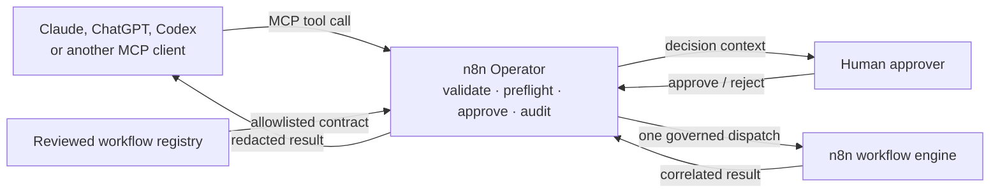

# n8n Operator

[](https://github.com/katekruger/n8n-operator/actions/workflows/ci.yml)
[](https://github.com/katekruger/n8n-operator/actions/workflows/codeql.yml)
[](https://www.python.org/)
[](https://modelcontextprotocol.io/)
[](LICENSE)

**A governed MCP control plane for discovering, validating, executing, and debugging
approved n8n workflows from Claude, ChatGPT, Codex, and compatible MCP clients.**

> **Status: v1 release candidate.** All nine product phases are implemented and the
> local release gate is green. Repeatable live-n8n and hosted OpenAI connector checks
> remain before the public v1 release —
> registry, MCP server (stdio + Streamable HTTP), n8n integration, execution, and the
> full operator CLI (`db`, `registry`, `operations`, `audit`, `health`, `serve`). See
> [docs/BUILD_PLAN.md](docs/BUILD_PLAN.md) section 12 for the phase checklist,
> [docs/V1_LIMITATIONS.md](docs/V1_LIMITATIONS.md) for what v1 deliberately does not
> do, and [CHANGELOG.md](CHANGELOG.md) for the full history.

| Client / target | Transport | Evidence |
|---|---|---|
| Claude Desktop | stdio | ✅ Built-wheel MCP session verified |
| Generic MCP client | Streamable HTTP | ✅ Built-wheel MCP session verified |
| OpenAI hosted connector | Streamable HTTP | 🟡 Configuration documented; live connector verification pending |
| n8n 2.35.7 self-hosted | REST + webhook | ✅ Empirically verified; repeatable live gate available |

## Who this is for

n8n Operator is for GTM engineers, revenue-operations teams, and agent builders who
want an AI client to run a small, reviewed set of automations—not inherit unrestricted
access to an entire n8n instance. It is especially useful when a workflow can write to
a CRM, contact a customer, mutate production data, or otherwise needs an approval and
an audit trail.

## How it works



---

## The problem

n8n is an excellent workflow engine and a poor agent surface. Pointing an LLM at a raw
n8n instance hands it an unbounded, unversioned, credential-bearing remote-execution
primitive: the workflow list is discovered at runtime, the input contract is implicit in
the node graph, failures surface as raw execution JSON, and every webhook is a live
production side effect.

n8n Operator is the place to stand between "the model decided to do a thing" and "the
thing happened."

## What it does

| | |
|---|---|
| **Discover** | Only workflows an operator explicitly registered, with human-authored descriptions, risk classes, and input schemas. |
| **Validate** | Arguments checked against a declared JSON Schema before anything reaches n8n. |
| **Preflight** | Target verified live, active, and unmodified since registration, before approval is sought — and again immediately before dispatch. |
| **Execute** | An explicit `prepare → approve → execute` lifecycle with single-use handles, idempotency, and a durable audit trail. |
| **Debug** | Redacted, structured execution traces — enough to diagnose, not enough to exfiltrate. |
| **Operate** | A CLI for approval, cancellation, history, and a chain-verifiable audit export — no browser required. |

## What it refuses to do

- Expose a workflow that is not in the registry, however live it is on the instance.
- Accept a raw n8n workflow ID, URL, or payload in any tool argument.
- Return a credential, token, n8n ID, or instance URL in any tool result.
- Let an MCP client approve its own operation — approval is out-of-band, always.
- Retry anything automatically. Ambiguous outcomes surface as `UNKNOWN` for a human.
- Edit workflows (v1 and v2). Authoring stays in the n8n UI.

## Quickstart

Requires Python 3.12. While the release candidate is private, install it from a local
checkout. PyPI publishing is intentionally deferred until the public-release gate passes.

```bash
git clone https://github.com/katekruger/n8n-operator.git
cd n8n-operator
uv tool install .
```

<sub>Private-repository access is required. Contributors can instead run commands from
the checkout with `uv run n8n-operator ...`.</sub>

**1. Initialize the database.** This also seeds the v1 default principal — do this
before anything else.

```bash
n8n-operator db init
```

**2. Write or copy a registry.** [`examples/registry/workflows.example.yaml`](examples/registry/workflows.example.yaml)
is a fully annotated starting point; [docs/WORKFLOW_REGISTRY.md](docs/WORKFLOW_REGISTRY.md)
is the authoring reference. Validate before loading:

```bash
n8n-operator registry validate --path ./workflows.yaml
n8n-operator registry reload --path ./workflows.yaml
```

**3. Configure the n8n connection** (only needed for `serve`/`health`, not for `db`/
`registry`/`operations`/`audit`):

```bash
export N8N_OPERATOR_N8N_BASE_URL=https://your-n8n-instance.example.com
export N8N_OPERATOR_N8N_API_KEY=...          # or env:NAME / keyring:SERVICE/ACCOUNT
n8n-operator health                           # confirms the instance is reachable
```

**4. Run the server.**

```bash
n8n-operator serve stdio     # Claude Desktop and any subprocess-launching MCP host
n8n-operator serve http      # a remote Streamable HTTP MCP client (see below)
```

**No n8n instance yet?** [`scripts/demo.sh`](scripts/demo.sh) walks through discovery,
validation, and the audit trail against a scratch database — nothing above step 3
required. Run it:

```bash
scripts/demo.sh
```

### Connecting a client

[`examples/mcp-clients/`](examples/mcp-clients/) has ready-to-copy configs for Claude
Desktop (stdio) and a generic remote Streamable HTTP client. Both transports were
verified against a real build; hosted OpenAI connector verification is still pending. See
[examples/mcp-clients/README.md](examples/mcp-clients/README.md) for the details each
one needs (a non-loopback `serve http` bind requires a bearer token and an Origin
allowlist — boundary B9 — the server refuses to start otherwise).

### Approving a pending operation

Anything above `read_only` needs a human decision before it runs. The CLI is the
canonical channel ([ADR-010](docs/adr/ADR-010-approval-delivery-and-expiry.md)):

```bash
n8n-operator operations list                  # what's pending
n8n-operator operations approve <operation_id>  # renders the full decision context first
```

`n8n-operator serve approval` runs a convenience loopback web page over the same
decision — never the only way to decide an operation.

## Documentation

| Document | What it covers |
|---|---|
| [BUILD_PLAN.md](docs/BUILD_PLAN.md) | **Normative.** Product definition, version boundaries, state machine, registry schema, tool inventory, storage model, security boundaries, tests, acceptance criteria, phase checklist. |
| [ARCHITECTURE.md](docs/ARCHITECTURE.md) | Components, layering, request flows, data trust, persistence, configuration. |
| [THREAT_MODEL.md](docs/THREAT_MODEL.md) | Assets, trust boundaries, STRIDE analysis, LLM-specific threats, residual risks. |
| [WORKFLOW_REGISTRY.md](docs/WORKFLOW_REGISTRY.md) | How to register a workflow, and how to classify it correctly. |
| [MCP_TOOLS.md](docs/MCP_TOOLS.md) | **Normative** for tool arguments, results, and the error taxonomy. |
| [N8N_COMPATIBILITY.md](docs/N8N_COMPATIBILITY.md) | Empirical n8n API findings behind ADR-008/ADR-009. |
| [COMPATIBILITY_MATRIX.md](docs/COMPATIBILITY_MATRIX.md) | Tested n8n versions and feature support, at a glance. |
| [LIVE_N8N_TESTING.md](docs/LIVE_N8N_TESTING.md) | How to run the real-instance compatibility gate. |
| [V1_LIMITATIONS.md](docs/V1_LIMITATIONS.md) | Plain-language index of what v1 deliberately doesn't do. |
| [RECONCILING_UNKNOWN.md](docs/RECONCILING_UNKNOWN.md) | Step-by-step manual procedure for resolving an `UNKNOWN` operation. |
| [SECURITY.md](SECURITY.md) | How to report a vulnerability. |
| [CONTRIBUTING.md](CONTRIBUTING.md) | Development setup, the PR gate, and house conventions. |

### Decision records

| ADR | Decision |
|---|---|
| [001](docs/adr/ADR-001-portable-mcp-core.md) | Portable, transport-agnostic core; MCP is an adapter |
| [002](docs/adr/ADR-002-default-deny-registry.md) | Default-deny YAML workflow registry |
| [003](docs/adr/ADR-003-operation-handles.md) | Operation handles as single-use capabilities |
| [004](docs/adr/ADR-004-sqlite-to-postgres.md) | SQLite in v1, PostgreSQL in v2, one schema throughout |
| [005](docs/adr/ADR-005-no-automatic-retry-v1.md) | No automatic retries in v1 |
| [006](docs/adr/ADR-006-server-owned-n8n-credentials.md) | Server-owned n8n credentials |
| [007](docs/adr/ADR-007-deterministic-before-llm.md) | Deterministic enforcement before LLM judgment |
| [008](docs/adr/ADR-008-conservative-definition-canonicalization.md) | Conservative workflow-definition canonicalization |
| [009](docs/adr/ADR-009-dispatch-correlation.md) | Dispatch correlation and indeterminate outcomes |
| [010](docs/adr/ADR-010-approval-delivery-and-expiry.md) | Approval delivery and expiry semantics |
| [011](docs/adr/ADR-011-argument-limits-and-idempotency.md) | Core argument limits and idempotency namespaces |
| [012](docs/adr/ADR-012-governed-retry-and-audit-anchoring.md) | Governed retry and external audit anchoring |

## Version boundaries

**v1** — single user, one n8n instance, SQLite, stdio and remote Streamable HTTP MCP,
CLI, YAML registry, read-only inspection, input validation, preflight,
prepare/approve/execute, local approval page, idempotency, audit log. No retries, no
workflow editing.

**v2** — PostgreSQL, multiple users and organizations, OAuth/OIDC, RBAC, multiple n8n
environments, team approvals, monitoring, governed retries, workflow definition diffs.

**v3** — declarative workflow compiler, evaluation lab, governed workflow changes,
remediation assistant, template library, enterprise controls.

Full boundary table: [BUILD_PLAN.md](docs/BUILD_PLAN.md) section 3. Known v1-specific
gaps and their practical consequences: [V1_LIMITATIONS.md](docs/V1_LIMITATIONS.md).

## Development

Requires Python 3.12 and [uv](https://docs.astral.sh/uv/). See
[CONTRIBUTING.md](CONTRIBUTING.md) for the full guide; the short version:

```bash
uv sync --all-extras --dev
```

```bash
uv run pytest -m "not live_n8n"
```

```bash
uv run ruff check . && uv run ruff format --check . && uv run mypy
```

```bash
uv run python scripts/check_docs_consistency.py
```

The last command enforces that the documentation set agrees with itself and with the
repository tree — state names, transition IDs, tool inventory, acceptance criteria,
cross-document links, and the published file tree. It runs in CI and as a contract test.

## License

Apache-2.0. See [LICENSE](LICENSE).
