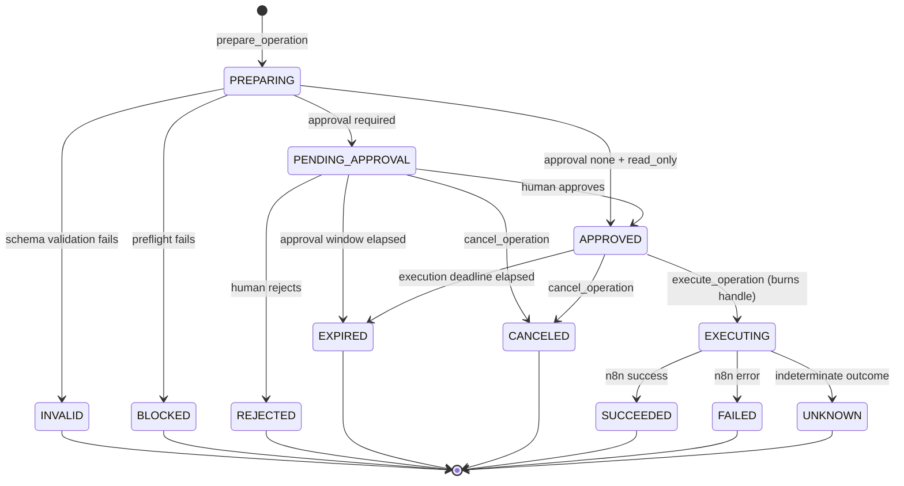

# n8n Operator — Build Plan

> **Status:** Architecture & bootstrap phase. No product functionality implemented.
> **Normative scope:** This document is the single source of truth for the product
> definition, version boundaries, repository structure, operation state machine,
> workflow registry schema, MCP tool inventory, storage model, security boundaries,
> test strategy, and acceptance criteria. Other documents in `docs/` elaborate on
> these definitions but must not contradict them. Where a conflict exists, this
> document wins and the other document is a defect.

---

## 1. Product definition

**n8n Operator is a governed MCP control plane for discovering, validating, executing, and debugging approved n8n workflows from Claude, ChatGPT, Codex, and compatible MCP clients.**

### 1.1 The problem

n8n is an excellent workflow engine and a poor agent surface. Pointing an LLM at a
raw n8n instance means handing it an unbounded, unversioned, credential-bearing
remote-execution primitive. The workflow list is discovered at runtime, the input
contract is implicit in the node graph, failures surface as raw execution JSON, and
every webhook is a live production side effect. There is no place to stand between
"the model decided to do a thing" and "the thing happened."

### 1.2 What n8n Operator is

A policy enforcement point that sits between MCP clients and one or more n8n
instances. It exposes a small, stable, well-typed tool surface and refuses to do
anything that is not explicitly approved in advance.

Five capabilities, in order of the lifecycle:

1. **Discover** — expose only the workflows an operator has explicitly registered,
   with human-authored titles, descriptions, risk classifications, and input schemas.
2. **Validate** — check caller-supplied arguments against a declared JSON Schema
   *before* anything reaches n8n, returning structured, model-actionable errors.
3. **Preflight** — verify that the target workflow is live, active, unmodified since
   registration, and that its instance is reachable, before an operation is offered
   for approval.
4. **Execute** — run the workflow through an explicit `prepare -> approve -> execute`
   lifecycle with operation handles, idempotency, timeouts, and a durable audit trail.
5. **Debug** — return redacted, structured execution traces so a model can explain a
   failure without being handed raw credentials or full customer payloads.

### 1.3 What n8n Operator is not

- Not an n8n replacement, scheduler, or runtime. n8n executes; Operator governs.
- Not a general-purpose n8n API proxy. There is no passthrough tool, ever.
- Not a workflow editor in v1 or v2. Workflow authoring stays in the n8n UI until v3,
  and even then it is governed and diff-reviewed.
- Not an autonomous remediation agent. It surfaces failures; humans decide.

### 1.4 Design principles

| # | Principle | Consequence |
|---|---|---|
| P1 | **Default deny** | An n8n workflow that is not in the registry does not exist to the model, even if it is live on the instance. See [ADR-002](adr/ADR-002-default-deny-registry.md). |
| P2 | **Deterministic before LLM** | Every gate that can be a schema check, a hash comparison, or a state transition is one. The model is never the enforcement mechanism. See [ADR-007](adr/ADR-007-deterministic-before-llm.md). |
| P3 | **The client never holds credentials** | n8n API keys and webhook secrets are server-owned, never returned by a tool, never in the registry file. See [ADR-006](adr/ADR-006-server-owned-n8n-credentials.md). |
| P4 | **Side effects are capability-gated** | Execution requires a single-use, server-issued operation handle bound to exact arguments. See [ADR-003](adr/ADR-003-operation-handles.md). |
| P5 | **Approval is out-of-band** | Humans approve through the CLI (canonical) or the local approval page (convenience), never through an MCP tool a compromised client could call. See [ADR-010](adr/ADR-010-approval-delivery-and-expiry.md). |
| P6 | **No silent repetition** | v1 never retries automatically. Ambiguous outcomes are surfaced as `UNKNOWN`. See [ADR-005](adr/ADR-005-no-automatic-retry-v1.md). |
| P7 | **Everything is auditable** | Every state transition and every decision is an append-only, hash-chained audit record. |
| P8 | **Portable core** | Protocol and transport are adapters around a transport-agnostic domain core. See [ADR-001](adr/ADR-001-portable-mcp-core.md). |
| P9 | **Never claim more than is known** | Unverifiable conditions are reported as unverifiable, indeterminate outcomes stay indeterminate, and no gate is weakened by an assumption that has not been demonstrated. See [ADR-008](adr/ADR-008-conservative-definition-canonicalization.md), [ADR-009](adr/ADR-009-dispatch-correlation.md). |

### 1.5 Primary users

- **The operator** — the person who owns the n8n instance, curates the registry,
  and approves side-effecting runs. Interacts via the CLI, which is the canonical
  approval channel, and optionally the local approval page (ADR-010).
- **The agent** — an MCP client (Claude, ChatGPT, Codex, or any compatible host)
  acting on behalf of the operator. Interacts only via MCP tools.
- **The auditor** (v2+) — reviews what ran, on whose authority, with what arguments.

---

## 2. Version outcomes

### 2.1 v1 outcome

> A single operator can point an MCP client at their own n8n instance and safely run
> a curated set of workflows, with every side effect gated by an explicit human
> approval and recorded in a tamper-evident audit log.

v1 is done when a solo operator can, without writing code:

- register workflows in a YAML file and have them validated at load time;
- see exactly those workflows from Claude Desktop over stdio and from a remote client
  over Streamable HTTP;
- have malformed arguments rejected with actionable errors before n8n is touched;
- be told, before approving, that a workflow has drifted from its registered definition;
- approve or reject a pending operation from the CLI on the Operator machine, or in the
  local approval page when one is running;
- execute the approved operation exactly once, even if the client retries;
- read a redacted failure trace good enough to diagnose the failing node;
- export a complete audit log of everything that happened.

**Explicit v1 non-goals:** multi-user, multi-instance, RBAC, retries, workflow
editing, scheduling, monitoring dashboards, notifications, template libraries.

### 2.2 v2 outcome

> A team can operate multiple n8n environments under role-based access control, with
> team approvals, governed retries, monitoring, and visibility into how workflow
> definitions change over time.

v2 is done when:

- PostgreSQL is the supported production store and SQLite is dev-only;
- users authenticate through OAuth/OIDC and carry an identity into every audit record;
- roles (`viewer`, `operator`, `approver`, `admin`) gate both tools and workflows;
- multiple n8n instances are registered as named environments with per-environment
  policy (e.g. `staging` auto-approves, `prod` requires two approvers);
- an approval can require N distinct human approvers and route to them;
- a failed operation can be retried only through an explicit, separately-audited,
  policy-checked `retry_operation` call that mints a *new* operation;
- definition drift is presented as a reviewable structural diff, not just a hash mismatch;
- operational metrics and health are exposed for monitoring.

### 2.3 v3 outcome

> Workflows themselves become governed artifacts: declaratively defined, evaluated
> against test suites before promotion, changed through reviewed diffs, and assembled
> from a vetted template library under enterprise controls.

v3 is done when:

- a declarative workflow source format compiles to n8n workflow JSON deterministically;
- an evaluation lab runs a workflow against fixture suites and scores it before promotion;
- workflow changes flow through `plan -> review -> apply` with rollback;
- a remediation assistant proposes (never applies) fixes for recurring failures;
- a template library lets an operator instantiate vetted workflows with parameters;
- enterprise controls exist: SSO enforcement, data residency, retention policy,
  break-glass procedures, and exportable compliance evidence.

---

## 3. Exact feature boundaries

The table is normative. An em dash means the capability does not exist in that version.

| Capability | v1 | v2 | v3 |
|---|---|---|---|
| Users | Single local operator | Multiple users, organizations | Same as v2 |
| Identity | Implicit local principal | OAuth/OIDC | OAuth/OIDC + enforced SSO |
| Authorization | All-or-nothing (registry is the only gate) | RBAC over tools, workflows, environments | RBAC + policy-as-code |
| n8n instances | Exactly one | Many, as named environments | Many |
| Datastore | SQLite | PostgreSQL (SQLite dev-only) | PostgreSQL |
| MCP transports | stdio + Streamable HTTP | stdio + Streamable HTTP | stdio + Streamable HTTP |
| Registry | YAML file, hand-authored | YAML + per-environment overlays | YAML + compiled sources |
| Workflow inspection | Read-only | Read-only + definition diffs | Read-only + diffs + evaluations |
| Input validation | JSON Schema 2020-12 | Same + policy predicates | Same + compiler-derived schemas |
| Preflight | Reachability, active, drift, credential *bindings*, correlation warning | Same + environment policy | Same + evaluation freshness |
| Approval | Single human; CLI canonical, local page optional | N-of-M team approvals, routed | Same + policy-driven quorum |
| Approval delivery | `approval_required` + operation ID + instructions; URL only to local callers | Routed notification (`request_approval`) | Same |
| Idempotency | Namespaced by principal + environment + workflow + key | Same, with real principals and environments | Same |
| Argument limits | Core-enforced canonical size cap | Same + per-principal quotas | Same |
| Dispatch correlation | Opt-in response envelope; absence degrades reconciliation only | Same + exact-ID reconciliation | Same |
| Expiry | Lazy transactional (authoritative) + best-effort sweeper | Same | Same |
| Retries | **None, ever** (ADR-005) | Governed, explicit, new operation, recalculated (ADR-012) | Same |
| Audit anchoring | — | `AuditAnchor`: signed local file, HTTPS webhook | + KMS, transparency log, WORM |
| Audit | Append-only hash chain, local | Same + export, retention | Same + compliance evidence packs |
| Monitoring | Health tool + structured logs | Metrics, alerting hooks | Same + SLOs |
| Workflow editing | **None** | **None** | Governed compile/plan/apply |
| Evaluation | — | — | Evaluation lab |
| Remediation | — | — | Advisory assistant |
| Templates | — | — | Vetted template library |

### 3.1 Boundaries that hold in every version

These are product invariants, not v1 limitations:

1. There is no MCP tool that takes a raw n8n workflow ID, URL, or arbitrary payload.
2. There is no MCP tool that returns a credential, API key, webhook secret, or token.
3. There is no MCP tool that approves an operation. Approval is out-of-band, always.
4. Execution requires a handle that was minted by a preceding `prepare`, and each
   handle is valid for exactly one execution attempt.
5. Nothing is retried without a new, separately-audited authorization.
6. The audit log is append-only. No tool, CLI command, or code path updates or
   deletes an audit record.

---

## 4. Repository structure

```
n8n-operator/
├── README.md
├── LICENSE
├── CHANGELOG.md
├── pyproject.toml                  # uv-managed, src layout, Python 3.12
├── alembic.ini
├── .env.example
├── .gitignore
├── .python-version
├── .github/
│   └── workflows/
│       └── ci.yml                  # lint, type-check, test
├── docs/
│   ├── BUILD_PLAN.md               # this file — normative
│   ├── ARCHITECTURE.md             # components, boundaries, data flow
│   ├── THREAT_MODEL.md             # assets, trust boundaries, threats, mitigations
│   ├── WORKFLOW_REGISTRY.md        # registry authoring reference
│   ├── MCP_TOOLS.md                # tool contracts — normative for tool I/O
│   └── adr/
│       ├── ADR-001-portable-mcp-core.md
│       ├── ADR-002-default-deny-registry.md
│       ├── ADR-003-operation-handles.md
│       ├── ADR-004-sqlite-to-postgres.md
│       ├── ADR-005-no-automatic-retry-v1.md
│       ├── ADR-006-server-owned-n8n-credentials.md
│       ├── ADR-007-deterministic-before-llm.md
│       ├── ADR-008-conservative-definition-canonicalization.md
│       ├── ADR-009-dispatch-correlation.md
│       ├── ADR-010-approval-delivery-and-expiry.md
│       ├── ADR-011-argument-limits-and-idempotency.md
│       └── ADR-012-governed-retry-and-audit-anchoring.md
├── examples/
│   └── registry/
│       └── workflows.example.yaml  # annotated sample registry
├── scripts/
│   └── check_docs_consistency.py   # doc invariants enforced in CI
├── src/
│   └── n8n_operator/
│       ├── __init__.py             # version only
│       ├── __main__.py             # `python -m n8n_operator` -> CLI
│       ├── py.typed
│       ├── config.py               # settings (Pydantic v2 BaseSettings)
│       ├── errors.py               # error taxonomy
│       ├── core/                   # transport-agnostic domain (ADR-001)
│       │   ├── __init__.py
│       │   ├── models.py           # domain types: Operation, Principal, Result
│       │   ├── state_machine.py    # section 5 — the only place transitions are decided
│       │   ├── handles.py          # ADR-003 — mint, bind, verify, burn
│       │   ├── idempotency.py      # canonical JSON + argument fingerprints
│       │   ├── redaction.py        # output redaction engine
│       │   └── service.py          # use-case orchestration (the portable core)
│       ├── registry/               # section 6 — YAML registry
│       │   ├── __init__.py
│       │   ├── schema.py           # Pydantic v2 models for registry entries
│       │   ├── loader.py           # parse, validate, snapshot, hash
│       │   └── validation.py       # caller-argument validation vs JSON Schema
│       ├── n8n/                    # the only module that talks to n8n
│       │   ├── __init__.py
│       │   ├── client.py           # httpx client, timeouts, no retries (ADR-005)
│       │   ├── preflight.py        # liveness, active, drift, credential checks
│       │   └── types.py            # n8n API response models
│       ├── storage/                # section 8 — persistence
│       │   ├── __init__.py
│       │   ├── models.py           # SQLAlchemy 2.0 ORM
│       │   ├── repository.py       # data access, portable SQL only (ADR-004)
│       │   ├── session.py          # engine/session lifecycle
│       │   └── migrations/         # Alembic
│       │       ├── env.py
│       │       ├── script.py.mako
│       │       └── versions/
│       │           └── 0001_initial.py    # AC-24: empty DB upgrades to head
│       ├── audit/                  # append-only, hash-chained
│       │   ├── __init__.py
│       │   ├── chain.py            # chain construction + verification
│       │   └── writer.py           # the only writer of audit records
│       ├── approval/               # out-of-band human approval
│       │   ├── __init__.py
│       │   ├── app.py              # FastAPI app, loopback-bound
│       │   ├── routes.py
│       │   └── templates/          # server-rendered approval page
│       ├── mcp/                    # MCP adapter (thin — ADR-001)
│       │   ├── __init__.py
│       │   ├── server.py           # MCPServer wiring
│       │   ├── tools.py            # tool definitions -> core.service calls
│       │   ├── resources.py        # registry:// and audit:// resources
│       │   └── transports.py       # stdio + Streamable HTTP
│       └── cli/                    # Typer
│           ├── __init__.py
│           ├── main.py
│           └── commands/
│               ├── __init__.py
│               ├── registry.py     # validate, list, show, hash, reload
│               ├── serve.py        # serve stdio | serve http | serve approval
│               ├── operations.py   # list, show, cancel, expire
│               ├── audit.py        # verify, export
│               └── db.py           # init, migrate, status
└── tests/
    ├── conftest.py
    ├── fixtures/
    │   └── canonicalization/       # sanitized harness fixtures (ADR-008)
    ├── unit/                       # pure logic, no I/O
    ├── property/                   # Hypothesis invariants (section 10.2)
    ├── contract/                   # MCP tool schema + error taxonomy contracts
    └── integration/                # real SQLite, mock n8n, live-n8n (opt-in)
```

**Layering rule (enforced in CI):** dependencies point inward only.
`cli`, `mcp`, `approval` -> `core` -> `registry`, `storage`, `audit`, `n8n`.
`core` must not import `mcp`, `cli`, `approval`, or `fastapi`.

---

## 5. Operation state machine

An **operation** is the unit of governance: one intent to run one registered
workflow with one exact set of arguments. It is created by `prepare_operation` and
is the subject of every audit record.

### 5.1 States

Twelve states. This list is exhaustive and is the vocabulary used by every other
document, the `operations.state` column, and the `state` field of every tool response.

| State | Kind | Meaning |
|---|---|---|
| `PREPARING` | transient | Operation record created; validation and preflight in progress. |
| `INVALID` | terminal | Arguments failed registry input-schema validation. Nothing reached n8n. |
| `BLOCKED` | terminal | Preflight failed: workflow inactive, definition drift, missing node credentials, or instance unreachable. |
| `PENDING_APPROVAL` | active | Validation and preflight passed. Awaiting an out-of-band human decision. |
| `APPROVED` | active | A human approved, or the registry classified the workflow as `approval: none`. Not yet executed. |
| `REJECTED` | terminal | A human explicitly denied the operation. |
| `EXPIRED` | terminal | The approval window elapsed while `PENDING_APPROVAL` or `APPROVED`. |
| `CANCELED` | terminal | Canceled by the caller or operator before execution was dispatched. |
| `EXECUTING` | active | Dispatched to n8n; awaiting completion. |
| `SUCCEEDED` | terminal | n8n reported successful completion. |
| `FAILED` | terminal | n8n reported an execution error, or the workflow completed with a failure status. |
| `UNKNOWN` | terminal | Dispatch outcome is indeterminate — the request may or may not have taken effect. Requires human resolution. **Never auto-retried** (ADR-005). |

### 5.2 Transitions

Every transition is written by `core/state_machine.py` and by nothing else. Each
emits exactly one `operation_events` row and one `audit_log` row.

| # | From | To | Trigger | Guard |
|---|---|---|---|---|
| T01 | *(none)* | `PREPARING` | `prepare_operation` | Workflow ID resolves in the active registry snapshot. |
| T02 | `PREPARING` | `INVALID` | Argument validation fails | — |
| T03 | `PREPARING` | `BLOCKED` | Preflight fails | — |
| T04 | `PREPARING` | `PENDING_APPROVAL` | Validation + preflight pass | Registry `approval` is `required`. Sets `approval_expires_at`. |
| T05 | `PREPARING` | `APPROVED` | Validation + preflight pass | Registry `approval` is `none` **and** `side_effects` is `read_only` — both required, evaluated against the snapshot in force now. Sets `execution_deadline`. Preflight emits an `UNATTENDED_EXECUTION` warning (ADR-009). |
| T06 | `PENDING_APPROVAL` | `APPROVED` | Human approves in the approval app | Approval token valid, unexpired, single-use. Sets `execution_deadline`. |
| T07 | `PENDING_APPROVAL` | `REJECTED` | Human rejects | Approval token valid and unexpired. |
| T08 | `PENDING_APPROVAL` | `EXPIRED` | Lazy transactional expiry on any read or action; best-effort sweeper; `operations expire` | `now > approval_expires_at`. Applied before state is evaluated (invariant I9, [ADR-010](adr/ADR-010-approval-delivery-and-expiry.md)). |
| T09 | `PENDING_APPROVAL` | `CANCELED` | `cancel_operation` | Caller is the originating principal. |
| T10 | `APPROVED` | `EXECUTING` | `execute_operation` | Handle valid, unburned, argument fingerprint matches, `now <= execution_deadline`, definition hash still matches. Burns the handle. |
| T11 | `APPROVED` | `EXPIRED` | Lazy transactional expiry on any read or action; best-effort sweeper; `operations expire` | `now > execution_deadline`. Applied before state is evaluated (invariant I9, [ADR-010](adr/ADR-010-approval-delivery-and-expiry.md)). |
| T12 | `APPROVED` | `CANCELED` | `cancel_operation` | Caller is the originating principal. |
| T13 | `EXECUTING` | `SUCCEEDED` | n8n reports success | — |
| T14 | `EXECUTING` | `FAILED` | n8n reports error | — |
| T15 | `EXECUTING` | `UNKNOWN` | Timeout, connection loss, or ambiguous response after dispatch | **No retry**, and never inferred to be a non-event ([ADR-009](adr/ADR-009-dispatch-correlation.md)). Recorded for human resolution. |

There are no other transitions. In particular there is no edge out of any terminal
state, no `FAILED -> EXECUTING`, and no edge out of `UNKNOWN` (a v2 governed retry
creates a **new** operation that references the old one; it does not move the old one).

### 5.3 Diagram



### 5.4 Invariants

Enforced in code and verified by property tests (section 10.2):

- **I1** — An operation's state is only ever changed by an edge in section 5.2.
- **I2** — Terminal states have no outgoing edges.
- **I3** — `EXECUTING` is reachable only from `APPROVED`, and only by burning a handle.
- **I4** — A handle can be burned at most once (enforced by a conditional database
  update whose affected-row count is checked, not by application logic alone).
- **I5** — Arguments are immutable after `PREPARING`. The fingerprint checked at
  `execute` is the fingerprint recorded at `prepare`.
- **I6** — Every state change appends one `operation_events` row and one `audit_log`
  row, in the same database transaction as the state change.
- **I7** — An operation in `UNKNOWN` is never automatically acted upon.
- **I8** — Two `prepare_operation` calls sharing an idempotency namespace
  `(principal, environment, workflow_id, idempotency_key)` return the same operation,
  never two ([ADR-011](adr/ADR-011-argument-limits-and-idempotency.md)).
- **I9** — No operation is read or acted upon in a state whose deadline has already
  passed: any overdue T08 or T11 is applied first, in the same transaction
  ([ADR-010](adr/ADR-010-approval-delivery-and-expiry.md)).
- **I10** — No operation is persisted whose canonical arguments exceed the effective
  size limit; the check precedes the write
  ([ADR-011](adr/ADR-011-argument-limits-and-idempotency.md)).
- **I11** — An approval decision authorizes exactly one operation. No operation inherits,
  extends, or reuses another operation's approval
  ([ADR-012](adr/ADR-012-governed-retry-and-audit-anchoring.md)).
- **I12** — An approval URL is never returned to a caller that cannot reach it
  ([ADR-010](adr/ADR-010-approval-delivery-and-expiry.md)).

---

## 6. Workflow registry schema

The registry is a YAML file. It is the **allowlist**: a workflow absent from it is
invisible and unexecutable (ADR-002). Authoring guidance and worked examples live in
[WORKFLOW_REGISTRY.md](WORKFLOW_REGISTRY.md); the normative shape is here.

### 6.1 Document shape

```yaml
apiVersion: n8n-operator/v1        # required; pinned, validated on load
metadata:
  name: string                     # required; registry name for logs and audit
  description: string              # optional
defaults:                          # optional; per-workflow fields override these
  approval: required               # none | required
  timeout_seconds: 60
  approval_ttl_seconds: 900
  execution_ttl_seconds: 300
workflows:                         # required; list, may be empty
  - <workflow entry>
```

### 6.2 Workflow entry fields

| Field | Type | Required | Default | Notes |
|---|---|---|---|---|
| `id` | string | yes | — | Stable operator-chosen ID matching `^[a-z0-9]+(?:[._-][a-z0-9]+)*$`. The only identifier an MCP client ever sees or sends. Unique within the registry. |
| `n8n_workflow_id` | string | yes | — | The n8n-side ID. **Never** exposed through any MCP tool. |
| `title` | string | yes | — | Human-readable; shown to the model and in the approval page. |
| `description` | string | yes | — | What it does and when to use it. Written for a model reader. |
| `owner` | string | yes | — | Accountable human. Free-form in v1; resolved to an identity in v2. |
| `version` | integer | yes | — | Operator-managed. Bumped when the registered contract changes. |
| `definition_hash` | string | yes | — | `sha256:<hex>` of the canonicalized n8n workflow definition at registration time. Drift detection compares against this. |
| `risk` | enum | yes | — | `low` / `medium` / `high`. Advisory metadata surfaced to the model and the approver. |
| `side_effects` | enum | yes | — | `read_only` / `external_write` / `irreversible`. Load-time policy input: only `read_only` may set `approval: none`. |
| `approval` | enum | no | `defaults.approval` | `none` / `required`. `none` is rejected at load time unless `side_effects: read_only`. |
| `trigger` | object | yes | — | See 6.3. How Operator invokes the workflow. |
| `input_schema` | object | yes | — | JSON Schema draft 2020-12. Must be an object schema with `additionalProperties: false`. Rejected at load time otherwise. |
| `output` | object | no | `{}` | See 6.4. Redaction and shaping of results. |
| `limits` | object | no | inherits `defaults` | See 6.5. |
| `tags` | list of string | no | `[]` | Free-form grouping, filterable in `list_workflows`. |
| `enabled` | boolean | no | `true` | `false` hides the workflow from discovery and refuses preparation. |

### 6.3 `trigger`

| Field | Type | Required | Notes |
|---|---|---|---|
| `type` | enum | yes | v1 supports `webhook` only. `api` (n8n REST execution) is reserved for v2. |
| `method` | enum | yes | `POST` / `GET`. |
| `path` | string | yes | Path component only, e.g. `/webhook/abc123`. Base URL comes from server config, never the registry. |
| `auth` | enum | yes | `none` / `header` / `basic`. |
| `secret_ref` | string | conditional | Required when `auth` is not `none`. An **indirect reference** to a secret (e.g. `env:N8N_WEBHOOK_TOKEN_CRM`). A literal secret in this field is a load-time error (ADR-006). |
| `correlation` | enum | no | `none` (default) / `response_envelope`. Declares whether the workflow returns the Operator response envelope carrying an n8n execution ID. `none` is fully executable but has reduced reconciliation and debugging capability, reported by preflight as `NO_EXECUTION_CORRELATION` ([ADR-009](adr/ADR-009-dispatch-correlation.md)). |

### 6.4 `output`

| Field | Type | Default | Notes |
|---|---|---|---|
| `redact` | list of string | `[]` | JSONPath expressions; matched values are replaced with `"[REDACTED]"` before the result leaves the process. |
| `max_bytes` | integer | `65536` | Results larger than this are truncated with an explicit `truncated: true` marker. |
| `include_node_trace` | boolean | `false` | Whether `get_execution_log` may return per-node data for this workflow (still redacted). |

### 6.5 `limits`

| Field | Type | Default | Notes |
|---|---|---|---|
| `timeout_seconds` | integer | `defaults.timeout_seconds` | Wall clock for a single dispatch. Exceeding it yields `UNKNOWN`, not a retry. |
| `approval_ttl_seconds` | integer | `defaults.approval_ttl_seconds` | `PENDING_APPROVAL` lifetime. |
| `execution_ttl_seconds` | integer | `defaults.execution_ttl_seconds` | `APPROVED` lifetime before `EXPIRED`. |
| `max_concurrent` | integer | `1` | Concurrent `EXECUTING` operations for this workflow. |
| `rate_limit_per_minute` | integer | `null` | Optional ceiling on executions per minute. |
| `max_argument_bytes` | integer | server ceiling | Per-workflow cap on the canonical argument size. May lower the server ceiling `N8N_OPERATOR_MAX_ARGUMENT_BYTES`, never raise it (rule R11, [ADR-011](adr/ADR-011-argument-limits-and-idempotency.md)). |

### 6.6 Load-time validation rules

A registry that violates any rule fails to load. The server refuses to start, and
`n8n-operator registry validate` exits non-zero. Partial loading is not supported —
a bad registry never degrades into a partially-live allowlist.

| Rule | Check |
|---|---|
| R1 | `apiVersion` equals a supported value. |
| R2 | `id` is unique and matches the ID pattern. |
| R3 | `n8n_workflow_id` is unique across entries. |
| R4 | `input_schema` is a valid draft 2020-12 object schema with `additionalProperties: false`. |
| R5 | `approval: none` requires `side_effects: read_only`. |
| R6 | `secret_ref` is an indirect reference (`env:` or `keyring:`), never a literal. |
| R7 | `definition_hash` matches `^sha256:[0-9a-f]{64}$`. |
| R8 | `trigger.path` is a path, not an absolute URL, and contains no host component. |
| R9 | Every JSONPath in `output.redact` parses. |
| R10 | `risk: high` requires `approval: required`, which `defaults` may not weaken. |
| R11 | `limits.max_argument_bytes`, when present, is a positive integer not greater than the server ceiling `N8N_OPERATOR_MAX_ARGUMENT_BYTES`. |
| R12 | `trigger.correlation` is one of `none` / `response_envelope`, and `response_envelope` is only valid for `trigger.type: webhook`. |

### 6.7 Snapshots

Each successful load produces a **registry snapshot**: the canonicalized document,
its `sha256`, the source path, and a load timestamp, persisted in `registry_snapshots`.
Every operation records the snapshot it was prepared against, so an audit reader can
reconstruct exactly which contract was in force. Reloading is explicit
(`n8n-operator registry reload` or process restart); the registry is never re-read
mid-operation.

### 6.8 Definition canonicalization

`definition_hash` is taken over a canonicalized form of the n8n workflow definition. The
canonicalization is deliberately **conservative**: it drops only what has been proven not
to matter, because over-exclusion produces a silent false negative — a semantic change the
drift check does not notice. Rationale and the compatibility harness are in
[ADR-008](adr/ADR-008-conservative-definition-canonicalization.md); these seven rules are
normative.

| Rule | Statement |
|---|---|
| CAN-01 | **Inclusion by default.** Every field of the definition contributes to the canonical form unless it appears on the exclusion allowlist. Unrecognized and newly-introduced fields are included. |
| CAN-02 | **Exclusion requires proof.** A field joins the allowlist only after the phase-4 compatibility harness shows that varying it, all else equal, does not alter observable workflow behavior. |
| CAN-03 | **The allowlist is explicit.** An enumerated, versioned table in code; each entry records the field path, the justifying harness run, and the n8n version range covered. No wildcards or pattern families. |
| CAN-04 | **Deterministic serialization.** Keys sorted by code point, array order significant, strings NFC-normalized, one canonical number form, UTF-8, no insignificant whitespace. Canonicalization is idempotent. |
| CAN-05 | **Semantic changes must change the hash.** Node type, node parameters, credential bindings, connections, workflow settings, trigger configuration, and error-handling configuration are never excludable. |
| CAN-06 | **Only proven-cosmetic changes may preserve the hash.** Hash preservation requires a CAN-02-justified allowlist entry. There is no third category. |
| CAN-07 | **Canonicalization is versioned.** The algorithm version is part of the hash preimage. Changing it requires a new registry `apiVersion` and a deliberate re-hash, never a silent revaluation of existing entries. |

Phase 4 ships with an **empty exclusion allowlist**; entries are added one at a time as the
harness justifies them. Every harness run saves a sanitized fixture under
`tests/fixtures/canonicalization/` (instance URLs, credential identifiers, real workflow
IDs, and payload data stripped).

---

## 7. MCP tool inventory by version

Tool names, arguments, results, and errors are specified normatively in
[MCP_TOOLS.md](MCP_TOOLS.md). This section is the authoritative **inventory** — which
tools exist in which version.

### 7.1 v1 — 12 tools

| Tool | Category | Side effects | Purpose |
|---|---|---|---|
| `list_workflows` | Discover | none | List registered, enabled workflows with title, description, risk, side-effect class, and tags. |
| `describe_workflow` | Discover | none | Full contract for one workflow: description, input schema, limits, approval policy, output shape. |
| `get_instance_health` | Discover | none | Reachability and version of the configured n8n instance. No credentials returned. |
| `validate_input` | Validate | none | Check arguments against a workflow's input schema; returns structured, path-anchored errors. |
| `preflight_workflow` | Validate | none | Liveness, active status, definition-drift, credential-*binding* and correlation checks, without creating an operation. Non-blocking `warn` and `unverifiable` statuses report reduced capability without refusing ([ADR-009](adr/ADR-009-dispatch-correlation.md)). |
| `prepare_operation` | Lifecycle | creates an operation | Validate + preflight + mint an operation handle. Returns `PENDING_APPROVAL` (with `approval_required`, the operation ID, and human instructions; an approval URL only for local callers — invariant I12) or `APPROVED`, `INVALID`, or `BLOCKED`. |
| `get_operation` | Lifecycle | none | Current state, timestamps, deadlines, and approval status of one operation. |
| `execute_operation` | Lifecycle | **runs the workflow** | Burn the handle and dispatch to n8n. The only side-effecting tool in the product. |
| `cancel_operation` | Lifecycle | cancels | Move a `PENDING_APPROVAL` or `APPROVED` operation to `CANCELED`. |
| `list_operations` | Inspect | none | Filterable history of operations. |
| `get_execution_result` | Inspect | none | Redacted, size-capped result of a completed operation. |
| `get_execution_log` | Debug | none | Redacted structured trace: node sequence, per-node status, error node, error message. |

**v1 MCP resources:** `registry://workflows` (the active snapshot, minus n8n IDs and
secret refs) and `audit://operations/{operation_id}` (the event chain for one operation).

**v1 MCP prompts:** none. Prompts are a client-side affordance and add no governance.

### 7.2 v2 — adds 8 tools (20 total)

| Tool | Purpose |
|---|---|
| `whoami` | Resolved identity, organization, roles, and effective permissions. |
| `list_environments` | Registered n8n environments visible to the caller, with per-environment approval policy. |
| `request_approval` | Route a `PENDING_APPROVAL` operation to named approvers or a group. Still cannot *grant* approval. |
| `get_approval_status` | Which approvals have been collected, which are outstanding, against the required quorum. |
| `retry_operation` | Governed retry: creates a **new** operation linked to the original, re-running validation, preflight, and approval. Never reuses the original handle (ADR-005). |
| `diff_workflow_definition` | Structural diff between the registered `definition_hash` and the live definition. |
| `get_metrics` | Operation counts, outcome distribution, latency percentiles, drift counts. |
| `list_audit_events` | Query the audit chain within the caller's authorization scope. |

Every v1 tool gains an optional `environment` argument in v2, defaulting to the
caller's default environment.

### 7.3 v3 — adds 8 tools (28 total)

| Tool | Purpose |
|---|---|
| `compile_workflow` | Compile a declarative workflow source into n8n workflow JSON. Pure; no side effects. |
| `plan_workflow_change` | Produce a reviewable plan diffing the compiled output against the live workflow. |
| `apply_workflow_change` | Apply a previously-approved plan. Handle-gated and approval-gated exactly like execution. |
| `run_evaluation` | Run a workflow against a fixture suite in the evaluation lab. |
| `get_evaluation_report` | Scores, failures, and regressions from an evaluation run. |
| `suggest_remediation` | Advisory analysis of recurring failures. Proposes; never applies. |
| `list_templates` | Vetted workflow templates with their parameters. |
| `instantiate_template` | Produce a declarative workflow source from a template. Produces source, not a live workflow. |

---

## 8. Storage model

SQLAlchemy 2.0 ORM over SQLite in v1, PostgreSQL in v2. Every schema change is an
Alembic migration; the schema is never created by `create_all` outside tests. The
portability rules that make the v2 migration mechanical are in
[ADR-004](adr/ADR-004-sqlite-to-postgres.md).

### 8.1 Tables

**`principals`** — who acted. v1 holds exactly one row (`local`).

| Column | Type | Notes |
|---|---|---|
| `id` | text PK | ULID. |
| `kind` | text | `local` in v1; `user` or `service` in v2. |
| `display_name` | text | |
| `external_subject` | text null | OIDC subject in v2. |
| `created_at` | timestamptz | |

**`registry_snapshots`** — section 6.7.

| Column | Type | Notes |
|---|---|---|
| `id` | text PK | ULID. |
| `content_hash` | text unique | `sha256:<hex>` of the canonicalized document. |
| `source_path` | text | |
| `document` | json | Canonicalized registry, secrets already indirected. |
| `loaded_at` | timestamptz | |

**`workflow_bindings`** — one resolved registry entry within one snapshot.

| Column | Type | Notes |
|---|---|---|
| `id` | text PK | ULID. |
| `snapshot_id` | text FK to `registry_snapshots.id` | |
| `workflow_id` | text | Registry ID. Unique per snapshot. |
| `n8n_workflow_id` | text | Never leaves the server. |
| `definition_hash` | text | Registered hash. |
| `side_effects` | text | |
| `approval_policy` | text | |
| `input_schema` | json | |

**`operations`** — the governance record.

| Column | Type | Notes |
|---|---|---|
| `id` | text PK | `op_<ULID>` — the operation handle (ADR-003). |
| `principal_id` | text FK | Explicit in v1, where it is always the single `local` principal. |
| `environment` | text | Explicit in v1, where it is always `default`. Part of the idempotency namespace (ADR-011). |
| `snapshot_id` | text FK | Registry contract in force. |
| `workflow_id` | text | |
| `definition_hash` | text | Hash observed at prepare time. |
| `state` | text | One of the twelve states in section 5.1. |
| `state_version` | integer | Optimistic-concurrency guard; incremented on every transition. |
| `arguments` | json | Redacted per `output.redact` before persistence. |
| `argument_fingerprint` | text | sha256 over canonical JSON of the *unredacted* arguments. |
| `argument_bytes` | integer | Size of the canonical argument serialization, checked against the effective limit before this row is written (I10). |
| `idempotency_key` | text null | Client-supplied. Namespaced by `(principal_id, environment, workflow_id, idempotency_key)`. |
| `handle_burned_at` | timestamptz null | Non-null exactly once (I4). |
| `approval_expires_at` | timestamptz null | |
| `execution_deadline` | timestamptz null | |
| `n8n_execution_id` | text null | |
| `parent_operation_id` | text null FK | v2 governed retries link here. |
| `created_at`, `updated_at` | timestamptz | |

Constraints: a unique index on
`(principal_id, environment, workflow_id, idempotency_key)` where
`idempotency_key IS NOT NULL` enforces I8 over the namespace defined in
[ADR-011](adr/ADR-011-argument-limits-and-idempotency.md). The handle burn is a conditional
update (`... WHERE handle_burned_at IS NULL`) whose affected-row count is checked,
enforcing I4.

**`operation_events`** — append-only transition log.

| Column | Type | Notes |
|---|---|---|
| `id` | text PK | ULID (lexicographically sortable, therefore chronological). |
| `operation_id` | text FK | |
| `from_state` | text null | Null for T01. |
| `to_state` | text | |
| `transition` | text | `T01` through `T15` from section 5.2. |
| `actor` | text | Principal ID, `system`, or `clock`. |
| `detail` | json | Validation errors, preflight findings, n8n error payloads. |
| `occurred_at` | timestamptz | |

**`approvals`** — out-of-band decisions.

| Column | Type | Notes |
|---|---|---|
| `id` | text PK | ULID. |
| `operation_id` | text FK | |
| `token_hash` | text unique | sha256 of the approval token. The token itself is never stored. |
| `issued_at`, `expires_at` | timestamptz | |
| `decided_at` | timestamptz null | |
| `decision` | text null | `approved` or `rejected`. |
| `decided_by` | text null | v1: `local`. v2: identity. |
| `client_fingerprint` | text null | Coarse request provenance for the audit trail. |

**`execution_results`** — what n8n returned.

| Column | Type | Notes |
|---|---|---|
| `operation_id` | text PK FK | One result per operation (no retries in v1). |
| `n8n_execution_id` | text null | |
| `status` | text | `success`, `error`, or `indeterminate`. |
| `started_at`, `finished_at` | timestamptz null | |
| `redacted_payload` | json | Post-redaction, post-truncation. |
| `node_trace` | json null | Present only when `output.include_node_trace`. |
| `error` | json null | Structured error: node, type, message. |

**`audit_log`** — append-only, hash-chained (section 9.4).

| Column | Type | Notes |
|---|---|---|
| `seq` | integer PK | Monotonic. |
| `prev_hash` | text | Hash of the previous entry; genesis is 64 zeros. |
| `entry_hash` | text unique | sha256 over the canonical serialization of this entry including `prev_hash`. |
| `occurred_at` | timestamptz | |
| `actor` | text | |
| `action` | text | e.g. `operation.prepared`, `approval.granted`, `execution.dispatched`. |
| `subject_type`, `subject_id` | text | |
| `outcome` | text | `allowed`, `denied`, or `error`. |
| `detail` | json | Redacted. |

**`alembic_version`** — migration state, managed by Alembic.

### 8.2 Retention

v1 retains everything indefinitely, locally. `execution_results.redacted_payload` is
the only large column and is capped by `output.max_bytes`. Retention policy and
archival are v3 enterprise controls; there is no delete path in v1 or v2.

---

## 9. Security boundaries

Full analysis in [THREAT_MODEL.md](THREAT_MODEL.md). This section states the boundaries
the implementation must enforce.

### 9.1 Trust zones

```
Zone A: MCP client + LLM         UNTRUSTED. Inputs may be attacker-influenced
   |                             (prompt injection, poisoned context, malicious args).
   |  MCP (stdio | Streamable HTTP)
   v
Zone B: n8n Operator             TRUSTED. Policy enforcement point. Holds credentials.
   |                             Every check that matters happens here.
   |  HTTPS + server-held secret
   v
Zone C: n8n instance             PRIVILEGED. Holds the real credentials to Zone D.
   |
   v
Zone D: Downstream SaaS/systems  Where irreversible things actually happen.
```

**Zone A is never trusted, including when the operator is the one typing.** The model
may be reasoning over hostile content. The whole design assumes a well-intentioned
operator and a potentially-manipulated agent.

### 9.2 Boundary controls

| # | Boundary | Control |
|---|---|---|
| B1 | A to B: identifier | The client can only send registry IDs. A raw `n8n_workflow_id`, URL, or path in a tool argument is impossible by schema, not by check. |
| B2 | A to B: arguments | Validated against the registry's JSON Schema with `additionalProperties: false` before any network call. |
| B3 | A to B: authorization | Execution requires a handle minted by `prepare` in the same principal's context, bound to an argument fingerprint, single-use (ADR-003). |
| B4 | A blocked from approval | There is no MCP tool that approves. Approval crosses a separate channel (loopback HTTP plus a human) that the client cannot reach. |
| B5 | B to A: credentials | No tool result contains a credential, token, webhook secret, n8n ID, or instance URL. Enforced by a response-shaping allowlist and a contract test. |
| B6 | B to A: data | Results pass through the redaction engine and size cap before serialization. |
| B7 | B to C: identity | Operator holds the n8n credential; the client never does (ADR-006). Secrets are resolved from env or keyring at process start and never written to the registry, logs, or database. |
| B8 | B to C: integrity | Definition drift check at preflight *and* again at execute. A workflow modified between approval and execution cannot run under the old approval. |
| B9 | B: transport | stdio is the default. The Streamable HTTP transport binds to loopback by default; a non-loopback bind requires an explicit bearer token and `Origin` allowlist (DNS-rebinding defense) and refuses to start otherwise. |
| B10 | B: approval app | Bound to `127.0.0.1` only, never configurable to a public interface in v1. Approval tokens are single-use, TTL-bounded, and stored only as hashes. |
| B11 | B: audit | Append-only. No update or delete statement against `audit_log` exists in the codebase; a contract test greps for one. |
| B12 | A to B: argument volume | A core-enforced cap on the canonical argument size, applied identically for every adapter and **before** persistence. Transport limits remain as defense in depth ([ADR-011](adr/ADR-011-argument-limits-and-idempotency.md)). |
| B13 | B to A: approval reachability | An approval URL is returned only to callers the transport proves are local. Remote callers receive `approval_required`, the operation ID, and instructions instead of an address they cannot reach (invariant I12, [ADR-010](adr/ADR-010-approval-delivery-and-expiry.md)). |

### 9.3 The confused-deputy problem

Operator holds credentials that the model does not. That makes it a deputy, and the
mitigation is that the deputy's authority is *enumerated*, not *delegated*: it can
only do the finite set of things in the registry, only with schema-valid arguments,
and — for anything with side effects — only after a human outside Zone A said yes to
this specific operation with these specific arguments.

### 9.4 Audit integrity

Each `audit_log` entry hashes its own canonical content together with the previous
entry's hash. `n8n-operator audit verify` walks the chain and reports the first break.
This is tamper-*evidence*, not tamper-*proofing*: an attacker with write access to
the database can rewrite the whole chain. v2 adds external anchoring; v3 adds
exportable, signed evidence packs.

### 9.5 Explicit residual risks (v1)

Accepted, documented, not mitigated in v1:

- A compromised operator machine defeats everything below it.
- n8n itself is trusted; Operator does not sandbox what a workflow does once dispatched.
- A human who approves without reading the arguments defeats the human gate, whichever
  approval channel they use.
- `UNKNOWN` outcomes require a human to check the downstream system. There is no
  automatic reconciliation, and Operator never infers that a timed-out dispatch did not
  run ([ADR-009](adr/ADR-009-dispatch-correlation.md)).
- A workflow registered with `trigger.correlation: none` cannot be reconciled by execution
  ID. It remains executable; preflight reports the limitation before approval.
- Preflight reports credential **bindings**, not credential validity. A bound but expired
  or revoked credential passes preflight and fails at execution.
- In a stdio-only deployment with no approval app and no scheduled
  `n8n-operator operations expire`, an `EXPIRED` audit event is written when the operation
  is next touched rather than at its deadline, and an operation nobody touches again may
  never get one. No expired operation is ever executed — lazy transactional expiry is
  authoritative (invariant I9) — so this is a limitation of audit *timeline fidelity*,
  not of safety.

---

## 10. Test strategy

### 10.1 Layers

| Layer | Directory | Scope | Runs |
|---|---|---|---|
| Unit | `tests/unit/` | Pure functions: state machine, canonical JSON, fingerprints, redaction, registry validation. No I/O. | Every commit |
| Property | `tests/property/` | Hypothesis invariants over the same pure core (section 10.2). | Every commit |
| Contract | `tests/contract/` | MCP tool schemas, error taxonomy, response-shaping allowlist, layering rules, doc consistency. | Every commit |
| Integration | `tests/integration/` | Real SQLite + Alembic + a mock n8n served by `httpx.MockTransport`; full lifecycle end to end. | Every commit |
| Live | `tests/integration/` marked `live_n8n` | Against a real n8n in Docker. | Opt-in, nightly |

### 10.2 Property tests (Hypothesis)

The invariants worth generating inputs for:

- **State machine** — for any random sequence of triggers from any state, the reached
  state is always in section 5.1 and every applied transition is in section 5.2 (I1, I2).
- **Terminality** — no generated trigger sequence produces an outgoing edge from a
  terminal state (I2).
- **Handle single-use** — for any interleaving of concurrent `execute` attempts on one
  operation, exactly one succeeds (I4).
- **Fingerprint stability** — for any JSON value, canonicalization is idempotent, and
  key reordering or insignificant whitespace does not change the fingerprint (I5).
- **Fingerprint sensitivity** — for any two structurally different JSON values, the
  fingerprints differ.
- **Idempotency** — for any pair of `prepare` calls sharing a namespace
  `(principal, environment, workflow_id, key)`, one operation exists afterwards; differing
  in any namespace component yields two (I8).
- **Argument limits** — for any payload whose canonical serialization exceeds the effective
  limit, no operation row is written and the error is `ARGUMENTS_TOO_LARGE` (I10).
- **Lazy expiry** — for any operation and any clock position past its deadline, every read
  and every action observes `EXPIRED`, and the transition is recorded exactly once (I9).
- **Canonicalization conservatism** — for any definition and any field *not* on the
  exclusion allowlist, changing that field changes the hash (CAN-01, CAN-05); for any
  allowlisted field, changing it does not (CAN-06).
- **Canonicalization idempotence** — canonicalizing a canonical form is a no-op (CAN-04).
- **Approval-URL reachability** — for any result produced for a non-local caller, no
  loopback URL appears anywhere in the serialization (I12).
- **Redaction totality** — for any payload and any registered redaction path, no
  redacted value appears anywhere in the serialized output, including nested and
  array positions.
- **Secret non-leakage** — for any tool result and any configured secret value, the
  secret does not appear in the serialization (B5).
- **Registry round-trip** — any registry that loads successfully re-serializes to the
  same canonical form and the same hash.
- **Audit chain** — for any sequence of appended entries the chain verifies, and any
  single mutation makes verification fail at the mutated entry.

### 10.3 Contract tests

- Every v1 tool in section 7.1 is registered with the MCP server, and no tool outside
  that list is registered.
- Every tool's input schema rejects unknown properties.
- No tool schema accepts a field named or shaped like a raw n8n identifier or URL.
- Every error returned by a tool belongs to the documented taxonomy in MCP_TOOLS.md.
- `core/` imports nothing from `mcp/`, `cli/`, `approval/`, `fastapi`, or `typer`.
- No SQL `UPDATE` or `DELETE` targets `audit_log`.
- No code path transitions out of `UNKNOWN`, and none infers non-execution from a timeout
  (ADR-009).
- No code path reuses, transfers, or extends another operation's approval (I11).
- The argument-size check is enforced in `core/`, not in an adapter (B12).
- The canonicalization exclusion allowlist is an explicit enumerated table; no wildcard or
  regex entry exists (CAN-03).
- Every ADR from ADR-001 to ADR-012 exists, carries a Status and a Decision, and is
  referenced by at least one normative document.
- `scripts/check_docs_consistency.py` passes: state names, transition IDs, tool
  inventory, canonicalization rules, the error taxonomy, ADR wiring, and the repository
  tree in section 4 agree across all documents and the actual filesystem.

### 10.4 Gates

Merge requires: `ruff check` clean, `ruff format --check` clean, `mypy --strict` clean
on `src/`, all non-live tests green, and at least 90% line coverage on
`src/n8n_operator/core/` and `src/n8n_operator/registry/` (the modules where a bug is a
security bug). Coverage elsewhere is reported but not gated.

### 10.5 What is deliberately not tested in v1

n8n's own behavior, MCP client conformance beyond the schemas, load and performance
characteristics, and browser-level testing of the approval page (its logic is tested
through the FastAPI test client).

---

## 11. Acceptance criteria

v1 ships when every criterion below is demonstrable by an automated test or a
scripted manual walkthrough. Each maps to at least one test in section 10.

### 11.1 Discovery and validation

- **AC-01** — A workflow present on the n8n instance but absent from the registry does
  not appear in `list_workflows` and cannot be prepared. `prepare_operation` on its
  registry ID returns `WORKFLOW_NOT_FOUND` with no signal distinguishing
  "unregistered" from "nonexistent".
- **AC-02** — A registry violating any rule in section 6.6 fails to load; the server
  exits non-zero at startup and `registry validate` reports the offending entry and rule.
- **AC-03** — `describe_workflow` returns the input schema, approval policy, risk,
  side-effect class, and limits — and no `n8n_workflow_id`, URL, or secret reference.
- **AC-04** — `validate_input` rejects a missing required field, a wrong-typed field,
  and an unknown extra field, each with a JSON-Pointer path to the offending location.

### 11.2 Preflight

- **AC-05** — With the workflow deactivated in n8n, `preflight_workflow` reports
  `WORKFLOW_INACTIVE` and `prepare_operation` yields `BLOCKED`.
- **AC-06** — With the workflow modified in n8n after registration, preflight reports
  `DEFINITION_DRIFT` including both hashes, and `prepare_operation` yields `BLOCKED`.
- **AC-07** — With n8n unreachable, preflight reports `INSTANCE_UNREACHABLE` within the
  configured timeout, and no operation reaches `EXECUTING`.

### 11.3 Lifecycle

- **AC-08** — `prepare_operation` on a `side_effects: external_write` workflow returns
  `PENDING_APPROVAL`, an operation handle, `approval_required: true`, and human-readable
  approval instructions. A loopback approval URL is included only for a local caller
  (AC-31).
- **AC-09** — `execute_operation` on a `PENDING_APPROVAL` operation is refused with
  `APPROVAL_REQUIRED`, and the operation stays in `PENDING_APPROVAL`.
- **AC-10** — After approval through the CLI (and, separately, through the local page),
  `execute_operation` dispatches exactly once; a second call with the same handle returns
  `HANDLE_ALREADY_USED` and dispatches nothing (verified by the mock n8n request count).
- **AC-11** — Two `prepare_operation` calls in the same idempotency namespace with the same
  key and the same arguments return the same operation ID. The same namespace and key with
  *different* arguments returns `IDEMPOTENCY_CONFLICT` (ADR-011).
- **AC-12** — An operation left unapproved past `approval_ttl_seconds` is `EXPIRED` on the
  next read or action even with no sweeper running, and `execute_operation` on it returns
  `OPERATION_EXPIRED` (invariant I9).
- **AC-13** — A workflow whose definition changes between approval and execution is
  refused at execute with `DEFINITION_DRIFT`; nothing is dispatched.
- **AC-14** — A `read_only` workflow with `approval: none` goes `PREPARING -> APPROVED`
  (T05) and executes without human interaction, with preflight reporting
  `UNATTENDED_EXECUTION`. A non-`read_only` workflow with `approval: none` fails registry
  load (R5). Both conditions are required for T05; neither alone suffices.

### 11.4 Failure handling

- **AC-15** — A workflow that errors in n8n leaves the operation `FAILED`, and
  `get_execution_log` names the failing node and its error message.
- **AC-16** — A dispatch that times out leaves the operation `UNKNOWN`, dispatches
  nothing further, and the audit log records the indeterminacy. No code path
  transitions `UNKNOWN` to anything.
- **AC-17** — There is no automatic retry anywhere: a grep-based contract test finds no
  retry loop, backoff helper, or `retries=` setting in the n8n client (ADR-005).

### 11.5 Security

- **AC-18** — No tool response in any test scenario contains the configured n8n API key,
  webhook secret, instance URL, or `n8n_workflow_id` (property test, section 10.2).
- **AC-19** — Configured `output.redact` paths are absent from `get_execution_result`
  and `get_execution_log`, including in nested and array positions.
- **AC-20** — The Streamable HTTP transport refuses to start on a non-loopback bind
  without a bearer token and `Origin` allowlist.
- **AC-21** — Both approval channels reject a reused token, an expired token, and a
  decision on an operation not in `PENDING_APPROVAL`; the CLI and the approval page write
  the identical transition through the same core use case.
- **AC-22** — `audit verify` passes on a clean database and identifies the exact
  sequence number after a single row is mutated.

### 11.6 Operability

- **AC-23** — The server runs under Claude Desktop over stdio and under a remote MCP
  client over Streamable HTTP, exposing the identical 12-tool surface (section 7.1).
- **AC-24** — `n8n-operator db migrate` brings an empty database to head, and the
  resulting schema matches the ORM metadata (autogenerate produces an empty diff).
- **AC-25** — `n8n-operator audit export` produces a complete, chain-verifiable record
  of every operation.

### 11.7 Canonicalization (ADR-008)

- **AC-26** — Changing any field not on the exclusion allowlist changes `definition_hash`;
  changing an allowlisted field does not. Verified against the sanitized fixtures in
  `tests/fixtures/canonicalization/` (CAN-01, CAN-05, CAN-06).
- **AC-27** — A definition carrying a field the canonicalizer has never seen still
  contributes to the hash — unknown fields are included, not dropped (CAN-01).
- **AC-28** — Every exclusion-allowlist entry names a field path, a justifying harness run,
  and an n8n version range; a contract test rejects wildcard entries (CAN-03).

### 11.8 Correlation, approval delivery, and limits

- **AC-29** — A workflow with `trigger.correlation: response_envelope` records the returned
  execution ID; a malformed or absent envelope does not by itself fail the dispatch, and the
  missing correlation is recorded as a finding (ADR-009).
- **AC-30** — `preflight_workflow` on a `correlation: none` workflow returns a `warn` with
  `NO_EXECUTION_CORRELATION`, `ready` remains `true`, and `prepare_operation` does not yield
  `BLOCKED`. Credential checks report bindings only, never validity, and report
  `unverifiable` where no n8n validation mechanism exists (ADR-009).
- **AC-31** — `prepare_operation` over a non-loopback Streamable HTTP bind returns
  `approval_required`, the operation ID, and instructions, and no loopback URL appears
  anywhere in the response; over stdio the same call includes `approval_url` (I12, B13).
- **AC-32** — An operation past its deadline reads as `EXPIRED` from every entry point with
  no sweeper running, the transition is written exactly once, and
  `n8n-operator operations expire` is idempotent (I9, ADR-010).
- **AC-33** — Arguments whose canonical serialization exceeds the effective limit return
  `ARGUMENTS_TOO_LARGE` and write no operation row, identically over stdio, Streamable HTTP,
  and the CLI. The same idempotency key under two different workflows produces two
  independent operations; the same namespace and key with different arguments returns
  `IDEMPOTENCY_CONFLICT` (I10, I8, B12).

---

## 12. Progress checklist

Every phase is done when its checklist is complete, its tests are green, and the docs
it touches are updated in the same change.

### Phase 0 — Architecture and bootstrap

- [x] Product definition, version outcomes, feature boundaries
- [x] Operation state machine defined (section 5)
- [x] Workflow registry schema defined (section 6)
- [x] MCP tool inventory defined (section 7)
- [x] Storage model defined (section 8)
- [x] Security boundaries defined (section 9)
- [x] Test strategy and acceptance criteria defined (sections 10, 11)
- [x] ADR-001 through ADR-007 written
- [x] ARCHITECTURE.md, THREAT_MODEL.md, WORKFLOW_REGISTRY.md, MCP_TOOLS.md written
- [x] Python 3.12 / uv / src-layout package skeleton
- [x] Dependencies pinned (Pydantic v2, FastAPI, SQLAlchemy, Alembic, httpx, Typer, pytest, Hypothesis, MCP SDK v2)
- [x] Lint, format, type-check, and CI configuration
- [x] Doc-consistency checker
- [ ] Repository published to a remote *(deliberately deferred)*

### Phase 0.1 — Architecture-decision closure

- [x] ADR-008 conservative definition canonicalization (CAN-01 - CAN-07)
- [x] ADR-009 dispatch correlation, indeterminate outcomes, credential-binding semantics
- [x] ADR-010 approval delivery (CLI canonical) and lazy transactional expiry
- [x] ADR-011 core argument limits and idempotency namespaces
- [x] ADR-012 governed retry recalculation and the `AuditAnchor` interface
- [x] Invariants I9 - I12, boundary controls B12 - B13, registry rules R11 - R12
- [x] Acceptance criteria AC-26 - AC-33
- [x] Threats T-38 - T-41; T-12 reclassified
- [x] BUILD_PLAN, ARCHITECTURE, THREAT_MODEL, WORKFLOW_REGISTRY, MCP_TOOLS updated
- [x] Doc-consistency checker extended (D10 - D12) and contract tests added

### Phase 1 — Configuration and storage foundation

- [x] `config.py`: settings model, env loading, secret indirection (`env:`/`keyring:`,
      mirroring registry `secret_ref`), startup validation, `max_argument_bytes` ceiling
      and approval-URL exposure mode. `resolve_database_url()` factored out so schema
      management never requires `N8N_BASE_URL`/`N8N_API_KEY` to be set.
- [x] `errors.py`: the full 24-code error taxonomy from MCP_TOOLS.md, including
      `ARGUMENTS_TOO_LARGE` and `IDEMPOTENCY_CONFLICT` (ADR-011 supersedes the phase-0
      spelling of the latter), separated into `DomainError` / `AuthorizationError` /
      `ProviderError` / `ConfigurationError` / `StorageError` categories, with a
      `to_dict()` that scrubs any accidentally-included secret before serialization.
- [x] `storage/models.py`: all tables in section 8.1, with explicit `environment` and
      `argument_bytes` on `operations` (ADR-011). `UTCDateTime` type decorator added
      after integration testing found that bare `DateTime(timezone=True)` does not
      survive a round trip through SQLite with its tzinfo intact.
- [x] Alembic initialized; migration `0001_initial` creating the full v1 schema, including
      the four-part idempotency unique index (a plain constraint, not a partial index —
      NULL-uniqueness semantics do the work ADR-011 needs)
- [x] `storage/session.py`, `storage/repository.py` with portable-SQL rules (ADR-004):
      `PRAGMA foreign_keys=ON`/WAL/busy-timeout at connection setup, CAS primitives
      (`compare_and_set_state`, `burn_handle`) for later handle burning, no state-machine
      policy in the repository layer
- [x] `cli db init | migrate | status`, driving Alembic programmatically (no `alembic.ini`
      read at runtime) so behavior is identical from a source checkout or an installed
      package
- [x] Tests: migration round-trip, autogenerate-is-empty (AC-24), repository CRUD,
      transaction rollback, namespace uniqueness, SQLite FK enforcement, portable-SQL
      contract (ADR-004 D1-D10), import-graph layering contract, CLI end-to-end via
      `typer.testing.CliRunner` — 319 tests, 96% coverage on the modules this phase
      implements (100% on `storage/models.py`, `storage/repository.py`, `errors.py`)

### Phase 2 — Registry

- [x] `registry/schema.py`: Pydantic v2 models for sections 6.1 through 6.5, plus the
      response-shaping projections (`WorkflowSummary`, `WorkflowDetail`) a later phase's
      `list_workflows`/`describe_workflow` will build from — their field sets structurally
      exclude `n8n_workflow_id`, `trigger` (and therefore `secret_ref`), and any URL
      (ADR-006, boundary B5)
- [x] `registry/loader.py`: strict/safe YAML parsing (duplicate-key rejection, a
      2 MiB file-size limit, no arbitrary object construction via a `SafeLoader`
      subclass), the one canonical-JSON implementation this codebase uses everywhere,
      content hashing, and orchestration (`load_registry`). Persisting the loaded result
      into a snapshot is `core/service.py`'s job, not this module's — `registry/` must
      not depend on `storage/` (ARCHITECTURE.md section 2.1)
- [x] All load-time rules R1 through R12 (section 6.6) with a named error per rule,
      reported all at once, not just the first (no partially-live allowlist, AC-02)
- [x] `registry/validation.py`: JSON Schema 2020-12 argument validation with RFC 6901
      JSON-Pointer error paths, matching MCP_TOOLS.md section 2.4's documented codes
- [x] `core/idempotency.py`: canonical argument fingerprints, the core-enforced maximum
      argument size applied before persistence (ADR-011, invariant I10), and the
      four-part idempotency namespace (`principal_id`, `environment`, `workflow_id`,
      `idempotency_key`) — pulled forward from phase 3 because this phase's rules need it
- [x] `core/service.py` (phase-2 slice): `reload_registry` — fully validates before
      touching storage, reuses an existing snapshot by content hash rather than
      duplicating, and leaves the previously-active snapshot in place on any failure.
      "Active" is the snapshot with the greatest `loaded_at`; there is no separate
      mutable pointer to move (section 6.7). Accepts an `AuditHook` protocol and calls it
      when provided; no implementation exists until phase 3, so `reload_registry` simply
      skips the call when `audit_hook` is `None`
- [x] `cli registry validate | list | show | hash | reload`. `hash` computes the
      registry document's own canonical content hash; the `--n8n-workflow-id` mode
      WORKFLOW_REGISTRY.md section 5 also describes (fetching a live definition hash from
      n8n) reports itself as not yet implemented rather than being silently ignored —
      it arrives with n8n integration in phase 4
- [x] `examples/registry/workflows.example.yaml` loads clean under the new validator
- [x] Tests: one failing fixture per rule R1 through R11, plus a direct-call test proving
      R12's check logic works even though it is unreachable via YAML in v1 (`trigger.type`
      is `Literal["webhook"]` only until a second trigger type exists); ten Hypothesis
      properties (hash stability under key-order/whitespace variation, hash sensitivity to
      a semantic change, YAML round-trip fidelity, literal secrets always rejected,
      absolute webhook URLs always rejected, `approval: none` requires `read_only`, high
      risk always requires approval, oversized canonical arguments always fail, and both
      idempotency-resolution properties); repository append-only contract tests for
      `RegistrySnapshotRepository`/`WorkflowBindingRepository`; CLI end-to-end tests via
      `typer.testing.CliRunner` covering every subcommand and the pre-`db init` and
      invalid-registry failure paths — 456 tests, ≥93% coverage on every module in
      `core/` and `registry/` this phase touches (95% combined), against a 90% gate

### Phase 3 — Core domain *(this phase)*

- [x] `core/models.py`: domain types — `Principal`, `Environment`, `Operation`,
      `OperationEvent`, `Approval`, `ExecutionResult`, `AuditEvent`, `PreflightCheck`,
      `PreflightResult`. `WorkflowContract` is `registry.schema.WorkflowEntry`
      re-exported under the domain-facing name, not a duplicate model. Structured errors
      are the `errors.py` taxonomy Phase 1 already implements in full — nothing new
      there. Every `core/service.py` use case returns one of these detached Pydantic
      objects, never a live SQLAlchemy row.
- [x] `core/state_machine.py`: the fifteen T01-T15 edges as a plain data table;
      `TERMINAL_STATES` is derived from the table itself (a state is terminal iff no
      transition ever leaves it), not separately asserted. `validate_transition` is the
      single gate every state change passes through — `core/service.py` calls it before
      every `OperationRepository.apply_transition`, and that repository method has no
      notion of legality of its own. Every undocumented `(transition, from_state)` pair
      raises `InvalidStateTransitionError`. `UNKNOWN` is terminal simply by never
      appearing as a `from_state` — no special case.
- [x] `core/idempotency.py` (pulled forward into phase 2, wired into `prepare_operation`
      here): canonical JSON, argument fingerprints, the four-part idempotency namespace,
      and the core-enforced argument size check (ADR-011, I10) — checked before the
      workflow's own resolved `limits.max_argument_bytes` (or the server ceiling) is
      exceeded, before any operation row is written. `ARGUMENTS_TOO_LARGE` is still
      audited despite no operation row existing: `prepare_operation` explicitly commits
      just that audit entry before raising, since the caller's `session_scope` would
      otherwise roll it back along with the exception it propagates.
- [x] `core/handles.py`: `mint_operation_handle` (a fresh `op_<ULID>`, CSPRNG-backed via
      `python-ulid`) and `mint_approval_token` (a separate, hashed-at-rest bearer secret
      for the future approval-page channel). ADR-003 is explicit that the operation
      handle *is* the operation ID, not a second secret — `execute_operation` accepts a
      `handle` parameter matching the MCP tool's documented shape (MCP_TOOLS.md 2.8) and
      raises `ARGUMENT_MISMATCH` if it differs from `operation_id`, but never treats it
      as an independent credential. Burn is `OperationRepository.burn_handle`'s
      conditional `UPDATE ... WHERE handle_burned_at IS NULL` (already built in phase 1);
      a burned handle is never re-minted — no code path clears `handle_burned_at`.
- [x] `core/redaction.py`: `redact` (JSONPath, via `jsonpath_ng`'s `.update()`, reaching
      nested objects and every array position), `scrub_secrets` (literal-value scrubbing
      of a caller-supplied list of known secrets — the operator's own configured n8n
      credential, not a generic pattern heuristic), and `cap_output` (an explicit
      `truncated: true` envelope with a bounded text preview, always valid JSON, always
      within `max_bytes` down to a one-byte floor).
- [x] Lazy transactional expiry (ADR-010, I9): `state_machine.overdue_expiry_transition`
      is applied by `core/service.py` at the top of every operation read or mutation
      (`get_operation`, `list_operations`, `cancel_operation`, `execute_operation`,
      `approve_operation`, `reject_operation`), in the same transaction, before state is
      evaluated for any other purpose.
- [x] `audit/chain.py` and `audit/writer.py`: canonical entry serialization, sha256
      hash-chaining with a 64-zero genesis, and `verify_chain`, which reports the first
      broken sequence number. `write()` is the single writer abstraction — every
      audit-worthy event in the codebase goes through it. Neither module imports
      `storage/`, `registry/`, `n8n/`, or `core/` (capability packages must not depend on
      each other) — `audit/writer.py` is typed against a small structural
      `AuditLogSink` protocol that `storage.repository.AuditLogRepository` already
      satisfies, so `core/service.py` (which may depend on both) is the only place the
      two ever meet.
- [x] `core/service.py`: use cases, transport-agnostic (ADR-001) — registry discovery
      (`list_workflows`, `describe_workflow`, `validate_input`, `preflight_workflow`,
      pulled forward from their MCP_TOOLS.md contracts since they need no n8n call), and
      the full operation lifecycle: `prepare_operation` (T01-T05, with an injected
      `PreflightPort` Phase 4's real adapter will implement), `approve_operation` (T06),
      `reject_operation` (T07), `cancel_operation` (T09/T12), `execute_operation` (T10 —
      burns the handle and re-checks the *registered* definition hash against the
      current active snapshot; the *live n8n* half of that check is phase 4's, layered on
      top), `record_execution_outcome` (T13/T14/T15 — the seam a future n8n adapter
      calls after dispatch; core never imports `httpx` or reasons about a timeout, so
      there is no code path that could infer non-execution from one, per ADR-009),
      `get_operation`, `list_operations`, and `get_execution_result`. `registry
      reload`'s audit entry, deferred behind an unimplemented `AuditHook` in phase 2, is
      now written directly through the real `audit/writer.py`.
- [x] Tests: 163 new tests across every layer — every one of T01 through T15 exercised
      directly against a real database, invariants I1 through I11 (I12's *caller-locality*
      half belongs to the not-yet-built MCP adapter; this phase only guarantees core never
      hands out a URL or raw token for that adapter to leak), concurrent handle burn
      under real thread contention (exactly one success across 8 competing threads),
      scoped idempotency (same/different namespace, same/different fingerprint), lazy
      expiry (both PENDING_APPROVAL and APPROVED, recorded exactly once), audit-chain
      tampering (content mutation, reordering, and bad genesis, each reported at the
      correct sequence number), redaction totality and secret non-leakage as Hypothesis
      properties, oversized arguments never reaching storage, and the import-graph
      contract (`registry`/`storage`/`audit`/`n8n` import neither each other nor `core`;
      `core` imports none of `mcp`/`cli`/`approval`/`fastapi`/`typer`). 619 tests total,
      97% coverage on `core/` and `registry/` against the 90% gate.

### Phase 4 — n8n integration

- [ ] `n8n/client.py`: httpx client, explicit timeouts, **no retry logic** (ADR-005)
- [ ] `n8n/types.py`: response models
- [ ] `n8n/preflight.py`: reachability, active, definition hash, credential *bindings*,
      correlation warning; `warn` and `unverifiable` statuses (ADR-009)
- [ ] Definition canonicalization per CAN-01 - CAN-07, shipping with an **empty** exclusion
      allowlist (ADR-008)
- [ ] Empirical compatibility harness (`live_n8n`), version matrix, and the exclusion
      allowlist table with per-entry evidence
- [ ] Sanitized fixtures saved to `tests/fixtures/canonicalization/`
- [ ] Response-envelope parsing for `trigger.correlation: response_envelope`
- [ ] Mock n8n transport fixture for integration tests
- [ ] Tests: AC-05, AC-06, AC-07, AC-17, AC-26, AC-27, AC-28, AC-30

### Phase 5 — MCP adapter

- [ ] `mcp/server.py`: `MCPServer` wiring over `core.service`
- [ ] `mcp/tools.py`: the 12 v1 tools (section 7.1) with Pydantic v2 argument models
- [ ] `mcp/resources.py`: `registry://workflows`, `audit://operations/{id}`
- [ ] `mcp/transports.py`: stdio + Streamable HTTP, with the B9 bind guard
- [ ] Response-shaping allowlist enforcing B5, and caller-locality gating for
      `approval_url` enforcing B13 and invariant I12
- [ ] `cli serve stdio | serve http`
- [ ] Tests: contract tests (section 10.3), AC-01, AC-03, AC-04, AC-20, AC-23, AC-31

### Phase 6 — Approval

- [ ] `cli operations approve | reject` — the canonical v1 approval channel (ADR-010),
      rendering workflow, arguments, risk, side-effect class, and drift status
- [ ] `approval/app.py`: FastAPI app, loopback-only bind — convenience channel
- [ ] Approval token mint and verify: single-use, TTL, hash-at-rest
- [ ] Approval page: workflow, arguments, risk, side-effect class, drift status
- [ ] Approve and reject routes writing T06 and T07, through the same core use case as
      the CLI
- [ ] Best-effort sweeper in the approval app; nothing depends on it
- [ ] `cli serve approval`
- [ ] Tests: AC-08, AC-09, AC-12, AC-21, AC-32

### Phase 7 — Execution and debugging

- [ ] `execute_operation`: handle burn, re-check drift, dispatch, deadline enforcement
- [ ] Outcome mapping to `SUCCEEDED`, `FAILED`, or `UNKNOWN`, with no inference that a
      timed-out dispatch did not run (ADR-009)
- [ ] Execution-ID capture from the response envelope where declared
- [ ] `execution_results` persistence with redaction and size capping
- [ ] `get_execution_result`, `get_execution_log`
- [ ] `cancel_operation`, `list_operations`, `get_operation`
- [ ] Tests: AC-10, AC-11, AC-13, AC-14, AC-15, AC-16, AC-19, AC-29, AC-33

### Phase 8 — Operator surface

- [ ] `cli operations list | show | cancel | expire`
- [ ] `cli audit verify | export`
- [ ] Structured logging with secret scrubbing
- [ ] `get_instance_health`
- [ ] Tests: AC-22, AC-25

### Phase 9 — v1 hardening and release

- [ ] Full acceptance-criteria pass (AC-01 through AC-33)
- [ ] Coverage gates met (section 10.4)
- [ ] Live-n8n suite green against a Docker instance
- [ ] README quickstart verified end to end on a clean machine
- [ ] Claude Desktop and one remote MCP client verified against the same build
- [ ] Threat model reviewed against the shipped code; residual risks re-confirmed
- [ ] `CHANGELOG.md`, version tag, install instructions

### Phase 10 — v2

- [ ] PostgreSQL support and a migration path from SQLite (ADR-004)
- [ ] OAuth/OIDC identity; `whoami`
- [ ] RBAC over tools, workflows, environments
- [ ] Multi-environment registry overlays; `list_environments`
- [ ] Team approvals with quorum; `request_approval`, `get_approval_status`
- [ ] Governed retries; `retry_operation` — new operation, full recalculation, no approval
      reuse (ADR-005, ADR-012, invariant I11)
- [ ] `diff_workflow_definition`
- [ ] Monitoring: `get_metrics`, `list_audit_events`, alerting hooks
- [ ] `AuditAnchor` interface plus the signed local anchor file and authenticated HTTPS
      webhook implementations (ADR-012)
- [ ] Exact-ID reconciliation annotations for `UNKNOWN` operations that carry an execution
      ID — annotations only, never a transition (ADR-009, invariant I7)

### Phase 11 — v3

- [ ] Declarative workflow source format and deterministic compiler
- [ ] `compile_workflow`, `plan_workflow_change`, `apply_workflow_change`
- [ ] Evaluation lab: fixtures, scoring, regression detection
- [ ] `run_evaluation`, `get_evaluation_report`
- [ ] Remediation assistant (advisory only)
- [ ] Template library: `list_templates`, `instantiate_template`
- [ ] Additional `AuditAnchor` implementations: KMS signing, transparency log, WORM storage
- [ ] Enterprise controls: SSO enforcement, retention, residency, break-glass, evidence packs
