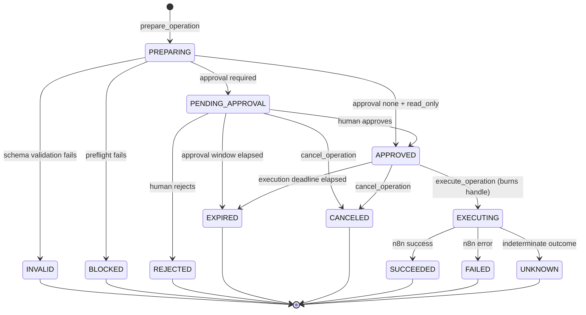

# n8n Operator — Build Plan

> **Status:** Architecture & bootstrap phase. No product functionality implemented.
> **Normative scope:** This document is the single source of truth for the product
> definition, version boundaries, repository structure, operation state machine,
> workflow registry schema, MCP tool inventory, storage model, security boundaries,
> test strategy, and acceptance criteria. Other documents in `docs/` elaborate on
> these definitions but must not contradict them. Where a conflict exists, this
> document wins and the other document is a defect.

---

## 1. Product definition

**n8n Operator is a governed MCP control plane for discovering, validating, executing, and debugging approved n8n workflows from Claude, ChatGPT, Codex, and compatible MCP clients.**

### 1.1 The problem

n8n is an excellent workflow engine and a poor agent surface. Pointing an LLM at a
raw n8n instance means handing it an unbounded, unversioned, credential-bearing
remote-execution primitive. The workflow list is discovered at runtime, the input
contract is implicit in the node graph, failures surface as raw execution JSON, and
every webhook is a live production side effect. There is no place to stand between
"the model decided to do a thing" and "the thing happened."

### 1.2 What n8n Operator is

A policy enforcement point that sits between MCP clients and one or more n8n
instances. It exposes a small, stable, well-typed tool surface and refuses to do
anything that is not explicitly approved in advance.

Five capabilities, in order of the lifecycle:

1. **Discover** — expose only the workflows an operator has explicitly registered,
   with human-authored titles, descriptions, risk classifications, and input schemas.
2. **Validate** — check caller-supplied arguments against a declared JSON Schema
   *before* anything reaches n8n, returning structured, model-actionable errors.
3. **Preflight** — verify that the target workflow is live, active, unmodified since
   registration, and that its instance is reachable, before an operation is offered
   for approval.
4. **Execute** — run the workflow through an explicit `prepare -> approve -> execute`
   lifecycle with operation handles, idempotency, timeouts, and a durable audit trail.
5. **Debug** — return redacted, structured execution traces so a model can explain a
   failure without being handed raw credentials or full customer payloads.

### 1.3 What n8n Operator is not

- Not an n8n replacement, scheduler, or runtime. n8n executes; Operator governs.
- Not a general-purpose n8n API proxy. There is no passthrough tool, ever.
- Not a workflow editor in v1 or v2. Workflow authoring stays in the n8n UI until v3,
  and even then it is governed and diff-reviewed.
- Not an autonomous remediation agent. It surfaces failures; humans decide.

### 1.4 Design principles

| # | Principle | Consequence |
|---|---|---|
| P1 | **Default deny** | An n8n workflow that is not in the registry does not exist to the model, even if it is live on the instance. See [ADR-002](adr/ADR-002-default-deny-registry.md). |
| P2 | **Deterministic before LLM** | Every gate that can be a schema check, a hash comparison, or a state transition is one. The model is never the enforcement mechanism. See [ADR-007](adr/ADR-007-deterministic-before-llm.md). |
| P3 | **The client never holds credentials** | n8n API keys and webhook secrets are server-owned, never returned by a tool, never in the registry file. See [ADR-006](adr/ADR-006-server-owned-n8n-credentials.md). |
| P4 | **Side effects are capability-gated** | Execution requires a single-use, server-issued operation handle bound to exact arguments. See [ADR-003](adr/ADR-003-operation-handles.md). |
| P5 | **Approval is out-of-band** | Humans approve through the CLI (canonical) or the local approval page (convenience), never through an MCP tool a compromised client could call. See [ADR-010](adr/ADR-010-approval-delivery-and-expiry.md). |
| P6 | **No silent repetition** | v1 never retries automatically. Ambiguous outcomes are surfaced as `UNKNOWN`. See [ADR-005](adr/ADR-005-no-automatic-retry-v1.md). |
| P7 | **Everything is auditable** | Every state transition and every decision is an append-only, hash-chained audit record. |
| P8 | **Portable core** | Protocol and transport are adapters around a transport-agnostic domain core. See [ADR-001](adr/ADR-001-portable-mcp-core.md). |
| P9 | **Never claim more than is known** | Unverifiable conditions are reported as unverifiable, indeterminate outcomes stay indeterminate, and no gate is weakened by an assumption that has not been demonstrated. See [ADR-008](adr/ADR-008-conservative-definition-canonicalization.md), [ADR-009](adr/ADR-009-dispatch-correlation.md). |

### 1.5 Primary users

- **The operator** — the person who owns the n8n instance, curates the registry,
  and approves side-effecting runs. Interacts via the CLI, which is the canonical
  approval channel, and optionally the local approval page (ADR-010).
- **The agent** — an MCP client (Claude, ChatGPT, Codex, or any compatible host)
  acting on behalf of the operator. Interacts only via MCP tools.
- **The auditor** (v2+) — reviews what ran, on whose authority, with what arguments.

---

## 2. Version outcomes

### 2.1 v1 outcome

> A single operator can point an MCP client at their own n8n instance and safely run
> a curated set of workflows, with every side effect gated by an explicit human
> approval and recorded in a tamper-evident audit log.

v1 is done when a solo operator can, without writing code:

- register workflows in a YAML file and have them validated at load time;
- see exactly those workflows from Claude Desktop over stdio and from a remote client
  over Streamable HTTP;
- have malformed arguments rejected with actionable errors before n8n is touched;
- be told, before approving, that a workflow has drifted from its registered definition;
- approve or reject a pending operation from the CLI on the Operator machine, or in the
  local approval page when one is running;
- execute the approved operation exactly once, even if the client retries;
- read a redacted failure trace good enough to diagnose the failing node;
- export a complete audit log of everything that happened.

**Explicit v1 non-goals:** multi-user, multi-instance, RBAC, retries, workflow
editing, scheduling, monitoring dashboards, notifications, template libraries.

### 2.2 v2 outcome

> A team can operate multiple n8n environments under role-based access control, with
> team approvals, governed retries, monitoring, and visibility into how workflow
> definitions change over time.

v2 is done when:

- PostgreSQL is the supported production store and SQLite is dev-only;
- users authenticate through OAuth/OIDC and carry an identity into every audit record;
- roles (`viewer`, `operator`, `approver`, `admin`) gate both tools and workflows;
- multiple n8n instances are registered as named environments with per-environment
  policy (e.g. `staging` auto-approves, `prod` requires two approvers);
- an approval can require N distinct human approvers and route to them;
- a failed operation can be retried only through an explicit, separately-audited,
  policy-checked `retry_operation` call that mints a *new* operation;
- definition drift is presented as a reviewable structural diff, not just a hash mismatch;
- operational metrics and health are exposed for monitoring.

### 2.3 v3 outcome

> Workflows themselves become governed artifacts: declaratively defined, evaluated
> against test suites before promotion, changed through reviewed diffs, and assembled
> from a vetted template library under enterprise controls.

v3 is done when:

- a declarative workflow source format compiles to n8n workflow JSON deterministically;
- an evaluation lab runs a workflow against fixture suites and scores it before promotion;
- workflow changes flow through `plan -> review -> apply` with rollback;
- a remediation assistant proposes (never applies) fixes for recurring failures;
- a template library lets an operator instantiate vetted workflows with parameters;
- enterprise controls exist: SSO enforcement, data residency, retention policy,
  break-glass procedures, and exportable compliance evidence.

---

## 3. Exact feature boundaries

The table is normative. An em dash means the capability does not exist in that version.

| Capability | v1 | v2 | v3 |
|---|---|---|---|
| Users | Single local operator | Multiple users, organizations | Same as v2 |
| Identity | Implicit local principal | OAuth/OIDC | OAuth/OIDC + enforced SSO |
| Authorization | All-or-nothing (registry is the only gate) | RBAC over tools, workflows, environments | RBAC + policy-as-code |
| n8n instances | Exactly one | Many, as named environments | Many |
| Datastore | SQLite | PostgreSQL (SQLite dev-only) | PostgreSQL |
| MCP transports | stdio + Streamable HTTP | stdio + Streamable HTTP | stdio + Streamable HTTP |
| Registry | YAML file, hand-authored | YAML + per-environment overlays | YAML + compiled sources |
| Workflow inspection | Read-only | Read-only + definition diffs | Read-only + diffs + evaluations |
| Input validation | JSON Schema 2020-12 | Same + policy predicates | Same + compiler-derived schemas |
| Preflight | Reachability, active, drift, credential *bindings*, correlation warning | Same + environment policy | Same + evaluation freshness |
| Approval | Single human; CLI canonical, local page optional | N-of-M team approvals, routed | Same + policy-driven quorum |
| Approval delivery | `approval_required` + operation ID + instructions; URL only to local callers | Routed notification (`request_approval`) | Same |
| Idempotency | Namespaced by principal + environment + workflow + key | Same, with real principals and environments | Same |
| Argument limits | Core-enforced canonical size cap | Same + per-principal quotas | Same |
| Dispatch correlation | Opt-in response envelope; absence degrades reconciliation only | Same + exact-ID reconciliation | Same |
| Expiry | Lazy transactional (authoritative) + best-effort sweeper | Same | Same |
| Retries | **None, ever** (ADR-005) | Governed, explicit, new operation, recalculated (ADR-012) | Same |
| Audit anchoring | — | `AuditAnchor`: signed local file, HTTPS webhook | + KMS, transparency log, WORM |
| Audit | Append-only hash chain, local | Same + export, retention | Same + compliance evidence packs |
| Monitoring | Health tool + structured logs | Metrics, alerting hooks | Same + SLOs |
| Workflow editing | **None** | **None** | Governed compile/plan/apply |
| Evaluation | — | — | Evaluation lab |
| Remediation | — | — | Advisory assistant |
| Templates | — | — | Vetted template library |

### 3.1 Boundaries that hold in every version

These are product invariants, not v1 limitations:

1. There is no MCP tool that takes a raw n8n workflow ID, URL, or arbitrary payload.
2. There is no MCP tool that returns a credential, API key, webhook secret, or token.
3. There is no MCP tool that approves an operation. Approval is out-of-band, always.
4. Execution requires a handle that was minted by a preceding `prepare`, and each
   handle is valid for exactly one execution attempt.
5. Nothing is retried without a new, separately-audited authorization.
6. The audit log is append-only. No tool, CLI command, or code path updates or
   deletes an audit record.

---

## 4. Repository structure

```
n8n-operator/
├── README.md
├── LICENSE
├── CHANGELOG.md
├── SECURITY.md                     # vulnerability reporting (phase 9)
├── CONTRIBUTING.md                 # dev setup, PR gate, conventions (phase 9)
├── pyproject.toml                  # uv-managed, src layout, Python 3.12
├── alembic.ini
├── .env.example
├── .gitignore
├── .python-version
├── .github/
│   ├── dependabot.yml              # weekly Python and Actions updates
│   └── workflows/
│       ├── ci.yml                  # lint, types, coverage, postgres harness, package smoke
│       ├── codeql.yml              # static security analysis
│       ├── live-n8n.yml            # manual real-instance compatibility gate
│       ├── secret-scan.yml         # full-history Gitleaks scan
│       └── release.yml             # tag-triggered: verify, attest, GitHub Release; PyPI gated
├── docs/
│   ├── BUILD_PLAN.md               # this file — normative
│   ├── ARCHITECTURE.md             # components, boundaries, data flow
│   ├── THREAT_MODEL.md             # assets, trust boundaries, threats, mitigations
│   ├── WORKFLOW_REGISTRY.md        # registry authoring reference
│   ├── MCP_TOOLS.md                # tool contracts — normative for tool I/O
│   ├── N8N_COMPATIBILITY.md        # phase 4 empirical findings (ADR-008, ADR-009)
│   ├── COMPATIBILITY_MATRIX.md     # tested n8n versions and feature support (v1 release)
│   ├── LIVE_N8N_TESTING.md         # repeatable real-instance smoke contract
│   ├── V1_LIMITATIONS.md           # plain-language index of v1 boundaries (phase 9)
│   ├── RECONCILING_UNKNOWN.md      # manual reconciliation guide for UNKNOWN (phase 9)
│   ├── RELEASE_ROLLBACK.md         # rollback/yank procedure for a bad release (phase 9)
│   ├── V2_TRACEABILITY.md          # v2 outcome/tool -> AC/test/doc/stage matrix (stage 00)
│   ├── POSTGRES_OPERATIONS.md      # backup/restore/rollback, capacity, dev setup (stage 01)
│   ├── OIDC_SETUP.md               # provider-neutral OIDC setup + reference config (stage 02)
│   ├── LEAST_PRIVILEGE.md          # worked role/scope profiles for three org shapes (stage 03)
│   ├── METRICS_AND_ALERTS.md       # get_metrics/list_audit_events/alert-hook guide (stage 08)
│   ├── AUDIT_ANCHORING.md          # key mgmt, publish/verify, protection scope (stage 09)
│   ├── GTM_STARTER_KITS.md         # starter-kit tour + real journey walkthroughs (stage 10)
│   ├── OPERATOR_GUIDE.md           # clean-machine path to a working staging env (stage 10)
│   ├── APPROVER_GUIDE.md           # decision context, self-approval, quorum (stage 10)
│   ├── TROUBLESHOOTING.md          # symptom-to-cause decision tree (stage 10)
│   ├── WHAT_THIS_REFUSES_TO_DO.md  # every refusal, why, and the threat it closes (stage 10)
│   ├── MCP_CLIENT_RECIPES.md       # literal tool-call JSON for the 20-tool surface (stage 10)
│   ├── STAGE_11_RELEASE_REPORT.md  # findings table, completion gate, go/no-go (stage 11)
│   ├── evidence/
│   │   ├── stage11-consistency-audit.md  # mechanized audit re-verification (stage 11)
│   │   ├── stage11-live-n8n-run.md       # real n8n instance run evidence (stage 11)
│   │   ├── stage11-load-test-results.md  # load test evidence (stage 11)
│   │   ├── stage11-migration-rehearsal.md # v2 migration rehearsal evidence (stage 11)
│   │   ├── stage11-packaging-ci-audit.md # packaging/provenance/CI audit (stage 11)
│   │   ├── stage11-protocol-sessions.md  # protocol session evidence (stage 11)
│   │   ├── stage11-security-review.md    # internal security review (stage 11, task 5)
│   │   └── stage11-security-review-addendum.md # residual finding: workflow-branch actor leak (stage 11, task 5)
│   ├── superpowers/
│   │   ├── plans/
│   │   │   └── 2026-08-30-stage-11-v2-integration-release-and-proof.md
│   │   └── specs/
│   │       └── 2026-08-30-stage-11-v2-integration-release-and-proof-design.md
│   ├── adr/
│   │   ├── ADR-001-portable-mcp-core.md
│   │   ├── ADR-002-default-deny-registry.md
│   │   ├── ADR-003-operation-handles.md
│   │   ├── ADR-004-sqlite-to-postgres.md
│   │   ├── ADR-005-no-automatic-retry-v1.md
│   │   ├── ADR-006-server-owned-n8n-credentials.md
│   │   ├── ADR-007-deterministic-before-llm.md
│   │   ├── ADR-008-conservative-definition-canonicalization.md
│   │   ├── ADR-009-dispatch-correlation.md
│   │   ├── ADR-010-approval-delivery-and-expiry.md
│   │   ├── ADR-011-argument-limits-and-idempotency.md
│   │   ├── ADR-012-governed-retry-and-audit-anchoring.md
│   │   ├── ADR-013-organization-tenant-and-principal-model.md
│   │   ├── ADR-014-oidc-trust-and-session-model.md
│   │   ├── ADR-015-rbac-authorization-evaluation.md
│   │   ├── ADR-016-environment-registry-overlays.md
│   │   ├── ADR-017-team-approval-quorum-semantics.md
│   │   ├── ADR-018-notification-and-alert-hook-delivery.md
│   │   ├── ADR-019-metrics-cardinality-and-privacy.md
│   │   ├── ADR-020-token-link-approval-not-an-authenticated-web-session.md
│   │   └── ADR-021-external-anchoring-guarantee-is-manual-and-narrow.md
├── examples/
│   ├── registry/
│   │   ├── workflows.example.yaml         # annotated sample registry
│   │   ├── synthetic_test_workflow.json   # importable n8n workflow for testing (phase 9)
│   │   └── starter-kits/                  # sanitized GTM starter-kit registry (stage 10)
│   │       └── gtm-starter-kits.yaml
│   ├── environments/                      # annotated sample overlays (stage 04)
│   │   ├── development.yaml               # no overrides — inherits the base registry
│   │   ├── staging.yaml                   # a new rate ceiling the base doesn't set
│   │   └── production.yaml                # approval required + tighter limits
│   └── mcp-clients/                       # ready-to-copy client configs (phase 9)
│       ├── README.md
│       ├── claude_desktop_config.json     # stdio
│       ├── streamable_http_client.json    # generic remote / Streamable HTTP
│       └── openai_responses_tool.json     # OpenAI Responses MCP tool object
├── docker/
│   ├── live-n8n/                   # reproducible live-n8n harness (phase 9)
│   │   └── docker-compose.yml      # pinned, loopback-only, project-scoped instance
│   └── postgres-test/              # pinned, loopback-only Postgres integration harness (stage 01)
│       └── docker-compose.yml
├── scripts/
│   ├── check_docs_consistency.py   # doc invariants enforced in CI
│   ├── demo.sh                     # five-minute no-n8n-required walkthrough (phase 9)
│   ├── release_smoke.sh            # isolated built-wheel release verification
│   ├── mcp_session_smoke.py        # real MCP client session over stdio, built wheel
│   ├── live_n8n_up.sh              # bring up + import/activate the live-n8n harness
│   ├── live_n8n_down.sh            # scoped teardown of the live-n8n harness
│   ├── check_release_consistency.py # version/tag/changelog agreement, release.yml
│   ├── inspect_release_artifacts.sh # wheel/sdist must ship no credential/DB file
│   ├── extract_changelog_section.py # one version's CHANGELOG.md section as release notes
│   └── load_test.py                # in-process threading load/concurrency harness (stage 11)
├── src/
│   └── n8n_operator/
│       ├── __init__.py             # version only
│       ├── __main__.py             # `python -m n8n_operator` -> CLI
│       ├── py.typed
│       ├── config.py               # settings (Pydantic v2 BaseSettings)
│       ├── errors.py               # error taxonomy
│       ├── logging_setup.py        # structured JSON logs, correlation IDs, scrubbing
│       ├── core/                   # transport-agnostic domain (ADR-001)
│       │   ├── __init__.py
│       │   ├── models.py           # domain types: Operation, Principal, Result
│       │   ├── state_machine.py    # section 5 — the only place transitions are decided
│       │   ├── handles.py          # ADR-003 — mint, bind, verify, burn
│       │   ├── idempotency.py      # canonical JSON + argument fingerprints
│       │   ├── redaction.py        # output redaction engine
│       │   ├── service.py          # use-case orchestration (the portable core)
│       │   ├── postgres_migration.py  # SQLite -> Postgres migration orchestration (stage 01)
│       │   ├── identity.py         # JIT provisioning, whoami, CLI identity (ADR-013, ADR-014; stage 02/03)
│       │   ├── authorization.py    # RBAC evaluator: role x workflow-scope x environment-scope (ADR-015; stage 03)
│       │   └── definition_diff.py  # structural workflow-diff algorithm (ADR-008; stage 07)
│       ├── registry/               # section 6 — YAML registry
│       │   ├── __init__.py
│       │   ├── schema.py           # Pydantic v2 models for registry entries
│       │   ├── loader.py           # parse, validate, snapshot, hash
│       │   └── validation.py       # caller-argument validation vs JSON Schema
│       ├── n8n/                    # the only module that talks to n8n
│       │   ├── __init__.py
│       │   ├── client.py           # httpx client, timeouts, no retries (ADR-005)
│       │   ├── canonicalization.py # versioned, evidence-driven hashing (ADR-008)
│       │   ├── preflight.py        # liveness, active, drift, credential checks
│       │   ├── health.py           # reachability adapter (HealthPort)
│       │   ├── dispatch.py         # webhook dispatch adapter (DispatchPort)
│       │   └── types.py            # n8n API response models
│       ├── identity/               # the only module that speaks OIDC (ADR-014; stage 02)
│       │   ├── __init__.py
│       │   └── oidc.py             # JWT/JWKS validation, discovery, key rotation
│       ├── storage/                # section 8 — persistence
│       │   ├── __init__.py
│       │   ├── models.py           # SQLAlchemy 2.0 ORM
│       │   ├── repository.py       # data access, portable SQL only (ADR-004)
│       │   ├── session.py          # engine/session lifecycle, pooling, retry (stage 01)
│       │   ├── health.py           # database connectivity probe (stage 01)
│       │   ├── postgres_migration.py  # SQLite -> PostgreSQL copy tool (stage 01)
│       │   └── migrations/         # Alembic
│       │       ├── env.py
│       │       ├── script.py.mako
│       │       └── versions/
│       │           ├── 0001_initial.py    # AC-24: empty DB upgrades to head
│       │           ├── 0002_approval_binding_hash.py  # phase 6, ADR-010
│       │           ├── 0003_v2_foundation_schema.py   # v2 data model (stage 01)
│       │           ├── 0004_service_principal_credential_ref.py  # stage 02
│       │           ├── 0005_approval_assigned_to.py  # stage 05
│       │           ├── 0006_audit_log_subject_index.py  # stage 06
│       │           └── 0007_workflow_definition_snapshots.py  # stage 07
│       ├── notifications/          # NotificationSink implementations (ADR-018; stage 05)
│       │   ├── __init__.py
│       │   ├── base.py             # local NotificationEventLike/DeliveryOutcome shapes
│       │   ├── local.py            # LocalNotificationSink — structured log line
│       │   └── webhook.py          # WebhookNotificationSink — authenticated HTTPS POST
│       ├── audit/                  # append-only, hash-chained
│       │   ├── __init__.py
│       │   ├── chain.py            # chain construction + verification
│       │   └── writer.py           # the only writer of audit records
│       ├── audit_anchor/           # AuditAnchor implementations (ADR-012 section 2; stage 09)
│       │   ├── __init__.py
│       │   ├── keys.py             # Ed25519 keygen, 0600 private-key file storage
│       │   ├── base.py             # local ChainAnchorLike shapes + sign/verify
│       │   ├── local_file.py       # LocalFileAnchor — signed, append-only, flock-guarded
│       │   └── webhook.py          # HttpsWebhookAnchor — authenticated HTTPS POST
│       ├── approval/               # out-of-band human approval
│       │   ├── __init__.py
│       │   ├── app.py              # FastAPI app, loopback-bound
│       │   ├── routes.py
│       │   └── templates/          # server-rendered approval page
│       ├── mcp/                    # MCP adapter (thin — ADR-001)
│       │   ├── __init__.py
│       │   ├── server.py           # MCPServer wiring
│       │   ├── tools.py            # tool definitions -> core.service calls
│       │   ├── resources.py        # registry:// and audit:// resources
│       │   └── transports.py       # stdio + Streamable HTTP
│       └── cli/                    # Typer
│           ├── __init__.py
│           ├── main.py
│           └── commands/
│               ├── __init__.py
│               ├── registry.py     # validate, list, show, hash, reload
│               ├── serve.py        # serve stdio | serve http | serve approval
│               ├── operations.py   # list, show, cancel, expire
│               ├── audit.py        # verify, export, list (stage 08)
│               ├── health.py       # get_instance_health, from the command line
│               ├── db.py           # init, migrate, status, migrate-to-postgres
│               ├── identity.py     # orgs, memberships, service principals (stage 02)
│               ├── environment.py  # environments, overlays (stage 04)
│               ├── notifications.py  # retry-failed (stage 05), check-alerts (stage 08)
│               ├── metrics.py      # show (stage 08)
│               └── anchor.py       # init-key, publish, verify, status (stage 09)
└── tests/
    ├── conftest.py
    ├── fixtures/
    │   └── canonicalization/       # sanitized harness fixtures (ADR-008)
    ├── unit/                       # pure logic, no I/O
    ├── property/                   # Hypothesis invariants (section 10.2)
    ├── contract/                   # MCP tool schema + error taxonomy contracts
    ├── integration/                # real SQLite and mock n8n
    │   ├── conftest.py                          # moved from integration/postgres/ (stage 11, task 3a)
    │   ├── test_v2_integrated_scenario.py       # two-org/three-env scenario (stage 11)
    │   ├── test_tenant_isolation_matrix.py      # cross-org read-surface regression guard (stage 11)
    │   ├── test_audit_workflow_branch_actor_scope.py  # xfail: workflow-branch actor leak (stage 11)
    │   ├── test_mcp_metrics_audit_tools.py      # get_metrics/list_audit_events MCP contract (stage 08/11)
    │   ├── test_metrics_audit_service.py        # service-level metrics/audit scope tests (stage 08/11)
    │   └── postgres/
    │       ├── test_v2_migration_rehearsal.py         # v2-shaped migration + rollback rehearsal (stage 11)
    │       └── test_audit_log_cross_org_isolation.py  # T-66 matrix against real PostgreSQL (stage 11)
    └── live/                       # real n8n, explicitly opt-in
```

**Layering rule (enforced in CI):** dependencies point inward only.
`cli`, `mcp`, `approval` -> `core` -> `registry`, `storage`, `audit`, `n8n`.
`core` must not import `mcp`, `cli`, `approval`, or `fastapi`.

---

## 5. Operation state machine

An **operation** is the unit of governance: one intent to run one registered
workflow with one exact set of arguments. It is created by `prepare_operation` and
is the subject of every audit record.

### 5.1 States

Twelve states. This list is exhaustive and is the vocabulary used by every other
document, the `operations.state` column, and the `state` field of every tool response.

| State | Kind | Meaning |
|---|---|---|
| `PREPARING` | transient | Operation record created; validation and preflight in progress. |
| `INVALID` | terminal | Arguments failed registry input-schema validation. Nothing reached n8n. |
| `BLOCKED` | terminal | Preflight failed: workflow inactive, definition drift, missing node credentials, or instance unreachable. |
| `PENDING_APPROVAL` | active | Validation and preflight passed. Awaiting an out-of-band human decision. |
| `APPROVED` | active | A human approved, or the registry classified the workflow as `approval: none`. Not yet executed. |
| `REJECTED` | terminal | A human explicitly denied the operation. |
| `EXPIRED` | terminal | The approval window elapsed while `PENDING_APPROVAL` or `APPROVED`. |
| `CANCELED` | terminal | Canceled by the caller or operator before execution was dispatched. |
| `EXECUTING` | active | Dispatched to n8n; awaiting completion. |
| `SUCCEEDED` | terminal | n8n reported successful completion. |
| `FAILED` | terminal | n8n reported an execution error, or the workflow completed with a failure status. |
| `UNKNOWN` | terminal | Dispatch outcome is indeterminate — the request may or may not have taken effect. Requires human resolution. **Never auto-retried** (ADR-005). |

### 5.2 Transitions

Every transition is written by `core/state_machine.py` and by nothing else. Each
emits exactly one `operation_events` row and one `audit_log` row.

| # | From | To | Trigger | Guard |
|---|---|---|---|---|
| T01 | *(none)* | `PREPARING` | `prepare_operation` | Workflow ID resolves in the active registry snapshot. |
| T02 | `PREPARING` | `INVALID` | Argument validation fails | — |
| T03 | `PREPARING` | `BLOCKED` | Preflight fails | — |
| T04 | `PREPARING` | `PENDING_APPROVAL` | Validation + preflight pass | Registry `approval` is `required`. Sets `approval_expires_at`. |
| T05 | `PREPARING` | `APPROVED` | Validation + preflight pass | Registry `approval` is `none` **and** `side_effects` is `read_only` — both required, evaluated against the snapshot in force now. Sets `execution_deadline`. Preflight emits an `UNATTENDED_EXECUTION` warning (ADR-009). |
| T06 | `PENDING_APPROVAL` | `APPROVED` | Human approves in the approval app | Approval token valid, unexpired, single-use. Sets `execution_deadline`. |
| T07 | `PENDING_APPROVAL` | `REJECTED` | Human rejects | Approval token valid and unexpired. |
| T08 | `PENDING_APPROVAL` | `EXPIRED` | Lazy transactional expiry on any read or action; best-effort sweeper; `operations expire` | `now > approval_expires_at`. Applied before state is evaluated (invariant I9, [ADR-010](adr/ADR-010-approval-delivery-and-expiry.md)). |
| T09 | `PENDING_APPROVAL` | `CANCELED` | `cancel_operation` | Caller is the originating principal. |
| T10 | `APPROVED` | `EXECUTING` | `execute_operation` | Handle valid, unburned, argument fingerprint matches, `now <= execution_deadline`, definition hash still matches. Burns the handle. |
| T11 | `APPROVED` | `EXPIRED` | Lazy transactional expiry on any read or action; best-effort sweeper; `operations expire` | `now > execution_deadline`. Applied before state is evaluated (invariant I9, [ADR-010](adr/ADR-010-approval-delivery-and-expiry.md)). |
| T12 | `APPROVED` | `CANCELED` | `cancel_operation` | Caller is the originating principal. |
| T13 | `EXECUTING` | `SUCCEEDED` | n8n reports success | — |
| T14 | `EXECUTING` | `FAILED` | n8n reports error | — |
| T15 | `EXECUTING` | `UNKNOWN` | Timeout, connection loss, or ambiguous response after dispatch | **No retry**, and never inferred to be a non-event ([ADR-009](adr/ADR-009-dispatch-correlation.md)). Recorded for human resolution. |

There are no other transitions. In particular there is no edge out of any terminal
state, no `FAILED -> EXECUTING`, and no edge out of `UNKNOWN` (a v2 governed retry
creates a **new** operation that references the old one; it does not move the old one).

### 5.3 Diagram



### 5.4 Invariants

Enforced in code and verified by property tests (section 10.2):

- **I1** — An operation's state is only ever changed by an edge in section 5.2.
- **I2** — Terminal states have no outgoing edges.
- **I3** — `EXECUTING` is reachable only from `APPROVED`, and only by burning a handle.
- **I4** — A handle can be burned at most once (enforced by a conditional database
  update whose affected-row count is checked, not by application logic alone).
- **I5** — Arguments are immutable after `PREPARING`. The fingerprint checked at
  `execute` is the fingerprint recorded at `prepare`.
- **I6** — Every state change appends one `operation_events` row and one `audit_log`
  row, in the same database transaction as the state change.
- **I7** — An operation in `UNKNOWN` is never automatically acted upon.
- **I8** — Two `prepare_operation` calls sharing an idempotency namespace
  `(principal, environment, workflow_id, idempotency_key)` return the same operation,
  never two ([ADR-011](adr/ADR-011-argument-limits-and-idempotency.md)).
- **I9** — No operation is read or acted upon in a state whose deadline has already
  passed: any overdue T08 or T11 is applied first, in the same transaction
  ([ADR-010](adr/ADR-010-approval-delivery-and-expiry.md)).
- **I10** — No operation is persisted whose canonical arguments exceed the effective
  size limit; the check precedes the write
  ([ADR-011](adr/ADR-011-argument-limits-and-idempotency.md)).
- **I11** — An approval decision authorizes exactly one operation. No operation inherits,
  extends, or reuses another operation's approval
  ([ADR-012](adr/ADR-012-governed-retry-and-audit-anchoring.md)).
- **I12** — An approval URL is never returned to a caller that cannot reach it
  ([ADR-010](adr/ADR-010-approval-delivery-and-expiry.md)).

### 5.5 v2 invariants (contracts fixed at stage 00; enforced starting stage 05)

The v1 state machine above is **unchanged in v2** — no new state, no new transition, no
edge added out of a terminal state. These two invariants govern the v2 authorization and
approval-routing layers that sit alongside it, at the same formal status as I1–I12:

- **I13** — An operation's approval-policy snapshot is fixed the moment the operation
  enters `PENDING_APPROVAL` (T04) and never gains members afterward. A principal removed
  from the organization after the snapshot is taken can no longer decide; a principal
  granted the approver role after the snapshot is taken was never eligible for this
  operation. A decision already cast survives removal
  ([ADR-017](adr/ADR-017-team-approval-quorum-semantics.md)).
- **I14** — Authorization denial is never distinguishable from absence. Every response an
  unauthorized caller can reach — for a workflow, an environment, or an operation outside
  their scope — is identical to the response a nonexistent one would produce. There is no
  `FORBIDDEN` error code in any version
  ([ADR-015](adr/ADR-015-rbac-authorization-evaluation.md), extending boundary B1's
  anti-enumeration guarantee across the v2 organization boundary).

---

## 6. Workflow registry schema

The registry is a YAML file. It is the **allowlist**: a workflow absent from it is
invisible and unexecutable (ADR-002). Authoring guidance and worked examples live in
[WORKFLOW_REGISTRY.md](WORKFLOW_REGISTRY.md); the normative shape is here.

### 6.1 Document shape

```yaml
apiVersion: n8n-operator/v1        # required; pinned, validated on load
metadata:
  name: string                     # required; registry name for logs and audit
  description: string              # optional
defaults:                          # optional; per-workflow fields override these
  approval: required               # none | required
  timeout_seconds: 60
  approval_ttl_seconds: 900
  execution_ttl_seconds: 300
workflows:                         # required; list, may be empty
  - <workflow entry>
```

### 6.2 Workflow entry fields

| Field | Type | Required | Default | Notes |
|---|---|---|---|---|
| `id` | string | yes | — | Stable operator-chosen ID matching `^[a-z0-9]+(?:[._-][a-z0-9]+)*$`. The only identifier an MCP client ever sees or sends. Unique within the registry. |
| `n8n_workflow_id` | string | yes | — | The n8n-side ID. **Never** exposed through any MCP tool. |
| `title` | string | yes | — | Human-readable; shown to the model and in the approval page. |
| `description` | string | yes | — | What it does and when to use it. Written for a model reader. |
| `owner` | string | yes | — | Accountable human. Free-form in v1; resolved to an identity in v2. |
| `version` | integer | yes | — | Operator-managed. Bumped when the registered contract changes. |
| `definition_hash` | string | yes | — | `sha256:<hex>` of the canonicalized n8n workflow definition at registration time. Drift detection compares against this. |
| `risk` | enum | yes | — | `low` / `medium` / `high`. Advisory metadata surfaced to the model and the approver. |
| `side_effects` | enum | yes | — | `read_only` / `external_write` / `irreversible`. Load-time policy input: only `read_only` may set `approval: none`. |
| `approval` | enum | no | `defaults.approval` | `none` / `required`. `none` is rejected at load time unless `side_effects: read_only`. |
| `trigger` | object | yes | — | See 6.3. How Operator invokes the workflow. |
| `input_schema` | object | yes | — | JSON Schema draft 2020-12. Must be an object schema with `additionalProperties: false`. Rejected at load time otherwise. |
| `output` | object | no | `{}` | See 6.4. Redaction and shaping of results. |
| `limits` | object | no | inherits `defaults` | See 6.5. |
| `tags` | list of string | no | `[]` | Free-form grouping, filterable in `list_workflows`. |
| `enabled` | boolean | no | `true` | `false` hides the workflow from discovery and refuses preparation. |

### 6.3 `trigger`

| Field | Type | Required | Notes |
|---|---|---|---|
| `type` | enum | yes | v1 supports `webhook` only. `api` (n8n REST execution) is reserved for v2. |
| `method` | enum | yes | `POST` / `GET`. |
| `path` | string | yes | Path component only, e.g. `/webhook/abc123`. Base URL comes from server config, never the registry. |
| `auth` | enum | yes | `none` / `header` / `basic`. |
| `secret_ref` | string | conditional | Required when `auth` is not `none`. An **indirect reference** to a secret (e.g. `env:N8N_WEBHOOK_TOKEN_CRM`). A literal secret in this field is a load-time error (ADR-006). |
| `correlation` | enum | no | `none` (default) / `response_envelope`. Declares whether the workflow returns the Operator response envelope carrying an n8n execution ID. `none` is fully executable but has reduced reconciliation and debugging capability, reported by preflight as `NO_EXECUTION_CORRELATION` ([ADR-009](adr/ADR-009-dispatch-correlation.md)). |

### 6.4 `output`

| Field | Type | Default | Notes |
|---|---|---|---|
| `redact` | list of string | `[]` | JSONPath expressions; matched values are replaced with `"[REDACTED]"` before the result leaves the process. |
| `max_bytes` | integer | `65536` | Results larger than this are truncated with an explicit `truncated: true` marker. |
| `include_node_trace` | boolean | `false` | Whether `get_execution_log` may return per-node data for this workflow (still redacted). |

### 6.5 `limits`

| Field | Type | Default | Notes |
|---|---|---|---|
| `timeout_seconds` | integer | `defaults.timeout_seconds` | Wall clock for a single dispatch. Exceeding it yields `UNKNOWN`, not a retry. |
| `approval_ttl_seconds` | integer | `defaults.approval_ttl_seconds` | `PENDING_APPROVAL` lifetime. |
| `execution_ttl_seconds` | integer | `defaults.execution_ttl_seconds` | `APPROVED` lifetime before `EXPIRED`. |
| `max_concurrent` | integer | `1` | Concurrent `EXECUTING` operations for this workflow. |
| `rate_limit_per_minute` | integer | `null` | Optional ceiling on executions per minute. |
| `max_argument_bytes` | integer | server ceiling | Per-workflow cap on the canonical argument size. May lower the server ceiling `N8N_OPERATOR_MAX_ARGUMENT_BYTES`, never raise it (rule R11, [ADR-011](adr/ADR-011-argument-limits-and-idempotency.md)). |

### 6.6 Load-time validation rules

A registry that violates any rule fails to load. The server refuses to start, and
`n8n-operator registry validate` exits non-zero. Partial loading is not supported —
a bad registry never degrades into a partially-live allowlist.

| Rule | Check |
|---|---|
| R1 | `apiVersion` equals a supported value. |
| R2 | `id` is unique and matches the ID pattern. |
| R3 | `n8n_workflow_id` is unique across entries. |
| R4 | `input_schema` is a valid draft 2020-12 object schema with `additionalProperties: false`. |
| R5 | `approval: none` requires `side_effects: read_only`. |
| R6 | `secret_ref` is an indirect reference (`env:` or `keyring:`), never a literal. |
| R7 | `definition_hash` matches `^sha256:[0-9a-f]{64}$`. |
| R8 | `trigger.path` is a path, not an absolute URL, and contains no host component. |
| R9 | Every JSONPath in `output.redact` parses. |
| R10 | `risk: high` requires `approval: required`, which `defaults` may not weaken. |
| R11 | `limits.max_argument_bytes`, when present, is a positive integer not greater than the server ceiling `N8N_OPERATOR_MAX_ARGUMENT_BYTES`. |
| R12 | `trigger.correlation` is one of `none` / `response_envelope`, and `response_envelope` is only valid for `trigger.type: webhook`. |
| R13 | *(v2)* An environment overlay ([ADR-016](adr/ADR-016-environment-registry-overlays.md)) may only set `n8n_workflow_id`, `definition_hash`, `trigger.path`, `trigger.secret_ref`, `approval`, or `limits`. An overlay setting any other field — `input_schema`, `side_effects`, `risk`, `title`, `description`, or `tags` — fails to load. |
| R14 | *(v2)* An overlay's `approval`/`limits` may only strengthen relative to the base entry (raise `approval` toward `required`, tighten a limit), never weaken it. A `(workflow_id, environment_id)` pair has at most one overlay, enforced by a database unique constraint, not an application check. |
| R15 | *(v2)* `limits.quorum_count` greater than 1 requires `approval: required` — a workflow that never reaches `PENDING_APPROVAL` has nothing for a quorum count to govern (stage 05, [ADR-017](adr/ADR-017-team-approval-quorum-semantics.md)). |

### 6.7 Snapshots

Each successful load produces a **registry snapshot**: the canonicalized document,
its `sha256`, the source path, and a load timestamp, persisted in `registry_snapshots`.
Every operation records the snapshot it was prepared against, so an audit reader can
reconstruct exactly which contract was in force. Reloading is explicit
(`n8n-operator registry reload` or process restart); the registry is never re-read
mid-operation.

### 6.8 Definition canonicalization

`definition_hash` is taken over a canonicalized form of the n8n workflow definition. The
canonicalization is deliberately **conservative**: it drops only what has been proven not
to matter, because over-exclusion produces a silent false negative — a semantic change the
drift check does not notice. Rationale and the compatibility harness are in
[ADR-008](adr/ADR-008-conservative-definition-canonicalization.md); these seven rules are
normative.

| Rule | Statement |
|---|---|
| CAN-01 | **Inclusion by default.** Every field of the definition contributes to the canonical form unless it appears on the exclusion allowlist. Unrecognized and newly-introduced fields are included. |
| CAN-02 | **Exclusion requires proof.** A field joins the allowlist only after the phase-4 compatibility harness shows that varying it, all else equal, does not alter observable workflow behavior. |
| CAN-03 | **The allowlist is explicit.** An enumerated, versioned table in code; each entry records the field path, the justifying harness run, and the n8n version range covered. No wildcards or pattern families. |
| CAN-04 | **Deterministic serialization.** Keys sorted by code point, array order significant, strings NFC-normalized, one canonical number form, UTF-8, no insignificant whitespace. Canonicalization is idempotent. |
| CAN-05 | **Semantic changes must change the hash.** Node type, node parameters, credential bindings, connections, workflow settings, trigger configuration, and error-handling configuration are never excludable. |
| CAN-06 | **Only proven-cosmetic changes may preserve the hash.** Hash preservation requires a CAN-02-justified allowlist entry. There is no third category. |
| CAN-07 | **Canonicalization is versioned.** The algorithm version is part of the hash preimage. Changing it requires a new registry `apiVersion` and a deliberate re-hash, never a silent revaluation of existing entries. |

Phase 4 ships with an **empty exclusion allowlist**; entries are added one at a time as the
harness justifies them. Every harness run saves a sanitized fixture under
`tests/fixtures/canonicalization/` (instance URLs, credential identifiers, real workflow
IDs, and payload data stripped).

---

## 7. MCP tool inventory by version

Tool names, arguments, results, and errors are specified normatively in
[MCP_TOOLS.md](MCP_TOOLS.md). This section is the authoritative **inventory** — which
tools exist in which version.

### 7.1 v1 — 12 tools

| Tool | Category | Side effects | Purpose |
|---|---|---|---|
| `list_workflows` | Discover | none | List registered, enabled workflows with title, description, risk, side-effect class, and tags. |
| `describe_workflow` | Discover | none | Full contract for one workflow: description, input schema, limits, approval policy, output shape. |
| `get_instance_health` | Discover | none | Reachability and version of the configured n8n instance. No credentials returned. |
| `validate_input` | Validate | none | Check arguments against a workflow's input schema; returns structured, path-anchored errors. |
| `preflight_workflow` | Validate | none | Liveness, active status, definition-drift, credential-*binding* and correlation checks, without creating an operation. Non-blocking `warn` and `unverifiable` statuses report reduced capability without refusing ([ADR-009](adr/ADR-009-dispatch-correlation.md)). |
| `prepare_operation` | Lifecycle | creates an operation | Validate + preflight + mint an operation handle. Returns `PENDING_APPROVAL` (with `approval_required`, the operation ID, and human instructions; an approval URL only for local callers — invariant I12) or `APPROVED`, `INVALID`, or `BLOCKED`. |
| `get_operation` | Lifecycle | none | Current state, timestamps, deadlines, and approval status of one operation. |
| `execute_operation` | Lifecycle | **runs the workflow** | Burn the handle and dispatch to n8n. The only side-effecting tool in the product. |
| `cancel_operation` | Lifecycle | cancels | Move a `PENDING_APPROVAL` or `APPROVED` operation to `CANCELED`. |
| `list_operations` | Inspect | none | Filterable history of operations. |
| `get_execution_result` | Inspect | none | Redacted, size-capped result of a completed operation. |
| `get_execution_log` | Debug | none | Redacted structured trace: node sequence, per-node status, error node, error message. |

**v1 MCP resources:** `registry://workflows` (the active snapshot, minus n8n IDs and
secret refs) and `audit://operations/{operation_id}` (the event chain for one operation).

**v1 MCP prompts:** none. Prompts are a client-side affordance and add no governance.

### 7.2 v2 — adds 8 tools (20 total)

| Tool | Purpose |
|---|---|
| `whoami` | Resolved identity, organization, roles, and effective permissions. |
| `list_environments` | Registered n8n environments visible to the caller, with per-environment approval policy. |
| `request_approval` | Route a `PENDING_APPROVAL` operation to named approvers or a group. Still cannot *grant* approval. |
| `get_approval_status` | Which approvals have been collected, which are outstanding, against the required quorum. |
| `retry_operation` | Governed retry: creates a **new** operation linked to the original, re-running validation, preflight, and approval. Never reuses the original handle (ADR-005). |
| `diff_workflow_definition` | Structural diff between the registered `definition_hash` and the live definition. |
| `get_metrics` | Operation counts, outcome distribution, latency percentiles, drift counts. |
| `list_audit_events` | Query the audit chain within the caller's authorization scope. |

Every v1 tool gains an optional `environment` argument in v2, defaulting to the
caller's default environment.

### 7.3 v3 — adds 8 tools (28 total)

| Tool | Purpose |
|---|---|
| `compile_workflow` | Compile a declarative workflow source into n8n workflow JSON. Pure; no side effects. |
| `plan_workflow_change` | Produce a reviewable plan diffing the compiled output against the live workflow. |
| `apply_workflow_change` | Apply a previously-approved plan. Handle-gated and approval-gated exactly like execution. |
| `run_evaluation` | Run a workflow against a fixture suite in the evaluation lab. |
| `get_evaluation_report` | Scores, failures, and regressions from an evaluation run. |
| `suggest_remediation` | Advisory analysis of recurring failures. Proposes; never applies. |
| `list_templates` | Vetted workflow templates with their parameters. |
| `instantiate_template` | Produce a declarative workflow source from a template. Produces source, not a live workflow. |

---

## 8. Storage model

SQLAlchemy 2.0 ORM over SQLite in v1, PostgreSQL in v2. Every schema change is an
Alembic migration; the schema is never created by `create_all` outside tests. The
portability rules that make the v2 migration mechanical are in
[ADR-004](adr/ADR-004-sqlite-to-postgres.md).

### 8.1 Tables

**`principals`** — who acted. v1 holds exactly one row (`local`).

| Column | Type | Notes |
|---|---|---|
| `id` | text PK | ULID. |
| `kind` | text | `local` in v1; `user` or `service` in v2. |
| `display_name` | text | |
| `external_subject` | text null | OIDC subject in v2. |
| `created_at` | timestamptz | |

**`registry_snapshots`** — section 6.7.

| Column | Type | Notes |
|---|---|---|
| `id` | text PK | ULID. |
| `content_hash` | text unique | `sha256:<hex>` of the canonicalized document. |
| `source_path` | text | |
| `document` | json | Canonicalized registry, secrets already indirected. |
| `loaded_at` | timestamptz | |

**`workflow_bindings`** — one resolved registry entry within one snapshot.

| Column | Type | Notes |
|---|---|---|
| `id` | text PK | ULID. |
| `snapshot_id` | text FK to `registry_snapshots.id` | |
| `workflow_id` | text | Registry ID. Unique per snapshot. |
| `n8n_workflow_id` | text | Never leaves the server. |
| `definition_hash` | text | Registered hash. |
| `side_effects` | text | |
| `approval_policy` | text | |
| `input_schema` | json | |

**`operations`** — the governance record.

| Column | Type | Notes |
|---|---|---|
| `id` | text PK | `op_<ULID>` — the operation handle (ADR-003). |
| `principal_id` | text FK | Explicit in v1, where it is always the single `local` principal. |
| `environment` | text | Explicit in v1, where it is always `default`. Part of the idempotency namespace (ADR-011). |
| `snapshot_id` | text FK | Registry contract in force. |
| `workflow_id` | text | |
| `definition_hash` | text | Hash observed at prepare time. |
| `state` | text | One of the twelve states in section 5.1. |
| `state_version` | integer | Optimistic-concurrency guard; incremented on every transition. |
| `arguments` | json | Redacted per `output.redact` before persistence. |
| `argument_fingerprint` | text | sha256 over canonical JSON of the *unredacted* arguments. |
| `argument_bytes` | integer | Size of the canonical argument serialization, checked against the effective limit before this row is written (I10). |
| `idempotency_key` | text null | Client-supplied. Namespaced by `(principal_id, environment, workflow_id, idempotency_key)`. |
| `handle_burned_at` | timestamptz null | Non-null exactly once (I4). |
| `approval_expires_at` | timestamptz null | |
| `execution_deadline` | timestamptz null | |
| `n8n_execution_id` | text null | |
| `parent_operation_id` | text null FK | v2 governed retries link here. |
| `created_at`, `updated_at` | timestamptz | |

Constraints: a unique index on
`(principal_id, environment, workflow_id, idempotency_key)` where
`idempotency_key IS NOT NULL` enforces I8 over the namespace defined in
[ADR-011](adr/ADR-011-argument-limits-and-idempotency.md). The handle burn is a conditional
update (`... WHERE handle_burned_at IS NULL`) whose affected-row count is checked,
enforcing I4.

**`operation_events`** — append-only transition log.

| Column | Type | Notes |
|---|---|---|
| `id` | text PK | ULID (lexicographically sortable, therefore chronological). |
| `operation_id` | text FK | |
| `from_state` | text null | Null for T01. |
| `to_state` | text | |
| `transition` | text | `T01` through `T15` from section 5.2. |
| `actor` | text | Principal ID, `system`, or `clock`. |
| `detail` | json | Validation errors, preflight findings, n8n error payloads. |
| `occurred_at` | timestamptz | |

**`approvals`** — out-of-band decisions.

| Column | Type | Notes |
|---|---|---|
| `id` | text PK | ULID. |
| `operation_id` | text FK | |
| `token_hash` | text unique | sha256 of the approval token. The token itself is never stored. |
| `issued_at`, `expires_at` | timestamptz | |
| `decided_at` | timestamptz null | |
| `decision` | text null | `approved` or `rejected`. |
| `decided_by` | text null | v1: `local`. v2: identity. |
| `client_fingerprint` | text null | Coarse request provenance for the audit trail. |

**`execution_results`** — what n8n returned.

| Column | Type | Notes |
|---|---|---|
| `operation_id` | text PK FK | One result per operation (no retries in v1). |
| `n8n_execution_id` | text null | |
| `status` | text | `success`, `error`, or `indeterminate`. |
| `started_at`, `finished_at` | timestamptz null | |
| `redacted_payload` | json | Post-redaction, post-truncation. |
| `node_trace` | json null | Present only when `output.include_node_trace`. |
| `error` | json null | Structured error: node, type, message. |

**`audit_log`** — append-only, hash-chained (section 9.4).

| Column | Type | Notes |
|---|---|---|
| `seq` | integer PK | Monotonic. |
| `prev_hash` | text | Hash of the previous entry; genesis is 64 zeros. |
| `entry_hash` | text unique | sha256 over the canonical serialization of this entry including `prev_hash`. |
| `occurred_at` | timestamptz | |
| `actor` | text | |
| `action` | text | e.g. `operation.prepared`, `approval.granted`, `execution.dispatched`. |
| `subject_type`, `subject_id` | text | |
| `outcome` | text | `allowed`, `denied`, or `error`. |
| `detail` | json | Redacted. |

**`alembic_version`** — migration state, managed by Alembic.

### 8.2 Retention

v1 retains everything indefinitely, locally. `execution_results.redacted_payload` is
the only large column and is capped by `output.max_bytes`. Retention policy and
archival are v3 enterprise controls; there is no delete path in v1 or v2.

### 8.3 v2 data-model additions

Contracts fixed at stage 00; implemented starting stage 01
([ADR-004](adr/ADR-004-sqlite-to-postgres.md)'s portability rules D1–D10 apply to
every table below exactly as they do to the v1 tables above). No v1 table is dropped
or renamed; three gain columns, described first.

**`principals`** gains: `external_issuer` (text, null for `service`) alongside the
existing `external_subject` — identity is the pair, never `sub` alone
([ADR-014](adr/ADR-014-oidc-trust-and-session-model.md)). `disabled_at` (timestamptz,
null while active) — checked on every call, never cached
([ADR-014](adr/ADR-014-oidc-trust-and-session-model.md) section 4). `kind`'s v1 value
`local` is retired at the v2 `apiVersion`; `user` and `service` are the only values.

**`operations`** gains: `organization_id` (text FK, not null in v2) and an
`environment_id` (text FK) alongside the existing `environment` text column, which
becomes a display label rather than the join key. `approval_policy_snapshot` (json,
null until `request_approval` — actually written at T04, see below) — the list of
eligible approver `principal_id`s and the required `quorum_count`, fixed at
`PENDING_APPROVAL` and never rewritten (invariant I13).

**`approvals`** gains a **new column** `quorum_count` (integer, default 1 — v1's
existing single-decision behavior is `quorum_count: 1` under the same table, not a
different code path) and becomes one-row-per-decision rather than one-row-per-operation:
its existing unique-per-operation shape is replaced by a unique constraint on
`(operation_id, decided_by)` — the same table, wider key, so `decided_by` (already a
v1 column, always `local` in v1) now legitimately repeats across rows for the same
`operation_id` in v2.

**`organizations`**

| Column | Type | Notes |
|---|---|---|
| `id` | text PK | ULID. |
| `name` | text | |
| `created_at` | timestamptz | |

**`organization_memberships`** — the RBAC grant
([ADR-013](adr/ADR-013-organization-tenant-and-principal-model.md),
[ADR-015](adr/ADR-015-rbac-authorization-evaluation.md)).

| Column | Type | Notes |
|---|---|---|
| `id` | text PK | ULID. |
| `principal_id` | text FK | |
| `organization_id` | text FK | |
| `roles` | json | Non-empty array drawn from `viewer`/`operator`/`approver`/`admin`. |
| `workflow_scope` | text | Workflow-ID glob pattern, `*` for all. |
| `environment_scope` | json | Array of environment IDs, or `["*"]` for all. |
| `created_at` | timestamptz | |
| `removed_at` | timestamptz null | Non-null means the membership no longer grants anything, checked live on every call — never cached. |

Unique on `(principal_id, organization_id)` while `removed_at IS NULL` — one active
membership per principal per organization; role/scope changes update the row rather
than adding a second one, keeping "what can this principal do here right now" a single
row lookup.

**`environments`** ([ADR-016](adr/ADR-016-environment-registry-overlays.md)).

| Column | Type | Notes |
|---|---|---|
| `id` | text PK | ULID. |
| `organization_id` | text FK | |
| `name` | text | Unique per organization. |
| `n8n_base_url_ref` | text | Config/secret reference, never a literal URL in a shared table row beyond what config already resolves (ADR-006 discipline extended). |
| `n8n_api_key_ref` | text | `env:`/`keyring:` indirection, same rule as `trigger.secret_ref` (R6). |
| `is_production` | boolean | Never influences implicit default resolution beyond the single-environment case ([ADR-016](adr/ADR-016-environment-registry-overlays.md) section 3). |
| `archived_at` | timestamptz null | Soft-delete only; historical operations remain resolvable forever. |
| `created_at` | timestamptz | |

**`workflow_environment_overlays`** ([ADR-016](adr/ADR-016-environment-registry-overlays.md), rules R13–R14).

| Column | Type | Notes |
|---|---|---|
| `id` | text PK | ULID. |
| `workflow_id` | text | References the base registry entry's `id`. |
| `environment_id` | text FK | |
| `n8n_workflow_id` | text null | Override; null means inherit the base (only valid if the base is meaningful across environments, otherwise required). |
| `definition_hash` | text null | Override. |
| `trigger_path` | text null | Override. |
| `trigger_secret_ref` | text null | Override. |
| `approval_override` | text null | `required` only — an overlay may never set `none` where the base is `required` (R14). |
| `limits_override` | json null | Only keys that tighten a base `limits` value. |

Unique on `(workflow_id, environment_id)` — R14's "at most one overlay per pair" is a
database constraint, not an application check.

**`notification_deliveries`** ([ADR-018](adr/ADR-018-notification-and-alert-hook-delivery.md)).

| Column | Type | Notes |
|---|---|---|
| `id` | text PK | ULID. |
| `idempotency_key` | text unique | `(subject_id, principal_id, event_type)`, canonicalized. |
| `subject_type`, `subject_id` | text | What the notification concerns. |
| `principal_id` | text null | Null for an alert hook (targets a configured endpoint, not a person). |
| `event_type` | text | e.g. `approval.requested`, `drift.detected`, `operation.stuck`. |
| `attempts` | integer | |
| `status` | text | `delivered`, `failed`, `pending`. |
| `last_attempted_at` | timestamptz null | |
| `delivered_at` | timestamptz null | |

**`audit_anchors`** ([ADR-012](adr/ADR-012-governed-retry-and-audit-anchoring.md) section 2)
— receipts from `AuditAnchor.publish`, one row per anchor.

| Column | Type | Notes |
|---|---|---|
| `id` | text PK | ULID. |
| `covers_through_seq` | integer | The `audit_log.seq` this anchor pins up to. |
| `entry_hash` | text | `audit_log.entry_hash` at `covers_through_seq`. |
| `implementation` | text | `local_file` or `https_webhook` in v2. |
| `receipt` | json | Implementation-specific, content-free (no actors, arguments, or subjects — the anchor pins chain state, never audit content). |
| `published_at` | timestamptz | |
| `publish_failed` | boolean | Fail-visible per ADR-012's requirement — a failed publish is a row, not a silent gap. |

---

## 9. Security boundaries

Full analysis in [THREAT_MODEL.md](THREAT_MODEL.md). This section states the boundaries
the implementation must enforce.

### 9.1 Trust zones

```
Zone A: MCP client + LLM         UNTRUSTED. Inputs may be attacker-influenced
   |                             (prompt injection, poisoned context, malicious args).
   |  MCP (stdio | Streamable HTTP)
   v
Zone B: n8n Operator             TRUSTED. Policy enforcement point. Holds credentials.
   |                             Every check that matters happens here.
   |  HTTPS + server-held secret
   v
Zone C: n8n instance             PRIVILEGED. Holds the real credentials to Zone D.
   |
   v
Zone D: Downstream SaaS/systems  Where irreversible things actually happen.
```

**Zone A is never trusted, including when the operator is the one typing.** The model
may be reasoning over hostile content. The whole design assumes a well-intentioned
operator and a potentially-manipulated agent.

### 9.2 Boundary controls

| # | Boundary | Control |
|---|---|---|
| B1 | A to B: identifier | The client can only send registry IDs. A raw `n8n_workflow_id`, URL, or path in a tool argument is impossible by schema, not by check. |
| B2 | A to B: arguments | Validated against the registry's JSON Schema with `additionalProperties: false` before any network call. |
| B3 | A to B: authorization | Execution requires a handle minted by `prepare` in the same principal's context, bound to an argument fingerprint, single-use (ADR-003). |
| B4 | A blocked from approval | There is no MCP tool that approves. Approval crosses a separate channel (loopback HTTP plus a human) that the client cannot reach. |
| B5 | B to A: credentials | No tool result contains a credential, token, webhook secret, n8n ID, or instance URL. Enforced by a response-shaping allowlist and a contract test. |
| B6 | B to A: data | Results pass through the redaction engine and size cap before serialization. |
| B7 | B to C: identity | Operator holds the n8n credential; the client never does (ADR-006). Secrets are resolved from env or keyring at process start and never written to the registry, logs, or database. |
| B8 | B to C: integrity | Definition drift check at preflight *and* again at execute. A workflow modified between approval and execution cannot run under the old approval. |
| B9 | B: transport | stdio is the default. The Streamable HTTP transport binds to loopback by default; a non-loopback bind requires an explicit bearer token and `Origin` allowlist (DNS-rebinding defense) and refuses to start otherwise. |
| B10 | B: approval app | Bound to `127.0.0.1` only, never configurable to a public interface in v1. Approval tokens are single-use, TTL-bounded, and stored only as hashes. |
| B11 | B: audit | Append-only. No update or delete statement against `audit_log` exists in the codebase; a contract test greps for one. |
| B12 | A to B: argument volume | A core-enforced cap on the canonical argument size, applied identically for every adapter and **before** persistence. Transport limits remain as defense in depth ([ADR-011](adr/ADR-011-argument-limits-and-idempotency.md)). |
| B13 | B to A: approval reachability | An approval URL is returned only to callers the transport proves are local. Remote callers receive `approval_required`, the operation ID, and instructions instead of an address they cannot reach (invariant I12, [ADR-010](adr/ADR-010-approval-delivery-and-expiry.md)). |
| B14 | *(v2)* A to B: identity | Identity flows only through a validated OIDC bearer token, never through a tool argument. No tool accepts a field that asserts "act as principal X" ([ADR-014](adr/ADR-014-oidc-trust-and-session-model.md)). |
| B15 | *(v2)* B: organization isolation | Every organization-scoped query filters by `organization_id`, resolved from the caller's authenticated membership, never from a client-supplied value. No query spans organizations ([ADR-013](adr/ADR-013-organization-tenant-and-principal-model.md)). |
| B16 | *(v2)* B to external: notification content | A notification or alert-hook payload carries an event type, a subject ID, and a fetch reference — never operation arguments, workflow title/description, or execution results ([ADR-018](adr/ADR-018-notification-and-alert-hook-delivery.md)), extending B5/B6 to a delivery surface Operator does not fully control. |
| B17 | *(v2)* B: approval quorum integrity | The requesting principal is structurally excluded from their own operation's approval-policy snapshot; the snapshot never gains members after it is taken (invariant I13, [ADR-017](adr/ADR-017-team-approval-quorum-semantics.md)). |

### 9.3 The confused-deputy problem

Operator holds credentials that the model does not. That makes it a deputy, and the
mitigation is that the deputy's authority is *enumerated*, not *delegated*: it can
only do the finite set of things in the registry, only with schema-valid arguments,
and — for anything with side effects — only after a human outside Zone A said yes to
this specific operation with these specific arguments.

### 9.4 Audit integrity

Each `audit_log` entry hashes its own canonical content together with the previous
entry's hash. `n8n-operator audit verify` walks the chain and reports the first break.
This is tamper-*evidence*, not tamper-*proofing*: an attacker with write access to
the database can rewrite the whole chain. v2 adds external anchoring; v3 adds
exportable, signed evidence packs.

### 9.5 Explicit residual risks (v1)

Accepted, documented, not mitigated in v1:

- A compromised operator machine defeats everything below it.
- n8n itself is trusted; Operator does not sandbox what a workflow does once dispatched.
- A human who approves without reading the arguments defeats the human gate, whichever
  approval channel they use.
- `UNKNOWN` outcomes require a human to check the downstream system. There is no
  automatic reconciliation, and Operator never infers that a timed-out dispatch did not
  run ([ADR-009](adr/ADR-009-dispatch-correlation.md)).
- A workflow registered with `trigger.correlation: none` cannot be reconciled by execution
  ID. It remains executable; preflight reports the limitation before approval.
- Preflight reports credential **bindings**, not credential validity. A bound but expired
  or revoked credential passes preflight and fails at execution.
- In a stdio-only deployment with no approval app and no scheduled
  `n8n-operator operations expire`, an `EXPIRED` audit event is written when the operation
  is next touched rather than at its deadline, and an operation nobody touches again may
  never get one. No expired operation is ever executed — lazy transactional expiry is
  authoritative (invariant I9) — so this is a limitation of audit *timeline fidelity*,
  not of safety.

---

## 10. Test strategy

### 10.1 Layers

| Layer | Directory | Scope | Runs |
|---|---|---|---|
| Unit | `tests/unit/` | Pure functions: state machine, canonical JSON, fingerprints, redaction, registry validation. No I/O. | Every commit |
| Property | `tests/property/` | Hypothesis invariants over the same pure core (section 10.2). | Every commit |
| Contract | `tests/contract/` | MCP tool schemas, error taxonomy, response-shaping allowlist, layering rules, doc consistency. | Every commit |
| Integration | `tests/integration/` | Real SQLite + Alembic + a mock n8n served by `httpx.MockTransport`; full lifecycle end to end. | Every commit |
| Postgres | `tests/integration/postgres/` marked `postgres` | Against a real, pinned PostgreSQL (v2 stage 01): pooling, statement timeout, UTC handling, health checks, a real deadlock resolved via retry, and the SQLite→Postgres migration tool. | Every commit (CI service container); opt-in locally via `N8N_OPERATOR_TEST_POSTGRES_URL` |
| Live | `tests/integration/` marked `live_n8n` | Against a real n8n in Docker. | Opt-in, nightly |

### 10.2 Property tests (Hypothesis)

The invariants worth generating inputs for:

- **State machine** — for any random sequence of triggers from any state, the reached
  state is always in section 5.1 and every applied transition is in section 5.2 (I1, I2).
- **Terminality** — no generated trigger sequence produces an outgoing edge from a
  terminal state (I2).
- **Handle single-use** — for any interleaving of concurrent `execute` attempts on one
  operation, exactly one succeeds (I4).
- **Fingerprint stability** — for any JSON value, canonicalization is idempotent, and
  key reordering or insignificant whitespace does not change the fingerprint (I5).
- **Fingerprint sensitivity** — for any two structurally different JSON values, the
  fingerprints differ.
- **Idempotency** — for any pair of `prepare` calls sharing a namespace
  `(principal, environment, workflow_id, key)`, one operation exists afterwards; differing
  in any namespace component yields two (I8).
- **Argument limits** — for any payload whose canonical serialization exceeds the effective
  limit, no operation row is written and the error is `ARGUMENTS_TOO_LARGE` (I10).
- **Lazy expiry** — for any operation and any clock position past its deadline, every read
  and every action observes `EXPIRED`, and the transition is recorded exactly once (I9).
- **Canonicalization conservatism** — for any definition and any field *not* on the
  exclusion allowlist, changing that field changes the hash (CAN-01, CAN-05); for any
  allowlisted field, changing it does not (CAN-06).
- **Canonicalization idempotence** — canonicalizing a canonical form is a no-op (CAN-04).
- **Approval-URL reachability** — for any result produced for a non-local caller, no
  loopback URL appears anywhere in the serialization (I12).
- **Redaction totality** — for any payload and any registered redaction path, no
  redacted value appears anywhere in the serialized output, including nested and
  array positions.
- **Secret non-leakage** — for any tool result and any configured secret value, the
  secret does not appear in the serialization (B5).
- **Registry round-trip** — any registry that loads successfully re-serializes to the
  same canonical form and the same hash.
- **Audit chain** — for any sequence of appended entries the chain verifies, and any
  single mutation makes verification fail at the mutated entry.

### 10.3 Contract tests

- Every v1 tool in section 7.1 is registered with the MCP server, and no tool outside
  that list is registered.
- Every tool's input schema rejects unknown properties.
- No tool schema accepts a field named or shaped like a raw n8n identifier or URL.
- Every error returned by a tool belongs to the documented taxonomy in MCP_TOOLS.md.
- `core/` imports nothing from `mcp/`, `cli/`, `approval/`, `fastapi`, or `typer`.
- No SQL `UPDATE` or `DELETE` targets `audit_log`.
- No code path transitions out of `UNKNOWN`, and none infers non-execution from a timeout
  (ADR-009).
- No code path reuses, transfers, or extends another operation's approval (I11).
- The argument-size check is enforced in `core/`, not in an adapter (B12).
- The canonicalization exclusion allowlist is an explicit enumerated table; no wildcard or
  regex entry exists (CAN-03).
- Every ADR from ADR-001 to ADR-021 exists, carries a Status and a Decision, and is
  referenced by at least one normative document.
- `scripts/check_docs_consistency.py` passes: state names, transition IDs, tool
  inventory, canonicalization rules, the error taxonomy, ADR wiring, and the repository
  tree in section 4 agree across all documents and the actual filesystem.

### 10.4 Gates

Merge requires: `ruff check` clean, `ruff format --check` clean, `mypy --strict` clean
on `src/`, all non-live tests green, and at least 90% line coverage on
`src/n8n_operator/core/` and `src/n8n_operator/registry/` (the modules where a bug is a
security bug). Coverage elsewhere is reported but not gated.

### 10.5 What is deliberately not tested in v1

n8n's own behavior, MCP client conformance beyond the schemas, load and performance
characteristics, and browser-level testing of the approval page (its logic is tested
through the FastAPI test client).

---

## 11. Acceptance criteria

v1 ships when every criterion below is demonstrable by an automated test or a
scripted manual walkthrough. Each maps to at least one test in section 10.

### 11.1 Discovery and validation

- **AC-01** — A workflow present on the n8n instance but absent from the registry does
  not appear in `list_workflows` and cannot be prepared. `prepare_operation` on its
  registry ID returns `WORKFLOW_NOT_FOUND` with no signal distinguishing
  "unregistered" from "nonexistent".
- **AC-02** — A registry violating any rule in section 6.6 fails to load: `registry
  reload` refuses to write a new snapshot and exits non-zero, `registry validate`
  reports the offending entry and rule, and the previously active snapshot (if any)
  remains in force. Corrected in phase 9 release verification: `n8n-operator serve
  stdio`/`serve http` do not themselves read the registry file or exit at startup on
  an invalid one — they serve from whatever snapshot is already in the database, which
  can only ever be one `registry reload` already validated (default-deny is enforced
  at load time, not at every server start). A database with no snapshot loaded at all
  starts serving normally and returns `REGISTRY_UNAVAILABLE` on every registry-dependent
  tool call, rather than refusing to start the process.
- **AC-03** — `describe_workflow` returns the input schema, approval policy, risk,
  side-effect class, and limits — and no `n8n_workflow_id`, URL, or secret reference.
- **AC-04** — `validate_input` rejects a missing required field, a wrong-typed field,
  and an unknown extra field, each with a JSON-Pointer path to the offending location.

### 11.2 Preflight

- **AC-05** — With the workflow deactivated in n8n, `preflight_workflow` reports
  `WORKFLOW_INACTIVE` and `prepare_operation` yields `BLOCKED`.
- **AC-06** — With the workflow modified in n8n after registration, preflight reports
  `DEFINITION_DRIFT` including both hashes, and `prepare_operation` yields `BLOCKED`.
- **AC-07** — With n8n unreachable, preflight reports `INSTANCE_UNREACHABLE` within the
  configured timeout, and no operation reaches `EXECUTING`.

### 11.3 Lifecycle

- **AC-08** — `prepare_operation` on a `side_effects: external_write` workflow returns
  `PENDING_APPROVAL`, an operation handle, `approval_required: true`, and human-readable
  approval instructions. A loopback approval URL is included only for a local caller
  (AC-31).
- **AC-09** — `execute_operation` on a `PENDING_APPROVAL` operation is refused with
  `APPROVAL_REQUIRED`, and the operation stays in `PENDING_APPROVAL`.
- **AC-10** — After approval through the CLI (and, separately, through the local page),
  `execute_operation` dispatches exactly once; a second call with the same handle returns
  `HANDLE_ALREADY_USED` and dispatches nothing (verified by the mock n8n request count).
- **AC-11** — Two `prepare_operation` calls in the same idempotency namespace with the same
  key and the same arguments return the same operation ID. The same namespace and key with
  *different* arguments returns `IDEMPOTENCY_CONFLICT` (ADR-011).
- **AC-12** — An operation left unapproved past `approval_ttl_seconds` is `EXPIRED` on the
  next read or action even with no sweeper running, and `execute_operation` on it returns
  `OPERATION_EXPIRED` (invariant I9).
- **AC-13** — A workflow whose definition changes between approval and execution is
  refused at execute with `DEFINITION_DRIFT`; nothing is dispatched.
- **AC-14** — A `read_only` workflow with `approval: none` goes `PREPARING -> APPROVED`
  (T05) and executes without human interaction, with preflight reporting
  `UNATTENDED_EXECUTION`. A non-`read_only` workflow with `approval: none` fails registry
  load (R5). Both conditions are required for T05; neither alone suffices.

### 11.4 Failure handling

- **AC-15** — A workflow that errors in n8n leaves the operation `FAILED`, and
  `get_execution_log` names the failing node and its error message.
- **AC-16** — A dispatch that times out leaves the operation `UNKNOWN`, dispatches
  nothing further, and the audit log records the indeterminacy. No code path
  transitions `UNKNOWN` to anything.
- **AC-17** — There is no automatic retry anywhere: a grep-based contract test finds no
  retry loop, backoff helper, or `retries=` setting in the n8n client (ADR-005).

### 11.5 Security

- **AC-18** — No tool response in any test scenario contains the configured n8n API key,
  webhook secret, instance URL, or `n8n_workflow_id` (property test, section 10.2).
- **AC-19** — Configured `output.redact` paths are absent from `get_execution_result`
  and `get_execution_log`, including in nested and array positions.
- **AC-20** — The Streamable HTTP transport refuses to start on a non-loopback bind
  without a bearer token and `Origin` allowlist.
- **AC-21** — Both approval channels reject a reused token, an expired token, and a
  decision on an operation not in `PENDING_APPROVAL`; the CLI and the approval page write
  the identical transition through the same core use case.
- **AC-22** — `audit verify` passes on a clean database and identifies the exact
  sequence number after a single row is mutated.

### 11.6 Operability

- **AC-23** — The server runs under Claude Desktop over stdio and under a remote MCP
  client over Streamable HTTP, exposing the identical 12-tool surface (section 7.1).
- **AC-24** — `n8n-operator db migrate` brings an empty database to head, and the
  resulting schema matches the ORM metadata (autogenerate produces an empty diff).
- **AC-25** — `n8n-operator audit export` produces a complete, chain-verifiable record
  of every operation.

### 11.7 Canonicalization (ADR-008)

- **AC-26** — Changing any field not on the exclusion allowlist changes `definition_hash`;
  changing an allowlisted field does not. Verified against the sanitized fixtures in
  `tests/fixtures/canonicalization/` (CAN-01, CAN-05, CAN-06).
- **AC-27** — A definition carrying a field the canonicalizer has never seen still
  contributes to the hash — unknown fields are included, not dropped (CAN-01).
- **AC-28** — Every exclusion-allowlist entry names a field path, a justifying harness run,
  and an n8n version range; a contract test rejects wildcard entries (CAN-03).

### 11.8 Correlation, approval delivery, and limits

- **AC-29** — A workflow with `trigger.correlation: response_envelope` records the returned
  execution ID; a malformed or absent envelope does not by itself fail the dispatch, and the
  missing correlation is recorded as a finding (ADR-009).
- **AC-30** — `preflight_workflow` on a `correlation: none` workflow returns a `warn` with
  `NO_EXECUTION_CORRELATION`, `ready` remains `true`, and `prepare_operation` does not yield
  `BLOCKED`. Credential checks report bindings only, never validity, and report
  `unverifiable` where no n8n validation mechanism exists (ADR-009).
- **AC-31** — `prepare_operation` over a non-loopback Streamable HTTP bind returns
  `approval_required`, the operation ID, and instructions, and no loopback URL appears
  anywhere in the response; over stdio the same call includes `approval_url` (I12, B13).
- **AC-32** — An operation past its deadline reads as `EXPIRED` from every entry point with
  no sweeper running, the transition is written exactly once, and
  `n8n-operator operations expire` is idempotent (I9, ADR-010).
- **AC-33** — Arguments whose canonical serialization exceeds the effective limit return
  `ARGUMENTS_TOO_LARGE` and write no operation row, identically over stdio, Streamable HTTP,
  and the CLI. The same idempotency key under two different workflows produces two
  independent operations; the same namespace and key with different arguments returns
  `IDEMPOTENCY_CONFLICT` (I10, I8, B12).

### 11.9 v2 — organizations, environments, RBAC, quorum, retry, and delivery (stage 00 contracts)

Fixed as contracts at stage 00; each becomes demonstrable starting the stage that
implements it (noted per criterion). Numbering continues from 11.8; none of AC-01
through AC-33 changes meaning or is renumbered.

- **AC-34** — A principal's organization memberships are exactly its non-`removed_at`
  `organization_memberships` rows; `whoami` lists only those, and no tool call ever
  exposes the existence of an organization the caller does not belong to — including
  through a guessed ID in any v2 tool's `environment` or `organization` argument, which
  returns the same `ENVIRONMENT_NOT_FOUND`/`WORKFLOW_NOT_FOUND` a nonexistent ID would
  ([ADR-013](adr/ADR-013-organization-tenant-and-principal-model.md), invariant I14).
  Stage 02.
- **AC-35** — A `principals` row of `kind: service` has no `external_issuer`/`sub` pair
  usable for interactive OIDC login, cannot appear as a `request_approval` notification
  target derived from an interactive session, and JIT-provisions on first authenticated
  call without ever JIT-provisioning a membership — a service principal with zero
  memberships authenticates successfully and is authorized for nothing
  ([ADR-013](adr/ADR-013-organization-tenant-and-principal-model.md) section 2,
  [ADR-014](adr/ADR-014-oidc-trust-and-session-model.md)). Stage 02.
- **AC-36** — A single OIDC `(iss, sub)` pair holding memberships in two organizations
  resolves an implicit organization only when every environment named or defaulted
  resolves to memberships in exactly one organization; an ambiguous case (no
  `environment` given, memberships span organizations with no single implicit
  environment) returns `ENVIRONMENT_REQUIRED` rather than guessing
  ([ADR-013](adr/ADR-013-organization-tenant-and-principal-model.md) section 3). Stage 02.
- **AC-37** — With two or more non-archived environments in an organization, every v2
  tool and every v1 tool's v2 form that accepts `environment` returns
  `ENVIRONMENT_REQUIRED` when it is omitted — never silently defaulting to production,
  and never defaulting to any environment flagged `is_production: true` — while a
  single-environment organization resolves that one environment implicitly
  ([ADR-016](adr/ADR-016-environment-registry-overlays.md) section 3, rule R13).
  Stage 04.
- **AC-38** — The role-capability matrix in
  [ADR-015](adr/ADR-015-rbac-authorization-evaluation.md) is exhaustive and enforced:
  a property test drives every (role, tool) pair from the matrix table against the
  authorization evaluator and asserts the allow/deny outcome matches the table exactly,
  for all four roles across all 20 v1+v2 tools. Stage 03.
- **AC-39** — A caller holding a role scoped to workflow set W1 and environment set E1
  is authorized for a tool call only when the call's workflow is in W1 **and** its
  environment is in E1 — never on either condition alone. A membership granting
  `operator` on `crm.*` in the `staging` environment does not authorize `crm.sync` in
  `production`, and does not authorize `mkt.campaign_sync` in `staging`
  ([ADR-015](adr/ADR-015-rbac-authorization-evaluation.md), rule: intersection, never
  union). Stage 03.
- **AC-40** — An operation's `approval_policy_snapshot`, once written at
  `PENDING_APPROVAL`, is unchanged by a subsequent membership grant, revocation, or role
  change — a newly-granted approver cannot decide on an operation requested before the
  grant, and a decision cast by a since-removed approver before their removal remains
  valid and counted toward quorum (invariant I13,
  [ADR-017](adr/ADR-017-team-approval-quorum-semantics.md) section 1). Stage 05.
- **AC-41** — Every `request_approval` notification and every alert-hook delivery
  carries an idempotency key of `(subject_id, principal_id, event_type)`; two deliveries
  with the same key produce one received notification, verified by a fake
  `NotificationSink` counting distinct receipts, and a delivery exhausting its bounded
  retry count is recorded `DELIVERY_FAILED` rather than retried indefinitely
  ([ADR-018](adr/ADR-018-notification-and-alert-hook-delivery.md) section 2). Stage 05
  (approval routing), stage 08 (alert hooks).
- **AC-42** — `get_metrics` accepts only `window` values `1h`/`24h`/`7d`/`30d`; any
  latency percentile bucket with fewer than 10 samples in the requested window is `null`
  with `"reason": "insufficient_sample"`, never a computed value; and a single-dimension
  breakdown beyond 50 distinct values folds the remainder into one `"other"` bucket
  carrying only a count ([ADR-019](adr/ADR-019-metrics-cardinality-and-privacy.md)
  sections 2–4). Stage 08.
- **AC-43** — `list_audit_events` paginates by opaque cursor anchored to `audit_log.seq`
  (never an offset), bounded `limit` 1–100 default 20; an entry whose `subject_id` names
  a workflow or environment outside the caller's authorized scope is excluded from the
  query entirely, never returned redacted (ADR-012 section 3,
  [ADR-015](adr/ADR-015-rbac-authorization-evaluation.md)). Stage 08.
- **AC-44** — Two callers, one authorized for workflow `crm.sync_contact` and one not,
  issue `describe_workflow`, `get_operation`, `diff_workflow_definition`, and
  `list_audit_events` calls against the same real operation ID and workflow ID; the
  unauthorized caller's response is bitwise identical in shape and error code to the
  same call against a nonexistent ID, for every one of the four tools (invariant I14,
  no `FORBIDDEN` code exists anywhere in v2). Stage 03.
- **AC-45** — `whoami` and every authorization check treat a `principals` row with
  non-null `disabled_at` — service principal — or a membership with non-null
  `removed_at` — as unauthenticated/unauthorized on the **next** call after the change,
  with no session, cache, or token permitting continued access; verified by disabling a
  principal mid-test between two calls using the same bearer token
  ([ADR-014](adr/ADR-014-oidc-trust-and-session-model.md) section 4). Stage 02.
- **AC-46** — A JWKS `kid` miss triggers exactly one rate-limited re-fetch per
  configured cooldown window (never an unbounded re-fetch loop under a forged-`kid`
  probe), and a token whose `iat`/`exp` falls within ±60 seconds of server clock skew is
  accepted while one outside that window is rejected
  ([ADR-014](adr/ADR-014-oidc-trust-and-session-model.md) section 2). Stage 02.
- **AC-47** — An archived environment remains resolvable by every read tool
  (`get_operation`, `list_operations`, `get_execution_result`,
  `get_execution_log`, `list_audit_events`, `diff_workflow_definition` against a
  historical operation) for operations that ran before archival, and is rejected with
  `ENVIRONMENT_ARCHIVED` by every tool that would create new state
  (`prepare_operation`, `execute_operation`, `retry_operation`, `request_approval`)
  ([ADR-016](adr/ADR-016-environment-registry-overlays.md) section 4). Stage 04.
- **AC-48** — Two `workflow_environment_overlays` rows for the same
  `(workflow_id, environment_id)` are rejected by a database unique-constraint violation
  surfaced as a load-time registry error, never as a silent last-write-wins; an overlay
  attempting to set `approval_override: none` against a base `approval: required` fails
  the same load-time validation (rules R13, R14,
  [ADR-016](adr/ADR-016-environment-registry-overlays.md) section 1). Stage 04.
- **AC-49** — A principal in an operation's `approval_policy_snapshot` who decides twice
  on the same operation receives `APPROVAL_ALREADY_DECIDED` on the second attempt and
  the operation's decision set is unchanged by it; the operation's own preparing
  principal never appears in its own `approval_policy_snapshot`, verified by preparing
  an operation as a principal who also holds `approver` scoped to that workflow and
  environment and confirming their exclusion
  ([ADR-017](adr/ADR-017-team-approval-quorum-semantics.md) sections 1, 3). Stage 05.
- **AC-50** — `retry_operation` on a parent in `SUCCEEDED`, `CANCELED`, `INVALID`,
  `EXECUTING`, `PENDING_APPROVAL`, or `APPROVED` returns `RETRY_NOT_APPLICABLE` and
  creates no new operation; `retry_operation` on an `UNKNOWN` parent succeeds (creating
  a new operation, never acting on the `UNKNOWN` one itself, invariant I7) and two
  concurrent `retry_operation` calls against the same parent with the same
  `idempotency_key` return the same new operation exactly once each, with no duplicate
  row and no duplicate n8n dispatch, verified by a race test asserting a single winner
  under concurrent database writes (ADR-012 section 1, invariant I11). Stage 06.

---

## 12. Progress checklist

Every phase is done when its checklist is complete, its tests are green, and the docs
it touches are updated in the same change.

### Phase 0 — Architecture and bootstrap

- [x] Product definition, version outcomes, feature boundaries
- [x] Operation state machine defined (section 5)
- [x] Workflow registry schema defined (section 6)
- [x] MCP tool inventory defined (section 7)
- [x] Storage model defined (section 8)
- [x] Security boundaries defined (section 9)
- [x] Test strategy and acceptance criteria defined (sections 10, 11)
- [x] ADR-001 through ADR-007 written
- [x] ARCHITECTURE.md, THREAT_MODEL.md, WORKFLOW_REGISTRY.md, MCP_TOOLS.md written
- [x] Python 3.12 / uv / src-layout package skeleton
- [x] Dependencies pinned (Pydantic v2, FastAPI, SQLAlchemy, Alembic, httpx, Typer, pytest, Hypothesis, MCP SDK v2)
- [x] Lint, format, type-check, and CI configuration
- [x] Doc-consistency checker
- [ ] Repository published to a remote *(deliberately deferred)*

### Phase 0.1 — Architecture-decision closure

- [x] ADR-008 conservative definition canonicalization (CAN-01 - CAN-07)
- [x] ADR-009 dispatch correlation, indeterminate outcomes, credential-binding semantics
- [x] ADR-010 approval delivery (CLI canonical) and lazy transactional expiry
- [x] ADR-011 core argument limits and idempotency namespaces
- [x] ADR-012 governed retry recalculation and the `AuditAnchor` interface
- [x] Invariants I9 - I12, boundary controls B12 - B13, registry rules R11 - R12
- [x] Acceptance criteria AC-26 - AC-33
- [x] Threats T-38 - T-41; T-12 reclassified
- [x] BUILD_PLAN, ARCHITECTURE, THREAT_MODEL, WORKFLOW_REGISTRY, MCP_TOOLS updated
- [x] Doc-consistency checker extended (D10 - D12) and contract tests added

### Phase 1 — Configuration and storage foundation

- [x] `config.py`: settings model, env loading, secret indirection (`env:`/`keyring:`,
      mirroring registry `secret_ref`), startup validation, `max_argument_bytes` ceiling
      and approval-URL exposure mode. `resolve_database_url()` factored out so schema
      management never requires `N8N_BASE_URL`/`N8N_API_KEY` to be set.
- [x] `errors.py`: the full 24-code error taxonomy from MCP_TOOLS.md, including
      `ARGUMENTS_TOO_LARGE` and `IDEMPOTENCY_CONFLICT` (ADR-011 supersedes the phase-0
      spelling of the latter), separated into `DomainError` / `AuthorizationError` /
      `ProviderError` / `ConfigurationError` / `StorageError` categories, with a
      `to_dict()` that scrubs any accidentally-included secret before serialization.
- [x] `storage/models.py`: all tables in section 8.1, with explicit `environment` and
      `argument_bytes` on `operations` (ADR-011). `UTCDateTime` type decorator added
      after integration testing found that bare `DateTime(timezone=True)` does not
      survive a round trip through SQLite with its tzinfo intact.
- [x] Alembic initialized; migration `0001_initial` creating the full v1 schema, including
      the four-part idempotency unique index (a plain constraint, not a partial index —
      NULL-uniqueness semantics do the work ADR-011 needs)
- [x] `storage/session.py`, `storage/repository.py` with portable-SQL rules (ADR-004):
      `PRAGMA foreign_keys=ON`/WAL/busy-timeout at connection setup, CAS primitives
      (`compare_and_set_state`, `burn_handle`) for later handle burning, no state-machine
      policy in the repository layer
- [x] `cli db init | migrate | status`, driving Alembic programmatically (no `alembic.ini`
      read at runtime) so behavior is identical from a source checkout or an installed
      package
- [x] Tests: migration round-trip, autogenerate-is-empty (AC-24), repository CRUD,
      transaction rollback, namespace uniqueness, SQLite FK enforcement, portable-SQL
      contract (ADR-004 D1-D10), import-graph layering contract, CLI end-to-end via
      `typer.testing.CliRunner` — 319 tests, 96% coverage on the modules this phase
      implements (100% on `storage/models.py`, `storage/repository.py`, `errors.py`)

### Phase 2 — Registry

- [x] `registry/schema.py`: Pydantic v2 models for sections 6.1 through 6.5, plus the
      response-shaping projections (`WorkflowSummary`, `WorkflowDetail`) a later phase's
      `list_workflows`/`describe_workflow` will build from — their field sets structurally
      exclude `n8n_workflow_id`, `trigger` (and therefore `secret_ref`), and any URL
      (ADR-006, boundary B5)
- [x] `registry/loader.py`: strict/safe YAML parsing (duplicate-key rejection, a
      2 MiB file-size limit, no arbitrary object construction via a `SafeLoader`
      subclass), the one canonical-JSON implementation this codebase uses everywhere,
      content hashing, and orchestration (`load_registry`). Persisting the loaded result
      into a snapshot is `core/service.py`'s job, not this module's — `registry/` must
      not depend on `storage/` (ARCHITECTURE.md section 2.1)
- [x] All load-time rules R1 through R12 (section 6.6) with a named error per rule,
      reported all at once, not just the first (no partially-live allowlist, AC-02)
- [x] `registry/validation.py`: JSON Schema 2020-12 argument validation with RFC 6901
      JSON-Pointer error paths, matching MCP_TOOLS.md section 2.4's documented codes
- [x] `core/idempotency.py`: canonical argument fingerprints, the core-enforced maximum
      argument size applied before persistence (ADR-011, invariant I10), and the
      four-part idempotency namespace (`principal_id`, `environment`, `workflow_id`,
      `idempotency_key`) — pulled forward from phase 3 because this phase's rules need it
- [x] `core/service.py` (phase-2 slice): `reload_registry` — fully validates before
      touching storage, reuses an existing snapshot by content hash rather than
      duplicating, and leaves the previously-active snapshot in place on any failure.
      "Active" is the snapshot with the greatest `loaded_at`; there is no separate
      mutable pointer to move (section 6.7). Accepts an `AuditHook` protocol and calls it
      when provided; no implementation exists until phase 3, so `reload_registry` simply
      skips the call when `audit_hook` is `None`
- [x] `cli registry validate | list | show | hash | reload`. `hash` computes the
      registry document's own canonical content hash; the `--n8n-workflow-id` mode
      WORKFLOW_REGISTRY.md section 5 also describes (fetching a live definition hash from
      n8n) reports itself as not yet implemented rather than being silently ignored —
      it arrives with n8n integration in phase 4
- [x] `examples/registry/workflows.example.yaml` loads clean under the new validator
- [x] Tests: one failing fixture per rule R1 through R11, plus a direct-call test proving
      R12's check logic works even though it is unreachable via YAML in v1 (`trigger.type`
      is `Literal["webhook"]` only until a second trigger type exists); ten Hypothesis
      properties (hash stability under key-order/whitespace variation, hash sensitivity to
      a semantic change, YAML round-trip fidelity, literal secrets always rejected,
      absolute webhook URLs always rejected, `approval: none` requires `read_only`, high
      risk always requires approval, oversized canonical arguments always fail, and both
      idempotency-resolution properties); repository append-only contract tests for
      `RegistrySnapshotRepository`/`WorkflowBindingRepository`; CLI end-to-end tests via
      `typer.testing.CliRunner` covering every subcommand and the pre-`db init` and
      invalid-registry failure paths — 456 tests, ≥93% coverage on every module in
      `core/` and `registry/` this phase touches (95% combined), against a 90% gate

### Phase 3 — Core domain

- [x] `core/models.py`: domain types — `Principal`, `Environment`, `Operation`,
      `OperationEvent`, `Approval`, `ExecutionResult`, `AuditEvent`, `PreflightCheck`,
      `PreflightResult`. `WorkflowContract` is `registry.schema.WorkflowEntry`
      re-exported under the domain-facing name, not a duplicate model. Structured errors
      are the `errors.py` taxonomy Phase 1 already implements in full — nothing new
      there. Every `core/service.py` use case returns one of these detached Pydantic
      objects, never a live SQLAlchemy row.
- [x] `core/state_machine.py`: the fifteen T01-T15 edges as a plain data table;
      `TERMINAL_STATES` is derived from the table itself (a state is terminal iff no
      transition ever leaves it), not separately asserted. `validate_transition` is the
      single gate every state change passes through — `core/service.py` calls it before
      every `OperationRepository.apply_transition`, and that repository method has no
      notion of legality of its own. Every undocumented `(transition, from_state)` pair
      raises `InvalidStateTransitionError`. `UNKNOWN` is terminal simply by never
      appearing as a `from_state` — no special case.
- [x] `core/idempotency.py` (pulled forward into phase 2, wired into `prepare_operation`
      here): canonical JSON, argument fingerprints, the four-part idempotency namespace,
      and the core-enforced argument size check (ADR-011, I10) — checked before the
      workflow's own resolved `limits.max_argument_bytes` (or the server ceiling) is
      exceeded, before any operation row is written. `ARGUMENTS_TOO_LARGE` is still
      audited despite no operation row existing: `prepare_operation` explicitly commits
      just that audit entry before raising, since the caller's `session_scope` would
      otherwise roll it back along with the exception it propagates.
- [x] `core/handles.py`: `mint_operation_handle` (a fresh `op_<ULID>`, CSPRNG-backed via
      `python-ulid`) and `mint_approval_token` (a separate, hashed-at-rest bearer secret
      for the future approval-page channel). ADR-003 is explicit that the operation
      handle *is* the operation ID, not a second secret — `execute_operation` accepts a
      `handle` parameter matching the MCP tool's documented shape (MCP_TOOLS.md 2.8) and
      raises `ARGUMENT_MISMATCH` if it differs from `operation_id`, but never treats it
      as an independent credential. Burn is `OperationRepository.burn_handle`'s
      conditional `UPDATE ... WHERE handle_burned_at IS NULL` (already built in phase 1);
      a burned handle is never re-minted — no code path clears `handle_burned_at`.
- [x] `core/redaction.py`: `redact` (JSONPath, via `jsonpath_ng`'s `.update()`, reaching
      nested objects and every array position), `scrub_secrets` (literal-value scrubbing
      of a caller-supplied list of known secrets — the operator's own configured n8n
      credential, not a generic pattern heuristic), and `cap_output` (an explicit
      `truncated: true` envelope with a bounded text preview, always valid JSON, always
      within `max_bytes` down to a one-byte floor).
- [x] Lazy transactional expiry (ADR-010, I9): `state_machine.overdue_expiry_transition`
      is applied by `core/service.py` at the top of every operation read or mutation
      (`get_operation`, `list_operations`, `cancel_operation`, `execute_operation`,
      `approve_operation`, `reject_operation`), in the same transaction, before state is
      evaluated for any other purpose.
- [x] `audit/chain.py` and `audit/writer.py`: canonical entry serialization, sha256
      hash-chaining with a 64-zero genesis, and `verify_chain`, which reports the first
      broken sequence number. `write()` is the single writer abstraction — every
      audit-worthy event in the codebase goes through it. Neither module imports
      `storage/`, `registry/`, `n8n/`, or `core/` (capability packages must not depend on
      each other) — `audit/writer.py` is typed against a small structural
      `AuditLogSink` protocol that `storage.repository.AuditLogRepository` already
      satisfies, so `core/service.py` (which may depend on both) is the only place the
      two ever meet.
- [x] `core/service.py`: use cases, transport-agnostic (ADR-001) — registry discovery
      (`list_workflows`, `describe_workflow`, `validate_input`, `preflight_workflow`,
      pulled forward from their MCP_TOOLS.md contracts since they need no n8n call), and
      the full operation lifecycle: `prepare_operation` (T01-T05, with an injected
      `PreflightPort` Phase 4's real adapter will implement), `approve_operation` (T06),
      `reject_operation` (T07), `cancel_operation` (T09/T12), `execute_operation` (T10 —
      burns the handle and re-checks the *registered* definition hash against the
      current active snapshot; the *live n8n* half of that check is phase 4's, layered on
      top), `record_execution_outcome` (T13/T14/T15 — the seam a future n8n adapter
      calls after dispatch; core never imports `httpx` or reasons about a timeout, so
      there is no code path that could infer non-execution from one, per ADR-009),
      `get_operation`, `list_operations`, and `get_execution_result`. `registry
      reload`'s audit entry, deferred behind an unimplemented `AuditHook` in phase 2, is
      now written directly through the real `audit/writer.py`.
- [x] Tests: 163 new tests across every layer — every one of T01 through T15 exercised
      directly against a real database, invariants I1 through I11 (I12's *caller-locality*
      half belongs to the not-yet-built MCP adapter; this phase only guarantees core never
      hands out a URL or raw token for that adapter to leak), concurrent handle burn
      under real thread contention (exactly one success across 8 competing threads),
      scoped idempotency (same/different namespace, same/different fingerprint), lazy
      expiry (both PENDING_APPROVAL and APPROVED, recorded exactly once), audit-chain
      tampering (content mutation, reordering, and bad genesis, each reported at the
      correct sequence number), redaction totality and secret non-leakage as Hypothesis
      properties, oversized arguments never reaching storage, and the import-graph
      contract (`registry`/`storage`/`audit`/`n8n` import neither each other nor `core`;
      `core` imports none of `mcp`/`cli`/`approval`/`fastapi`/`typer`). 619 tests total,
      97% coverage on `core/` and `registry/` against the 90% gate.

### Phase 4 — n8n integration

- [x] **Empirical spike first, against a real running n8n** — Docker was unavailable on
      the build machine (no `docker`/`podman`/`colima`/`lima`); with explicit user
      approval, n8n 2.35.7 ran standalone via Node 22 (installed via `nvm` — the system
      Node 25 fails to build n8n's native `isolated-vm` dependency), bound to
      `127.0.0.1` only, isolated data directory, never pointed at production. Findings,
      every request/response pair, and their consequences for the implementation are in
      [N8N_COMPATIBILITY.md](N8N_COMPATIBILITY.md). Nothing found contradicts ADR-008 or
      ADR-009 — both are empirically confirmed, plus new version-specific implementation
      facts neither anticipated (n8n's publish/version model, `activeVersion`'s
      nullability when inactive, the absence of a release-version API endpoint, the
      unreliability of n8n's own credential-test endpoint).
- [x] `n8n/client.py`: httpx client, explicit connect/read timeouts, **no retry logic**
      (ADR-005) — a control-plane endpoint allowlist checked before every call, a
      bounded response size, pagination-loop protection on `list_executions`, and the
      server-owned API key (ADR-006) sent as a header, never logged and never present
      in a raised exception's message or details.
- [x] `n8n/types.py`: response models. `WorkflowDefinition` validates structurally only
      (`extra="allow"`) — canonicalization operates on the raw parsed dict, never a
      reconstructed model, so CAN-01 does not depend on a model's round-trip fidelity.
      `ExecutionSummary` deliberately never carries full per-node `runData` — the client
      never even requests it, so there is nothing for an adapter-side model to leak.
- [x] `n8n/canonicalization.py`: added to the repository tree (BUILD_PLAN section 4) as
      its own module, consistent with ADR-008's dedicated treatment of this concern.
      CAN-01 through CAN-07 implemented over the raw API response; structural scope
      (`nodes`/`connections`/`settings` only — everything else, including the entire
      `activeVersion` object, is row metadata that was never a candidate for inclusion)
      decided before CAN-01 is even applied, per the `activeVersion`-nullability finding
      above. Two exclusion-allowlist entries (`nodes[].position`, `pinData`), each
      evidence-scoped to n8n 2.35.7 — not shipped empty, since phase 4 is exactly where
      the harness described below ran and produced that evidence.
- [x] `n8n/preflight.py`: `instance_reachable`, `compatible_version` (new — no n8n
      release-version endpoint exists, so this compares the public API's own spec
      version against a configured set, `unverifiable`/`warn`, never `fail`),
      `workflow_exists`, `workflow_active`, `trigger_compatibility` (new — registry
      `trigger.path`/`method` vs. the live webhook node), `definition_unchanged`,
      `credential_bindings` (presence only), `credential_validity` (always
      `unverifiable` — tested against n8n's own credential-test endpoint and found
      unreliable, not merely assumed unusable), `correlation`, and `unattended_execution`
      (ADR-009 section 5). Every check downstream of a failed prerequisite is `skipped`,
      never `pass`. Satisfies `core.service.PreflightPort` structurally (a local
      `WorkflowLike` Protocol and local `PreflightCheck`/`PreflightResult` dataclasses,
      not imports from `core/` or `registry/` — capability packages must not depend on
      each other).
- [x] Empirical compatibility harness: one seed workflow, nine isolated single-field
      comparisons (position, name, pin data, active state, a node parameter, connection
      topology, credential binding, webhook path, plus the node-name/connections-address-by-name
      structural argument), each with the live production webhook called before and
      after to observe actual behavior, not just the diff. One n8n version (2.35.7), one
      corpus item per field — not yet a version matrix or a multi-input corpus; both are
      named as explicit follow-up work in N8N_COMPATIBILITY.md section 13.
- [x] Sanitized fixtures saved to `tests/fixtures/canonicalization/` (16 files: 8
      before/after pairs, an unchanged-read pair, and a redacted execution-detail shape)
      — instance URLs, the real API key, credential secrets, the test account's
      email/user ID, and raw webhook payload data all stripped.
- [x] Response-envelope parsing for `trigger.correlation: response_envelope`
      (`n8n/types.py`'s `ResponseEnvelope`) — confirmed working against the live
      instance with a real `$execution.id`; a malformed or absent envelope never fails
      the dispatch itself (`n8n/client.py`'s `dispatch_webhook` treats it as "no
      correlation available", not an error).
- [x] Mock n8n transport fixture for integration tests: `tests/integration/mock_n8n.py`,
      an `httpx.MockTransport`-backed simulator of `/healthz`, the workflow/execution
      control-plane endpoints, and webhook dispatch (including injectable timeouts and
      connection errors), with request bookkeeping for assertions like "dispatched
      exactly once".
- [x] Tests: AC-05, AC-06, AC-07 (preflight against the mock transport), AC-17
      (grep-based no-retry contract), AC-26, AC-27, AC-28 (canonicalization against the
      real fixtures and a Hypothesis fuzz), AC-29, AC-30, timeout/connection-error to
      `"indeterminate"`, malformed provider responses, an execution status outside the
      known enum, missing credential binding reported distinctly from unverifiable
      validity, a definition change observed between two reads, and API key redaction
      (never in a raised exception, sent only as the documented header, never in a URL).
      86 new tests (705 total), 97% coverage on `core/` and `registry/` against the 90%
      gate (`n8n/` itself, not gated, at 95%).

### Phase 5 — MCP adapter

- [x] Built against the installed **MCP Python SDK v2.1.1** (`mcp>=2.1,<3`), verified
      directly from the installed package rather than assumed from prior SDK
      familiarity — v2's ergonomic `mcp.server.mcpserver.MCPServer` (not the v1
      `mcp.server.fastmcp` compatibility shim, never imported anywhere in this phase).
- [x] `mcp/tools.py`: the 12 v1 tools (section 7.1), each with its own explicit
      Pydantic v2 argument model (`extra="forbid"`, subclassing the SDK's own
      `ArgModelBase` so it *is* the model actually validated at call time, not just
      advertised). `Tool` objects are constructed by hand rather than through
      `MCPServer.tool()`'s signature-introspection, which builds its argument model
      from the handler's own parameters with permissive `extra` handling — verified
      directly against the installed SDK's `func_metadata.py` that this SILENTLY
      DROPS an unknown top-level field rather than rejecting it, which cannot satisfy
      "additionalProperties: false, unknown fields are a hard error" (boundary B2) no
      matter how the handler itself is written. The explicit model is both
      `Tool.parameters` (the published schema) and `fn_metadata.arg_model` (what
      `Tool.run` validates against), so the two can never drift apart.
- [x] `mcp/resources.py`: `registry://workflows`, `audit://operations/{operation_id}` —
      registered onto an already-built `MCPServer` via the ergonomic `@server.resource`
      decorator (no `extra=forbid` concern here: a resource URI template parameter is a
      path substitution, not a client-supplied JSON blob).
- [x] `mcp/server.py`: the composition root. Builds one `MCPServer` per call, wiring the
      real `n8n.client.N8nClient`/`n8n.preflight.N8nPreflight`/`n8n.health.N8nHealth`
      into `core.service.PreflightPort`/`HealthPort` — `core.service.get_instance_health`
      and its `HealthPort` protocol are new this phase, the exact seam
      `PreflightPort` already established in phase 3/4 for the identical reason
      (testability without a network in the loop, ADR-001). `_PreflightAdapter`/
      `_HealthAdapter` convert `n8n/`'s locally-defined, duck-typed result dataclasses
      into the real `core.models.PreflightResult`/`HealthCheckResult` — the one place
      allowed to import both sides, since `n8n/` may not import `core/`
      (ARCHITECTURE.md section 2.1) and `mcp/tools.py` handlers never call `n8n/`
      directly. `execute_operation` stays exactly what `core.service.execute_operation`
      already does (burn the handle, move to `EXECUTING`) — dispatching to n8n and
      resolving to `SUCCEEDED`/`FAILED`/`UNKNOWN` is Phase 7's extension of that same
      function (ARCHITECTURE.md section 4.3 steps 7-10); this phase's handler is
      written to need no change when that lands, since it always reports whatever
      state the use case returns.
- [x] `mcp/transports.py`: stdio (`server.run(transport="stdio")`, always local — the
      parent process is the boundary) and Streamable HTTP (`server.streamable_http_app`
      + `uvicorn`), with the B9 bind guard. `config.Settings` already refuses to
      *construct* on a non-loopback `http_bind` without a bearer token and a non-empty
      Origin allowlist (phase 1's own `_validate_http_bind_guard` — that half of B9 was
      already done); this phase adds `_TransportSecurityMiddleware`, the *per-request*
      enforcement of both — verified necessary because the installed SDK's own
      `TransportSecuritySettings` treats a **missing** `Origin` header as same-origin
      and lets it through, the wrong default for a listener that must reject exactly
      that (AC-20's "reject missing or invalid Origin").
- [x] `core.service` additions this phase needed: `HealthPort`/`get_instance_health`
      (new); `prepare_operation` now returns the one-time raw approval token as a third
      tuple element (`None` on an idempotent replay) — the only point in the codebase
      the raw value is ever available, since only its hash is persisted
      (`core/handles.py`), and the MCP adapter needs it, for a local caller only, to
      build `approval_url`; `list_workflows` gained optional `tags`/`risk`/
      `side_effects` filters; `list_operations` gained an opaque `cursor` (an operation
      ID — ULID order agrees with `created_at` order, so "strictly older than the last
      row of the previous page" needs no second sort key); `cancel_operation` gained an
      advisory `reason`, recorded on the transition's audit detail exactly like
      `prepare_operation`'s already does (ADR-007).
- [x] Response-shaping allowlist enforcing B5: every handler builds its return dict
      from an explicit key list matching MCP_TOOLS.md's documented shape — never by
      dumping a domain object's own fields or forwarding a registry/storage row — so a
      new internal field added elsewhere is invisible by default rather than leaked by
      default. Caller-locality gating for `approval_url` (B13, I12) is a `ToolDeps`
      value fixed once per transport at server-construction time (stdio is always
      local; a Streamable HTTP bind is local only when loopback), not a per-request
      check — a loopback bind is unreachable from anywhere but a local process to begin
      with, and a non-loopback bind is treated as remote for every caller on it.
- [x] Errors: every handler catches `OperatorError` and returns
      `{"error": exc.to_dict()}` as an ordinary (non-`isError`) result, deliberately —
      the installed SDK's own `isError` path (reached when a schema-validation failure
      is caught before a handler runs at all) wraps only a prose string with no
      `code`/`details`/`retryable`, verified directly from `Tool.run`'s exception
      handling; using it for business errors too would mean returning taxonomy-shaped
      errors two different, incompatible ways depending on which layer caught the
      failure.
- [x] Tool annotations: accurate `read_only_hint`/`destructive_hint`/`idempotent_hint`/
      `open_world_hint` per tool (a contract test checks every tool against its
      expected annotation). `execute_operation` is the one `destructive_hint: true`
      tool; `cancel_operation` is `read_only_hint: false` (changes Operator state) but
      not destructive; `prepare_operation` is `read_only_hint: false` (creates a
      durable operation row) with `open_world_hint: false` (its domain of interaction
      is the database, not n8n — it dispatches nothing). No tool is named or shaped
      like an approval grant, and none of `core.service.approve_operation`/
      `reject_operation` is reachable from any handler's source (boundary B4) — both
      checked directly by a contract test.
- [x] `cli serve stdio | serve http` — the one narrow, deliberate exception to "adapters
      don't import each other" (ARCHITECTURE.md section 2.1): `cli/commands/serve.py`
      is the process entrypoint that *starts* the MCP adapter, composition rather than
      reimplementation, and the layering contract test (`test_layering.py`) now excepts
      exactly that one file, with the reasoning recorded alongside the exception.
- [x] Tests: contract tests (exact 12-tool inventory in both directions, every schema
      declares `additionalProperties: false`, no schema field shaped like a raw n8n
      identifier/secret/URL, identical schemas across a local and a remote `ToolDeps`,
      no tool grants approval, per-tool annotation checks) plus integration tests for
      AC-01, AC-03, AC-04, AC-31 (approval_url present/absent by caller locality),
      secret/result shaping, the argument-size limit enforced identically through this
      transport (B12), and `_TransportSecurityMiddleware`'s per-request Origin/bearer
      enforcement (AC-20) — `config.Settings`' own startup-refusal half of B9/AC-20 was
      already covered in phase 1. AC-23 (identical surface over stdio and Streamable
      HTTP) is the cross-transport schema-identity contract test plus
      `mcp/server.py::build_server`'s single code path for both. 92 new tests (797
      total), 95% coverage overall; `core/` and `registry/` remain above the 90% gate
      (`mcp/`, `cli/serve.py` themselves not gated).

### Phase 6 — Approval *(this phase)*

- [x] Approval token service (`core/handles.py`): `mint_approval_token` (256-bit,
      `secrets.token_urlsafe`, sha256 hash-at-rest, unchanged from phase 3) plus two
      new primitives — `hash_approval_token` (the verification-side counterpart, so a
      caller checking a presented token never re-derives the algorithm by hand) and
      `compute_approval_binding`, a sha256 over the operation's own
      `(id, principal_id, argument_fingerprint, snapshot_id, definition_hash)` at mint
      time, stored on a new `approvals.binding_hash` column
      (`storage/migrations/versions/0002_approval_binding_hash.py`, autogenerated and
      verified to produce an empty diff — AC-24) and re-checked at redemption
      (`core.service.resolve_approval_token`). None of those five fields is ever
      updated after an operation row is created, so the binding already holds
      structurally in v1 — the explicit, verified check is defense in depth against a
      future regression, not a condition any current code path can trigger; two tests
      prove it is load-bearing by writing directly to the row (bypassing every use
      case) and confirming the mismatch is caught.
- [x] `core.service` additions: `get_approval_decision_context` (workflow title, risk,
      side-effect class, redacted arguments, drift status, deadlines, and decision
      status — one shape shared by the CLI and the web page, so they can never render a
      pending operation differently), `resolve_approval_token` (token → the same
      context, or `ApprovalTokenInvalidError`/`ApprovalTokenAlreadyUsedError`/
      `ApprovalNotPendingError` — reached only by the web channel; the CLI names an
      operation ID directly and never verifies a token), `expire_overdue_operations`
      (the system-wide, non-principal-scoped sweep both `operations expire` and the
      approval app's sweeper call), and `approve_operation`/`reject_operation`/
      `cancel_operation` gained an advisory `client_fingerprint`/`reason` recorded on
      the transition's audit detail.
- [x] **Concurrency fix found and fixed while building this phase's own tests**: every
      state transition (`_apply_and_audit`, the one choke point `core.service` funnels
      all of T02-T15 through) now catches a lost compare-and-set race, re-validates the
      requested transition against the row's *current* state, and raises the honest
      `InvalidStateTransitionError` naming what the operation actually is now — before
      this fix, two channels racing to decide the same operation (confirmed by a test
      spawning concurrent CLI-shaped and web-shaped decisions) left the loser with a
      raw, unhandled `OptimisticLockError` (a 500 at the HTTP layer, a crash at the
      CLI). `_apply_lazy_expiry`'s own race-safety (added alongside) now builds on the
      same mechanism: a losing sweep re-fetches and returns the now-settled row instead
      of propagating the error.
- [x] `cli operations approve | reject | expire | approval-status` — the canonical v1
      approval channel (ADR-010). `approve`/`reject` render the full decision surface,
      then prompt for confirmation (`--yes` to skip) before calling
      `approve_operation`/`reject_operation` with the bare operation ID; `expire` calls
      `expire_overdue_operations` and reports a count; `approval-status` is a read-only
      render, useful on its own or after a CLI/web decision either one made. None of
      these commands requires `N8N_OPERATOR_N8N_BASE_URL`/`N8N_OPERATOR_N8N_API_KEY` —
      a new `config.resolve_approval_bind` (mirroring `resolve_database_url`) resolves
      only what approving/rejecting/expiring actually needs, so the operator can act on
      pending operations even while n8n itself is unreachable.
- [x] `approval/app.py` + `approval/routes.py`: FastAPI app, loopback-only bind
      (`config.resolve_approval_bind` refuses non-loopback the same way
      `Settings._validate_approval_bind_is_loopback` already does — boundary B10, no
      exception). `GET /approve/{token}` renders workflow title, risk, side-effect
      class, redacted arguments, drift status, and deadlines from a self-contained
      Jinja2 template (no external CSS/JS/fonts — "no external assets required"); a
      fresh CSRF value is minted per view and delivered two ways at once (an
      `HttpOnly`/`SameSite=Strict` cookie and a hidden form field), so `POST
      /approve/{token}`/`POST /reject/{token}` can verify double-submit CSRF plus
      `Host` and `Origin` header validation (DNS-rebinding/cross-origin defense) before
      ever calling `approve_operation`/`reject_operation` — the same core use case the
      CLI calls, so both channels write the identical T06/T07. Every response carries
      `Cache-Control: no-store, no-cache, must-revalidate`, `X-Frame-Options: DENY`, and
      a `frame-ancestors 'none'` CSP. No Swagger/ReDoc/OpenAPI routes are mounted.
      Access logging is disabled entirely (`access_log=False`) so the token embedded in
      every request path never reaches a log file; a test confirms the raw token never
      appears in any `n8n_operator`-namespaced log record across a full decision.
- [x] Best-effort sweeper: a background `asyncio` task inside the approval app's
      lifespan, calling `expire_overdue_operations` every 30 seconds and logging (never
      raising) on failure — nothing depends on it; lazy transactional expiry
      (invariant I9) is what actually makes an `EXPIRED` operation unexecutable.
- [x] `cli serve approval` — wired alongside `serve stdio`/`serve http`.
      `cli/commands/serve.py` is the one narrow, already-documented exception to
      "adapters don't import each other" (phase 5's layering-test exemption, now also
      covering its `approval.app` import).
- [x] Tests: AC-08 (prepare mints a redeemable token), AC-09 (execute refused until
      approved, then allowed), AC-12 (expired on next read/action with no sweeper
      running, at every entry point including `resolve_approval_token`), AC-21 (reused
      token, invalid token, a decision on a non-`PENDING_APPROVAL` operation rejected by
      both channels, both channels writing the identical T06), AC-32 (idempotent
      `operations expire`, exactly-once `T08` event) — plus a changed-payload-
      fingerprint and a changed-definition-hash binding-mismatch test, CSRF (missing
      cookie, wrong form value, missing/wrong Origin, correct Host requirement),
      concurrent approve/reject on one operation (exactly one of `{200, 409}`),
      concurrent sweeper/lazy-expiry on one operation (no raise, exactly one `T08`),
      a full CLI-only stdio flow (prepare → approve → execute, zero browser or listener
      involved), and token hygiene (never in an `n8n_operator` log record, never stored
      unhashed). 38 new tests (835 total), 94% coverage overall; `core/` and
      `registry/` remain above the 90% gate.

### Phase 7 — Execution and debugging

- [x] `execute_operation` extended with the full pre-burn verification chain (ARCHITECTURE.md
      4.3): handle/operation-ID equality, lazy expiry + principal + environment binding,
      unburned-handle and state checks, an argument-fingerprint re-verification against
      the operation's own stored (raw) arguments (invariant I5), the registry's own
      current-snapshot drift check, then a *live* re-check against n8n
      (`_verify_live_before_execute`, reusing `PreflightPort` rather than a second
      drift-detection path — ADR-009 section 6), and finally `max_concurrent`. The
      handle is burned *before* the concurrency count is read, deliberately: SQLite is
      single-writer, and the burn's `UPDATE` is what makes a caller's transaction
      acquire that write lock — checking the count first would let two threads racing
      on *different* operations of the same workflow both read a stale count and both
      pass; burning first serializes every concurrent caller through SQLite itself, and
      a refused attempt still leaves nothing behind because raising rolls back the
      whole transaction. `environment` is a new, currently-always-satisfied parameter
      (v1 has exactly one) — explicit and verified for the same "make the structural
      invariant real" reason as phase 6's approval-token binding.
- [x] `core.service.dispatch_operation(session_factory, ...)`: the one function in this
      module that manages its own transactions rather than taking a caller's open
      `Session` — a real HTTP call to n8n cannot happen inside a held database
      transaction. Reads the `EXECUTING` row's raw arguments in one transaction, calls
      `DispatchPort.dispatch` with no session open, and records the outcome
      (`record_execution_outcome`, extended with a `started_at`/`finished_at` pair
      derived from the T10 timestamp and wall-clock completion, and a new `node_trace`
      parameter) in a second transaction. A crash between dispatch and recording is
      exactly ADR-009's "lost response" case: the operation is left `EXECUTING`,
      unresolved, for an operator to reconcile — never retried, never dispatched a
      second time (ADR-005).
- [x] Outcome mapping, conservative by construction: a confirmed 2xx response is
      `SUCCEEDED`; a confirmed non-2xx response is `FAILED`; a timeout, a lost
      response, or an unparseable response body is `UNKNOWN` — a *malformed but
      parseable* correlation envelope does not, by itself, demote a real success/error
      to `UNKNOWN` (ADR-009 section 2's own distinction, already fixed at the source in
      `n8n/client.py::dispatch_webhook` this phase — a pre-existing test from phase 4
      had this backwards and was corrected along with it). No code path transitions
      `UNKNOWN` to anything (invariant I7).
- [x] Execution-ID capture from the response envelope where declared
      (`trigger.correlation: response_envelope`); `fetch_node_trace` is called only
      when the dispatch outcome itself reports a trustworthy correlation *and* the
      workflow's own `output.include_node_trace` opts in — never guessed from a nearby
      execution.
- [x] `n8n/client.py::get_execution_node_trace`: the one, deliberately narrow exception
      to "never fetch `includeData=true`" (docs/N8N_COMPATIBILITY.md section 8) —
      allowed to call it, but reads only five named scalar fields per node via `.get()`
      and builds a brand-new dict of primitives, never forwarding any nested object
      (especially `data.main`, which can carry a webhook trigger's raw inbound
      request). Safe by construction regardless of whether the assumed n8n response
      shape is exactly right; grounded in the real fixture phase 4's live spike
      captured, not a guessed schema. `n8n/dispatch.py::N8nDispatch` is the adapter
      satisfying `core.service.DispatchPort`; `mcp/server.py` wires it and
      `N8nClient.known_secrets()` into `ToolDeps` alongside the existing preflight and
      health adapters.
- [x] `execution_results` persistence extended with `node_trace`, stored as-is (already
      allowlist-shaped, never carrying `data.main`) rather than passed through
      `redact`/`cap_output` — there is nothing in it those rules would catch.
      `operations.arguments` is now stored **raw** at prepare time (previously
      redacted, which made dispatch and fingerprint re-verification structurally
      impossible); redaction moved to the read boundary — `get_operation` and phase
      6's `_approval_decision_context` are the only two places that ever echo
      arguments to a caller, and both now redact there instead of at rest.
- [x] `get_execution_result`, `get_execution_log` — both already existed structurally
      from phase 5; `get_execution_log`'s handler already read `result.node_trace` in
      anticipation of this phase and needed no change. A missing/unavailable trace
      reads as `nodes: []`, `failed_node: null` — never a guess at which nearby
      execution the caller meant.
- [x] `cancel_operation`, `list_operations`, `get_operation` — unchanged in shape;
      `get_operation` gained the redact-at-read-boundary change above.
- [x] `mcp/tools.py::execute_operation` orchestrates `service.execute_operation` (burn
      + T10) then `service.dispatch_operation` (dispatch + resolve) as two separate
      calls, then shapes the result per MCP_TOOLS.md 2.8: `SUCCEEDED`/`FAILED` carry
      `started_at`/`finished_at`/`duration_ms` and a `result`/`error` object with
      `truncated` merged in (matching the doc's own example shape); `UNKNOWN` carries
      `code: "DISPATCH_INDETERMINATE"` (sourced from `errors.DispatchIndeterminateError`,
      never a bare string literal — the error-taxonomy contract test forbids that), a
      do-not-retry `message`, and a `correlation` block reporting whether an execution
      ID is available for reconciliation.
- [x] Tests: AC-10 (dispatches exactly once; a reused handle dispatches nothing
      further, proven by a call counter), AC-11 (unchanged, still green), AC-13
      (registry-snapshot drift, already covered in phase 3, plus a new *live* drift
      re-check via a fake preflight reporting `definition_unchanged: fail` after
      approval — nothing dispatched either way), AC-14 (a `read_only`/`approval: none`
      operation dispatches without any human decision), AC-15 (a workflow that errors
      in n8n leaves the operation `FAILED`, and `get_execution_log` names the failing
      node and its error — both at the `core.service` level and through the MCP tool),
      AC-16 (timeout, before-any-response and after-n8n-received-the-request variants,
      and a bare lost response all map identically to `UNKNOWN`, dispatch nothing
      further, and the audit log records the indeterminacy exactly once), AC-19
      (configured `output.redact` paths absent from the persisted, then read-back,
      result). Also: a malformed-but-parseable correlation envelope does not block
      success and never triggers a node-trace fetch; an oversized result is truncated
      and reported; a tampered argument fingerprint (written directly to the row,
      bypassing every use case) is caught at execute; cancellation cannot interrupt an
      `EXECUTING` operation (no such edge in the state machine); concurrent execute
      calls on the *same* operation still burn the handle exactly once (extended to
      tolerate either `HANDLE_ALREADY_USED` or `CONCURRENCY_LIMIT_REACHED` for the
      loser, depending on interleaving — both correctly mean "did not run twice");
      concurrent execute calls on *different* approved operations of a
      `max_concurrent: 1` workflow, under genuine thread concurrency, let exactly one
      through; rate limiting is enforced at prepare time, per workflow, across
      principals; no automatic retry, both statically (a grep-based contract test
      extended to cover `core/service.py`, plus a check that `dispatch_operation`'s
      source calls `dispatch.dispatch` exactly once) and behaviorally (a fake dispatch
      call counter stays at 1 regardless of outcome kind). 40 new tests (875 total),
      93% coverage overall; `core/` (96%) and `registry/` (94-98%) remain above the 90%
      gate.

### Phase 8 — Operator surface

- [x] `cli operations list | show | cancel` — `expire` already existed (phase 6).
      `list` is this principal's own history, most recent first, as a `rich` table by
      default or `--json` (sorted keys) on request; `show` is one operation's full
      state, deadlines, and redacted arguments; `cancel` withdraws a
      `PENDING_APPROVAL`/`APPROVED` operation, the same render-then-confirm shape
      `approve`/`reject` already use. None of the three requires n8n configuration
      (the same "governance state is orthogonal to n8n reachability" reasoning already
      documented for `approve`/`reject`/`expire`).
- [x] `cli audit verify | export` (`cli/commands/audit.py`, new). `verify` walks the
      full hash chain (`storage.repository.AuditLogRepository.list_all`, paging
      through `list_range` so a >100-row table is not misreported as broken after the
      first page — `verify_chain` assumes the *first* entry it sees anchors to the
      genesis hash) and reports the first break by sequence number, exiting `0`
      (intact) or the new `2` (broken) — distinct from `1` (a general/usage error, e.g.
      an uninitialized database) so a monitoring script can tell "tampered with" apart
      from "invoked wrong." `export` (`core.service.export_audit_record`, new) produces
      the full audit log, every operation's state transitions/actor/timestamps, and
      the registry snapshot(s) those operations were governed against — sorted-key
      JSON, to a file or stdout. Arguments are redacted at the export boundary exactly
      like `get_operation` (`operations.arguments` has stored raw at rest since phase
      7 — dispatch and fingerprint re-verification need the real values — so nothing
      upstream of a read boundary is safe to hand out unredacted), with an optional
      value-based `scrub_secrets` layer for a caller that has n8n configuration loaded
      (the CLI itself does not, so it passes none, relying on the structural guarantee
      that a credential is never written to the database at all — ADR-006). The
      `approvals` table — including the token's hash — is not part of the export at
      all; `operation_events` already carries every T06/T07 decision, actor, and
      timestamp verification needs.
- [x] Structured logging with secret scrubbing and correlation IDs
      (`logging_setup.py`, new — greenfield: nothing in the codebase configured
      logging before this phase). One JSON line per record
      (`timestamp`/`level`/`logger`/`message`/`correlation_id`/extras) on the
      `n8n_operator` logger namespace, to stderr, never stdout (a CLI command's own
      `--json` output must never share a stream with operational log noise). A
      process-wide, additive list of secret *values* (registered once known —
      typically after `config.load_settings()` resolves the n8n API key or HTTP bearer
      token) is scrubbed from every subsequent record regardless of which field put it
      there — the log-output counterpart to `core.redaction.scrub_secrets`, duplicated
      rather than imported so this module keeps zero internal dependencies and can be
      configured before anything else is. A correlation ID (a `contextvars.ContextVar`)
      is bound once per CLI invocation (`cli/main.py`'s new root callback, which
      configures logging before every subcommand) and once per Streamable HTTP request
      (`mcp/transports.py`'s new `_CorrelationIdMiddleware`) — every log line one unit
      of work produces, across every module (including `approval/app.py`'s existing
      logger, which propagates up to the same namespace with no code there needing to
      change), carries the same ID.
- [x] `get_instance_health` from the command line: `n8n-operator health`
      (`cli/commands/health.py`, new) — the one command besides `serve stdio`/`serve
      http` that needs the full n8n configuration, since reachability is a property of
      the configured instance. `--json` for machine output; exits `1` when
      unreachable. Carries no URL and no credential (boundary B5) — a discovery tool,
      not a way to learn where the instance lives — so nothing printed needs
      redaction; the shape itself cannot leak one.
- [x] Tests: AC-22 (`audit verify` passes on a clean database and identifies the exact
      sequence number after a single row is mutated — proven with the mutated row *not*
      always being the first one), AC-25 (`audit export` produces a complete,
      chain-verifiable record of every operation, with redaction and exclusion
      verified directly: `[REDACTED]` in place of a configured-secret argument/result
      field, the raw value never appearing anywhere in the export, and no `approvals`
      content at all). Also: export re-verification in a genuinely separate Python
      process (a `subprocess` reads the exported file, reconstructs
      `audit.chain.AuditEntryLike`-shaped entries from nothing but the JSON, and calls
      `verify_chain` itself — both on a clean chain and a tampered one); CLI exit codes
      across `list`/`show`/`cancel`/`audit verify`/`audit export`/`health` (`0`
      success, `1` general/not-found, the new `2` for a broken audit chain); logging
      secret scrubbing (registered before and after `configure_logging` has already
      run); deterministic JSON output (`operations list --json` byte-identical across
      repeated calls against unchanged state; sorted keys checked directly). 51 new
      tests (926 total), 93% coverage overall; `core/` (96%) and `registry/` (93-98%)
      remain above the 90% gate.

### Phase 9 — v1 hardening and release

- [x] Full acceptance-criteria pass (AC-01 through AC-25 individually mapped to
      verifying tests; AC-26 through AC-33 already carried direct evidence from the
      phases that implemented them). All 25 have direct test evidence except two
      findings, both corrected during this pass rather than left as silent gaps:
      **AC-02**'s own wording claimed "the server exits non-zero at startup" on an
      invalid registry — verified false by actually starting `serve http` against a
      database with no registry snapshot loaded (it starts fine and returns
      `REGISTRY_UNAVAILABLE` per call); the criterion's text is corrected above to
      describe what's actually enforced (`registry reload` refusing to write an
      invalid snapshot, which is the real default-deny gate). **AC-11**'s idempotency
      guarantee has direct behavioral tests but no test carries an explicit "AC-11"
      marker — confirmed by test name/logic match, not by comment. Full per-AC
      evidence table produced for this session; not duplicated here in full.
- [x] Coverage gates met (section 10.4): 93% overall, `core/` 97%, `registry/` 95% —
      both above the 90% gate. 930 tests total, all green.
- [ ] **Live-n8n suite green against a Docker instance — not run.** No Docker was
      available in the environment doing this verification pass. More significantly,
      a genuine finding: **the `live_n8n` pytest layer described in section 10.1 was
      never actually built** — the marker is registered and CI excludes it, but zero
      tests in the repository carry it (`pytest -m live_n8n --collect-only` → 0
      tests). The only n8n compatibility evidence on record is phase 4's one-time
      manual empirical spike (`docs/N8N_COMPATIBILITY.md`, summarized in the new
      `docs/COMPATIBILITY_MATRIX.md`). Recorded honestly as unfinished v1 work in
      `docs/V1_LIMITATIONS.md` rather than marked done.
- [x] README quickstart verified end to end on a clean machine: built the wheel
      (`uv build`), installed it into a brand-new venv with no access to the source
      checkout's own `.venv`, and ran `db init` → `registry reload` (against
      `examples/registry/workflows.example.yaml`) → a full stdio MCP session
      (`initialize`, `list_tools` = the exact 12, `list_resources` = the exact 2,
      `list_workflows`, `get_instance_health`, `describe_workflow` on an unknown ID)
      → a full Streamable HTTP MCP session (same tool/resource inventory,
      `prepare_operation` reaching a real, fully-detailed `BLOCKED` preflight report
      against a deliberately unreachable n8n address) — all against the built
      artifact, not the dev checkout. **Found and fixed a real bug in the process**:
      `db init` never seeded the v1 default principal, so this exact quickstart
      failed a `principals` foreign key on the very first `prepare_operation` before
      the fix. `db init`/`db migrate` now seed it idempotently; regression tests in
      `tests/integration/test_cli_db.py`.
- [x] Claude Desktop and one remote MCP client verified against the same build — with
      an honest caveat. **Claude Desktop itself (the GUI application) was not
      launched** — this verification environment has no desktop session to run it in.
      What was verified instead, against the built wheel: a full stdio MCP client
      session using the same protocol and transport Claude Desktop's `command`/`args`
      launch mechanism uses (`mcp.client.stdio`), and a full Streamable HTTP client
      session (`mcp.client.streamable_http`) representing the "remote MCP client"
      half directly. `examples/mcp-clients/` ships both configs, ready to paste into
      an actual Claude Desktop install. No OpenAI credentials were available in this
      environment for a live OpenAI-connector run specifically; the Streamable HTTP
      protocol surface a remote OpenAI connector would use was verified directly
      instead (see `examples/mcp-clients/README.md`'s own note on this).

      **Phase 9 continuation:** the stdio half of this check is no longer a one-time
      manual run — `scripts/mcp_session_smoke.py` automates the same
      `initialize`/`list_tools`/`list_resources`/tool-call/resource-read/shutdown
      session (reference `mcp` Python client) and now runs inside
      `scripts/release_smoke.sh`, so it executes on every CI push
      (`build · clean-install smoke`), not only when someone remembers to run it by
      hand. It also asserts the tool call and resource read carry none of the real
      registry's `n8n_workflow_id` values or the configured n8n base URL/API key.

      The Streamable HTTP half is now also automated, in
      `tests/integration/test_mcp_http_openai_compat.py` (5 tests, run in every CI
      pytest pass, not opt-in). Before writing it, the OpenAI Responses API's official
      `mcp` tool reference
      (`https://developers.openai.com/api/docs/api-reference/responses/create`) was
      checked directly: the `mcp` tool object documents `server_url`, an `authorization`
      OAuth-token field, and — confirmed only in the API reference, not the higher-level
      guide page, which omits it — a `headers` map, "Optional HTTP headers to send to
      the MCP server. Use for authentication or other purposes." That confirms
      `examples/mcp-clients/openai_responses_tool.json`'s `Authorization`+`Origin`
      `headers` shape is a real, documented mechanism, not an invented one — though
      neither the guide nor the reference states whether OpenAI's hosted backend will
      forward a literal `Origin` override verbatim; that remains unverified without a
      real hosted call. The test suite runs the real `build_server`/`serve_http`
      middleware stack (not a hand-rolled substitute) in-process over an ASGI
      transport, configured non-loopback so the actual bearer-token + Origin-allowlist
      enforcement (boundary B9) is exercised exactly as a real remote deployment would
      hit it: a full session with the documented header shape (init, the identical
      12-tool/2-resource surface stdio serves, a safe tool call, session continuation),
      and the missing-bearer/missing-origin/disallowed-origin rejections. This is
      **not** a real hosted OpenAI Responses API call — no publicly reachable TLS
      endpoint or OpenAI credentials were available to attempt one; per the
      release-readiness task's Phase 5 stop condition, that requires explicit
      human-in-the-loop approval before any public exposure, not attempted here.
- [x] Threat model reviewed against the shipped code; residual risks re-confirmed.
      Found and corrected three entries that had drifted from actual implementation
      rather than describing it: **T-35** (audit tampering detection) upgraded
      `partial` → `mitigated` — `audit verify`/`audit export` are now real, shipped,
      tested commands (they weren't when this entry was last accurate). **T-36**
      (data at rest) corrected — it claimed arguments are "stored redacted," which
      stopped being true in phase 7 (arguments are stored raw; only results are
      redacted at rest). **T-37** (crash-stranded `EXECUTING`) downgraded `mitigated`
      → `partial` — the entry claimed "recovery resolves stranded operations to
      `UNKNOWN`," and no such recovery exists anywhere in the codebase, automatic or
      manual; v1 detects nothing wrong and provides no command for it. New residual
      risk RR-10 and out-of-scope item 10 record this honestly, with the manual
      emergency procedure in `docs/RECONCILING_UNKNOWN.md`. Every other `mitigated`
      entry was spot-checked against the phase that implements it and found accurate.
- [x] `CHANGELOG.md` (all nine phases, newest first), version tag (`1.0.0rc3` —
      `pyproject.toml` and `n8n_operator.__version__`), install instructions (README
      quickstart, verified per above).

      **Phase 9 continuation — release-readiness Phase 7 (GitHub release executed):**
      `.github/workflows/release.yml` is a complete, tag-triggered (`push: tags: v*`
      only — never a PR, never workflow_dispatch against an arbitrary ref) release
      pipeline: `verify` (the full local gate, `scripts/check_release_consistency.py`
      for version/tag/changelog agreement, `uv build`, `scripts/release_smoke.sh`, the
      Streamable HTTP compatibility suite, `scripts/inspect_release_artifacts.sh` for
      no-credentials-shipped) → `provenance` (Sigstore-backed build attestation,
      `actions/attest-build-provenance`) → `github-release` (release notes extracted
      directly from the matching `CHANGELOG.md` section via
      `scripts/extract_changelog_section.py`, never hand-typed separately) →
      `pypi` (trusted publishing / OIDC, `pypa/gh-action-pypi-publish`, no long-lived
      token). The last two jobs each target a GitHub Environment (`release`, `pypi`) —
      both now created, restricted to protected branches only (`main`); neither has a
      required-reviewer rule configured (naming a specific human reviewer is a decision
      only the repository owner can make). `docs/RELEASE_ROLLBACK.md`
      documents the rollback (GitHub Release/tag deletion) and yank (PyPI has no
      delete; yanking is the only correction mechanism, and needs a human with PyPI
      account access) procedures for either surface. The `v1.0.0rc3` tag exercised the
      verification, build, clean-install smoke, Streamable HTTP compatibility, artifact
      inspection, provenance, and GitHub prerelease jobs successfully. PyPI publishing
      remains deliberately disabled until its trusted publisher is configured.
      `.github/PUBLIC_RELEASE_CHECKLIST.md` records the retained evidence and remaining
      live-client gates.

### Phase 10 — v2

v2 is broken into eleven implementation stages, each with its own execution prompt
(`docs/build-prompts/v2/NN-*.md`, tracked outside the product repo per PR #13). This
checklist mirrors those stages exactly so progress here and progress against the
prompts never drift apart. Every stage's acceptance criteria are the AC-34..50 set in
section 11.9 plus any v1 AC it touches; every stage's entry criteria are the prior
stage's exit criteria plus a green non-live gate.

#### Stage 00 — Baseline and v2 contract closure *(this stage)*

- [x] Complete v2 tool contracts for all 8 new tools (MCP_TOOLS.md section 5.1–5.8)
- [x] Every v1 tool's v2 `environment`/default-resolution/pagination/authorization/error
      contract specified (MCP_TOOLS.md section 5.9)
- [x] v2 data-model additions (section 8.3), invariants I13/I14 (section 5.5), registry
      rules R13/R14 (section 6.6), security boundaries B14–B17 (section 9.2)
- [x] Acceptance criteria AC-34 through AC-50 (section 11.9)
- [x] ADR-013 through ADR-019 added; ADR-012 updated with `list_audit_events` semantics
      rather than duplicated
- [ ] Three v2 user journeys added to ARCHITECTURE.md
- [ ] `docs/V2_TRACEABILITY.md` created, mapping every v2 outcome and tool to its
      acceptance criteria, tests, documentation, and implementing stage
- [ ] `scripts/check_docs_consistency.py` extended (new ADRs, updated AC/invariant/
      boundary/rule ranges, a new v2-tool-inventory drift check) and green
- [ ] Full non-live gate green on this branch; PR opened and left for review, not
      merged, tagged, or released (working rule 5)

#### Stage 01 — PostgreSQL production foundation

- [x] PostgreSQL support alongside SQLite; a migration path that carries existing v1
      SQLite data forward (ADR-004). `storage/session.py`'s `create_engine_for_url`
      builds a dialect-appropriate engine (bounded pool, `pool_pre_ping`, `pool_recycle`,
      a per-connection `statement_timeout`, `SET TIME ZONE 'UTC'` on PostgreSQL); every
      value is a `Settings` field. `n8n-operator db migrate-to-postgres` (a new CLI
      command, `core/postgres_migration.py` + `storage/postgres_migration.py`) is the
      migration path: idempotent, dry-run, preflight row counts, checkpointed and
      resumable, fail-closed on a non-empty destination or a source-changed-underneath-a-
      checkpoint, and independently re-verifies the destination's audit hash chain before
      reporting success. `storage/health.py` adds a connectivity/latency probe wired into
      `db status`; `config.redact_database_url`/`compose_database_url` keep a password
      out of every log line and CLI output while still supporting `env:`/`keyring:`
      indirection for `database_password` (ADR-006).
- [x] Alembic migrations for every v2 table in section 8.3, verified against both
      backends (autogenerate produces an empty diff on each, mirroring AC-24's rule).
      Migration `0003_v2_foundation_schema.py`: six new tables, three widened existing
      tables (`principals`, `operations`, `approvals`), `batch_alter_table` throughout so
      the same migration runs on SQLite (which cannot `ALTER TABLE ADD CONSTRAINT`
      outside batch mode) and PostgreSQL identically, and a `server_default` backfill for
      `approvals.quorum_count` (a `NOT NULL` column added to a table v1 already writes
      rows into) removed again immediately after so the column's only default going
      forward is the ORM's own Python-side one. `compare_metadata` reports an empty diff
      against both a fresh SQLite database and a fresh PostgreSQL database
      (`tests/integration/postgres/`). `tests/contract/test_portable_sql.py` extended
      with every new column/table's D1-D10 expectations.
- [x] The core-portability contract test (import-graph walk, ADR-001) extended to cover
      every new storage module without new violations. Found and fixed a real violation
      during this stage: an early draft of `storage/postgres_migration.py` imported
      `core.service.verify_audit_chain` directly to compose row-copy with audit-chain
      verification — caught by `tests/contract/test_layering.py`'s existing capability-
      package check (storage may not import core or audit). Fixed by moving the
      composition into a new `core/postgres_migration.py` (core orchestrates capability
      packages; `storage/postgres_migration.py` now reports only what a storage-only
      module can honestly report — row counts), matching how `core/service.py` already
      composes `storage` and `audit` for `verify_audit_chain` itself.
- [x] Production-safe connection pooling, transaction isolation, health checks,
      statement timeouts, UTC handling, and clean shutdown. Isolation: PostgreSQL's
      default READ COMMITTED plus the existing `state_version` optimistic-concurrency
      guard (ADR-004 rule D7, unchanged) — no `SERIALIZABLE` needed. A new
      `run_in_session_with_retry` primitive retries a DB-only transaction on a real
      deadlock (SQLSTATE `40P01`) or serialization failure (`40001`), proven against an
      actual two-transaction deadlock in `tests/integration/postgres/test_engine.py`
      (not a simulated error code) — deliberately not wired into
      `core/service.py`'s existing `prepare_operation`/`execute_operation` in this stage
      (a larger behavior change than "add PostgreSQL support," and ADR-005's
      no-automatic-retry discipline deserves its own deliberate review before any new
      exception is added near it); used instead by the migration tool's row-copy loop,
      where retrying is unambiguously safe. Clean shutdown: every engine this codebase
      creates is disposed in a `finally` block, unchanged pattern, audited across the new
      modules.
- [x] A pinned, loopback-only Postgres integration harness and CI job.
      `docker/postgres-test/docker-compose.yml` (postgres:16, loopback port binding,
      named volume, disposable) for local development;
      `.github/workflows/ci.yml`'s new `postgres` job runs the identical image as a
      GitHub Actions service container and executes `pytest -m postgres` — a new pytest
      marker (unlike `live_n8n`, this one **does** run in CI, since it needs no external
      credentials or a real n8n instance). `tests/integration/postgres/`: 27 tests
      covering an empty database, a fully populated one (every v1 operation state, one
      approval, one execution result, one registry snapshot, a real multi-entry audit
      chain), Unicode/JSON payload fidelity, destination-not-empty refusal, a
      conflicting-row fail-closed case, dry-run, preflight, interrupted-copy resumption,
      a stale-checkpoint refusal, connection pooling/statement-timeout/UTC-session/health-
      check behavior against the real server, and the CLI command end to end including
      password redaction. `tests/unit/test_session_retry.py` covers the retry
      primitive's control flow without needing a database at all.
- [x] Documentation: this checklist, ARCHITECTURE.md section 6.3, and
      [POSTGRES_OPERATIONS.md](POSTGRES_OPERATIONS.md) (backup/restore, rollback,
      capacity assumptions and connection-pool sizing across concurrent processes,
      diagnosing connection exhaustion, and the five-minute local setup above).

#### Stage 02 — Organizations and OIDC identity

- [x] `organizations`, `organization_memberships`, `environments` tables (already
      landed schema-only in stage 01's migration `0003_v2_foundation_schema.py`);
      `principals` gains `credential_ref` and the `uq_principals_external_identity`
      unique constraint on `(external_issuer, external_subject)` this stage, via a new
      migration `0004_service_principal_credential_ref.py`
      (`batch_alter_table`, verified against both backends — empty-diff
      `compare_metadata`, a downgrade/upgrade round trip, and a real backfill-safety
      check against pre-existing rows). Repositories:
      `storage/repository.py`'s new `OrganizationRepository`,
      `OrganizationMembershipRepository`, `EnvironmentRepository` (read-only), and
      `PrincipalRepository`'s new `get_by_external_identity`/`disable`/`enable`/
      `set_credential_ref`/`list_service_principals` (section 8.3, ADR-013).
- [x] Identity port and normalized principal context:
      `identity/oidc.py`'s `OidcVerifier` (pure JWT/JWKS validation, no database
      access — a new capability package, added to `tests/contract/test_layering.py`'s
      checked set) and `core/identity.py`'s `resolve_user_principal`/
      `ensure_dev_principal`/`build_whoami` (DB-backed orchestration). OIDC discovery,
      issuer/audience/algorithm allowlist (RS/ES/PS 256/384/512 only — never `none` or
      HS\*), JWKS caching by `kid` with exactly one rate-limited re-fetch on a miss,
      ±60s clock-skew tolerance applied identically to `exp`/`nbf`/`iat`, subject
      mapping via JIT provisioning (never with a membership), and disabled-principal
      handling re-checked live on every call (ADR-014). The composition-root bridge,
      `mcp/server.py`'s `_OperatorTokenVerifier`, implements the installed `mcp` SDK's
      own `TokenVerifier` protocol — real per-request identity through the SDK's own
      `AuthContextMiddleware`/`RequireAuthMiddleware`, not a hand-rolled parallel
      mechanism.
- [x] `identity_mode: "dev" | "oidc"` (default `"dev"` when `enable_v2` is set): stdio
      always authenticates as one fixed, idempotently-provisioned service principal
      regardless of configured mode (`ensure_dev_principal`, ADR-014 section 5),
      visibly labeled `"local development (identity_mode=dev — never for
      production)"`; a non-loopback HTTP bind with `identity_mode="dev"` is refused by
      a new `config.py` validator (`_validate_v2_identity_mode`).
- [x] Secure bootstrap and admin CLI: `n8n-operator identity bootstrap`/
      `create-org`/`list-orgs`/`add-membership`/`remove-membership`/
      `list-memberships`/`disable-principal`/`enable-principal`/
      `create-service-principal`/`rotate-service-credential`/
      `list-service-principals` (`cli/commands/identity.py`, 100% line/branch
      coverage). A service-principal secret is a `credential_ref` indirection
      (`env:NAME`/`keyring:SERVICE/ACCOUNT`, ADR-006) resolved only transiently to
      validate it and register it for log scrubbing — never printed, never stored,
      proven by `test_create_service_principal_never_prints_the_resolved_secret` and
      `test_rotate_service_credential_never_prints_the_new_secret`.
- [x] `whoami` tool (MCP_TOOLS.md section 5.1), byte-shape-identical to the documented
      example: `principal_id`, `kind`, `display_name`,
      `organizations[].{organization_id, name, roles, environments[]}` — no provider
      token, no raw claim, ever (`test_whoami_never_leaks_a_provider_token_or_raw_claim`).
      Registered as a thirteenth tool only when `ToolDeps.enable_v2` is set; v1's exact
      twelve-tool surface (AC-23) is otherwise untouched
      (`test_whoami_is_registered_only_when_v2_is_enabled`,
      `test_whoami_is_the_thirteenth_tool_in_v2_mode`,
      `test_whoami_is_not_registered_in_v1_mode`).
- [x] Disabled-principal and removed-membership re-check on every call, no caching
      (ADR-014 section 4) — proven against a real database with the identical,
      still-cryptographically-valid token before and after the state change
      (`test_a_disabled_principal_is_rejected_even_with_a_valid_token`,
      `test_a_removed_membership_leaves_whoami_empty_but_the_principal_still_authenticates`).
- [x] Actor and organization scope carried into logs, operations, and audit records:
      every `core/service.py` write path resolves the real per-request principal via
      `mcp/tools.py`'s `_resolve_principal_id` (the SDK's `AccessToken.claims` in OIDC
      mode, `deps.principal_id` otherwise) rather than a hardcoded value, so
      `operations.principal_id`/audit `actor` are attributable to the authenticated
      caller. `operations.organization_id`/`environment_id` are deliberately **not**
      populated this stage — no tool yet accepts an `environment` argument to resolve
      an organization from (stage 03/04), so there is no organization scope to carry
      yet without guessing one. Historical attribution survives a rename/disable
      because `principal_id` is a stable row ID, never the display name or `sub`
      itself — a renamed or disabled principal's past `operations`/audit rows are
      unchanged.
- [x] Required negative tests — see [OIDC_SETUP.md](OIDC_SETUP.md) section 5 for the
      full table mapping each of the stage's fourteen named cases to its test(s),
      including the two (deleted IdP account, disabled membership) that are the same
      code path as an existing case and are documented rather than duplicated.
- [x] Provider-neutral setup documentation plus one fully tested reference
      configuration: [OIDC_SETUP.md](OIDC_SETUP.md).
- [x] AC-34, AC-35, AC-45, AC-46 demonstrable; AC-36 partial (schema/resolution-path
      half demonstrable now, implicit-environment-selection half is a named stage 04
      dependency — see [V2_TRACEABILITY.md](V2_TRACEABILITY.md))

#### Stage 03 — RBAC and authorization boundaries

- [x] Role-capability matrix evaluator (`core/authorization.py`, new — pure domain
      logic, not a capability package, the same shape as `core/state_machine.py`)
      implementing the full (role, tool) table in ADR-015 exactly, driven by
      `tests/property/test_rbac_matrix.py`'s Hypothesis-generated (role, tool) pairs
      across all 20 v1+v2 tool names rather than hand-enumerated cases (AC-38). One
      evaluation function (`evaluate`); MCP, CLI, and `core/service.py`'s audit/approve/
      reject paths all call it — no adapter reimplements a role check, enforced
      automatically by a new layering contract test
      (`tests/contract/test_layering.py::test_no_adapter_reconstructs_the_role_vocabulary_itself`).
- [x] Workflow-scope AND role-capability intersection (never union) enforced on every
      v1 tool call and `whoami`'s own visibility path is unaffected (organization-wide
      by design). Cross-organization semantics: each membership's grant is tried
      independently — union *across* self-contained grants, never union *within* one
      grant's fields (ADR-015's own distinction) —
      `tests/integration/test_authorization_service.py::test_a_principal_in_two_organizations_is_authorized_by_either_grant_independently`.
      Environment-scope is fully implemented and exhaustively property-tested
      (AC-39) but not reachable from a real v1 tool call yet — no v1 tool carries an
      `environment` argument until stage 04 — a documented, explicit partial-scoping
      decision (`core/authorization.py`'s own module docstring, THREAT_MODEL.md RR-13),
      the direct continuation of stage 02's AC-36 partial-scoping precedent.
- [x] No `FORBIDDEN` error code anywhere; denial for authorization and denial for
      nonexistence are the same response shape (invariant I14) — every gated
      `core/service.py` function raises the *identical* existing not-found exception on
      denial as it already raised for genuine absence, never a second code path.
      `tests/property/test_no_enumeration.py::test_unauthorized_and_nonexistent_are_bitwise_identical_across_four_tools`
      proves this against real callers, real operations, and four different tools.
- [x] `list_operations` (and its backing `OperationRepository.list`) filters by scope
      *before* `LIMIT`, not after — a `workflow_scope` glob is translated into a SQL
      `LIKE` pattern (`workflow_scope_to_sql_like`) rather than filtered in Python
      post-fetch, closing the pagination side channel the completion gate names
      explicitly. `tests/integration/test_authorization_service.py::test_list_operations_scope_filter_applies_before_the_page_limit`.
- [x] Admin CLI: `identity add-membership` validates `workflow_scope`/
      `environment_scope` against real registry/environment data at grant time (ADR-015's
      own stated requirement — an unmatchable pattern fails loudly, never silently
      grants nothing while looking like a real grant), prompts for confirmation on an
      `admin` grant (`--yes` to skip), and a new `identity preview-permissions` command
      shows a principal's real, effective (role, tool) matrix — read-only, changes
      nothing. `cli/commands/operations.py`/`audit.py` gain real CLI identity for the
      first time (`core.identity.resolve_cli_principal_id`, mirroring ADR-014 §5's
      stdio rule exactly: `enable_v2=False` unchanged, `enable_v2=True` always the
      fixed dev/service principal); `ensure_dev_principal` now also idempotently grants
      that principal a real `admin` membership in one canonical "Local development"
      organization, so local dev stays easy under real enforcement (stage 02's own
      stated goal) without a bypass.
- [x] A principal may never decide (approve/reject) their own operation, regardless of
      role — buildable now with data (`operations.principal_id`) that already exists,
      without ADR-017's full quorum/snapshot machinery (stage 05). Proven at the
      `core.service` level and through the real CLI.
      `tests/integration/test_authorization_service.py::test_an_approver_may_never_decide_their_own_operation`,
      `tests/integration/test_cli_operations.py::test_v2_cli_cannot_approve_its_own_operation`.
- [x] Least-privilege guidance for three org shapes: [LEAST_PRIVILEGE.md](LEAST_PRIVILEGE.md).
- [x] AC-38, AC-39 (partial — see above), AC-44 demonstrable.

#### Stage 04 — Multi-environment registry

- [x] `environments`, `workflow_environment_overlays` tables — already existed from
      stage 01's schema-only migration; this stage gives `EnvironmentRepository` full
      CRUD (`create`/`get`/`archive`, alongside stage 02's `list_for_organization`)
      and adds `WorkflowEnvironmentOverlayRepository` (`upsert`/`get`/
      `list_for_environment`/`delete`), the one deliberately mutable repository in
      this schema. Overlay field allowlist (an unrecognized field, unknown/duplicate
      `workflow_id`) and strengthen-only enforcement (rule R13/R14 —
      `registry/loader.py`'s `check_overlay_rules`, an asymmetric per-field
      "strengthen direction" table: `approval_ttl_seconds` raise-only, every other
      limit lower-only) run at `reload-overlay` time, against the *current active*
      base snapshot — `tests/property/test_overlay_properties.py` (Hypothesis over
      base/overlay limit pairs, plus a real-database proof of the
      `(workflow_id, environment_id)` unique constraint).
- [x] `list_environments` tool (MCP_TOOLS.md section 5.2) — `core.service.
      list_environments` + the 14th MCP tool (`whoami` is the 13th), gated the same
      way `whoami` is on `deps.enable_v2`. Never an instance URL, raw workflow ID, or
      secret reference; an archived environment is included only for a caller who is
      `admin` in its organization (ADR-016 section 4). `tests/integration/
      test_mcp_list_environments_tool.py`.
- [x] Default-environment resolution: implicit only for a single non-archived
      environment, `ENVIRONMENT_REQUIRED` otherwise, production never implicit even
      across two different organizations (ADR-016 section 3) —
      `core.identity.resolve_environment`, reused by every v1 use case through the
      new `core.service._apply_environment` helper. Naming an environment ID resolves
      identically whether it doesn't exist or the caller isn't a member of its
      organization (no enumeration oracle). `tests/integration/
      test_environment_service.py`.
- [x] Environment archival (not deletion); a new `prepare_operation` against an
      archived environment is refused (`ENVIRONMENT_ARCHIVED`), but every read tool
      and an operation already `EXECUTING`-bound to it remain resolvable forever
      (ADR-016 section 4). `tests/integration/
      test_environment_service.py::test_archived_environment_rejects_new_prepare_but_stays_readable`,
      `::test_operation_prepared_before_archival_may_still_execute`.
- [x] Every v1 tool gained an `environment: str | None = None` argument and an
      `environment` result field (v2 only — v1's own result shape is byte-identical to
      before this stage); `prepare_operation`/`execute_operation` freeze the resolved
      environment onto the operation row itself (`operations.environment`/
      `environment_id`), so a later overlay edit never rewrites what an
      already-prepared operation was governed by, and the idempotency namespace
      (which already included `environment`) now genuinely separates two
      environments reusing the same key. `tests/integration/
      test_environment_service.py::test_idempotency_key_reused_across_environments_does_not_collide`.
- [x] A real security gap found and closed within this same stage, before it ever
      reached a live v1 tool call: `core.authorization.evaluate`'s environment-scope
      conjunct had no notion of which organization an `environment_id` actually
      belonged to, so a membership's `environment_scope: ["*"]` wrongly authorized
      *any* environment, including one in an unrelated organization. Fixed via a new
      `environment_organization_id` parameter, checked before a membership's own
      scope pattern (THREAT_MODEL.md T-54; closes RR-13).
      `tests/property/test_no_enumeration.py::test_a_wildcard_environment_scope_never_authorizes_another_organizations_environment`,
      `tests/integration/test_environment_service.py::test_cross_environment_operation_access_is_denied`.
- [x] `n8n-operator environment` CLI: `create`/`archive`/`list`/`show-safe`/`health`/
      `registry-diff`/`validate-overlay`/`reload-overlay`. `show-safe` never prints a
      resolved URL or credential, only the reference string itself (ADR-006);
      `health` resolves *that one environment's own* n8n configuration, not the
      process-wide one `n8n-operator health` (v1) checks. `tests/integration/
      test_cli_environment.py`, including a no-secrets artifact-inspection test
      (`test_no_command_ever_prints_the_resolved_secret_value`).
- [x] Annotated `examples/environments/{development,staging,production}.yaml`,
      validated against the real example base registry
      (`examples/registry/workflows.example.yaml`); `docs/WORKFLOW_REGISTRY.md`
      section 9.5.
- [x] Per-environment n8n client resolution for the MCP transport: `ToolDeps.
      n8n_client_factory` (`mcp/tools.py`'s new `N8nAdapterBundle` — preflight/health/
      dispatch bound to one environment), backed by `mcp/server.py`'s
      `_EnvironmentAdapterFactory`, which resolves `Environment.n8n_base_url_ref`/
      `n8n_api_key_ref` the first time a given environment is asked for and caches
      the client for the process lifetime (never re-resolved per call). `get_instance_
      health`, `preflight_workflow`, and `prepare_operation`/`execute_operation`
      (pinned to the operation's own already-resolved environment, not whatever the
      current call happens to name) all resolve through it in v2 mode; every v1/dev
      call is unaffected (`deps.n8n_client_factory=None`).
- [x] Two-instance MCP integration harness: two distinct `httpx.MockTransport`-backed
      n8n instances, proving `get_instance_health`/`preflight_workflow` genuinely
      reach a *different* instance depending on which environment resolved.
      `tests/integration/test_mcp_two_instance_environments.py`.
- [x] Named GTM scenario tests, driven through the real MCP tool layer
      (`tests/integration/test_gtm_scenarios.py`): ARCHITECTURE.md section 11.1's
      startup GTM engineer journey verbatim (implicit-environment refusal,
      `list_environments`, a strengthen-only production overlay making the identical
      workflow ID require approval only in `production`); a RevOps-style scenario
      restricting a capability to one environment while another stays open in both; a
      marketing operator's `describe_workflow` against a sales-only workflow
      returning `WORKFLOW_NOT_FOUND`, bitwise identical to a nonexistent ID.
- [x] AC-37, AC-47, AC-48 demonstrable

#### Stage 05 — Team approvals and routing

- [ ] `approvals` table widened to `quorum_count` and one-row-per-decision, unique on
      `(operation_id, decided_by)` (section 8.3)
- [ ] `approval_policy_snapshot` written at `PENDING_APPROVAL` entry, requester
      structurally excluded, never re-expanded (invariant I13, ADR-017 section 1)
- [ ] `request_approval`, `get_approval_status` tools (MCP_TOOLS.md sections 5.3–5.4)
- [ ] `NotificationSink` interface plus the authenticated HTTPS webhook implementation,
      at-least-once with dedup by `(subject_id, principal_id, event_type)` (ADR-018)
- [ ] AC-40, AC-41 (approval-routing half), AC-49 demonstrable

#### Stage 06 — Governed retry and reconciliation

- [ ] `retry_operation` tool (MCP_TOOLS.md section 5.5): new operation, full
      re-validation, re-preflight, and re-approval against the current snapshot, no
      approval reuse (ADR-012 section 1, invariant I11)
- [ ] `parent_operation_id` lineage; parent never moved, handle stays burned
- [ ] `UNKNOWN`-parent retry succeeds without acting on the parent; exact-ID
      reconciliation annotations recorded as audit annotations only, never a transition
      (ADR-009, invariant I7)
- [ ] AC-50 demonstrable, including the concurrent-retry race test

#### Stage 07 — Structural workflow diffs

- [ ] `diff_workflow_definition` tool (MCP_TOOLS.md section 5.6), built on the same
      canonicalization rules as `definition_hash` (ADR-008) so a diff and a drift
      detection can never disagree about what changed

#### Stage 08 — Metrics, audit query, and alert hooks

- [x] `get_metrics` tool (MCP_TOOLS.md section 5.7): pre-aggregation authorization
      filtering, enumerated windows, 50-entry cardinality cap with `"other"` bucket,
      10-sample percentile floor (ADR-019)
- [x] `list_audit_events` tool (MCP_TOOLS.md section 5.8): cursor pagination anchored
      to `audit_log.seq`, authorization-filters-before-pagination, v1 write-time
      redaction unchanged (ADR-012 section 3)
- [x] Alert-hook triggers (drift detected — reactive, fired inline by
      `prepare_operation`/`retry_operation`; `EXECUTING` stuck past threshold; an
      operation reaching `UNKNOWN` — both via the periodic
      `notifications check-alerts` sweep) delivered over the same `NotificationSink`
      (ADR-018)
- [x] `notification_deliveries` table (section 8.3) — already schema-present since
      stage 01 (migration 0003); stage 08 adds no new migration, only the two sweep
      call sites that use it
- [x] AC-41 (alert-hook half), AC-42, AC-43 demonstrable

#### Stage 09 — External audit anchoring

- [x] `AuditAnchor` interface plus the signed local anchor file and authenticated
      HTTPS webhook implementations (ADR-012 section 2)
- [x] `audit_anchors` table (section 8.3) — already schema-present since stage 01;
      fail-visible publication failures recorded (`publish_failed`), never silently
      skipped

#### Stage 10 — GTM starter kits and onboarding

- [x] Example registries and onboarding walkthroughs for the three v2 user journeys in
      ARCHITECTURE.md: a startup GTM engineer on staging+production, a RevOps
      two-person-approval bulk CRM update, and a marketing-ops drift/failed-enrichment
      investigation (`examples/registry/starter-kits/gtm-starter-kits.yaml`,
      `docs/GTM_STARTER_KITS.md`, `docs/OPERATOR_GUIDE.md`, `docs/APPROVER_GUIDE.md`,
      `docs/TROUBLESHOOTING.md`, `docs/WHAT_THIS_REFUSES_TO_DO.md`,
      `docs/MCP_CLIENT_RECIPES.md`, `docs/LEAST_PRIVILEGE.md` rewritten in place)

#### Stage 11 — v2 integration, release, and proof

- [x] Full AC-01 through AC-50 pass, including the v1 criteria re-verified against the
      v2 surface (AC-23's tool-count check becomes a 20-tool check, not a 12-tool one,
      once v2 ships)
- [x] The `live_n8n` pytest layer phase 9 recorded as never built (`docs/V1_LIMITATIONS.md`)
      exists and passes against v2's multi-environment surface, closing that gap rather
      than carrying it forward again
- [x] `docs/V2_TRACEABILITY.md` fully checked off — every row has a passing test and
      shipped documentation
- [x] Phase 9's release process (verify → provenance → github-release → pypi) repeated
      for the v2 tag — verified reproducible and correctly ordered
      (`docs/evidence/stage11-packaging-ci-audit.md`); the tag/publish action itself is
      explicitly out of scope for this stage (`docs/STAGE_11_RELEASE_REPORT.md`,
      advisory only, requires separate owner approval)

### Phase 11 — v3

- [ ] Declarative workflow source format and deterministic compiler
- [ ] `compile_workflow`, `plan_workflow_change`, `apply_workflow_change`
- [ ] Evaluation lab: fixtures, scoring, regression detection
- [ ] `run_evaluation`, `get_evaluation_report`
- [ ] Remediation assistant (advisory only)
- [ ] Template library: `list_templates`, `instantiate_template`
- [ ] Additional `AuditAnchor` implementations: KMS signing, transparency log, WORM storage
- [ ] Enterprise controls: SSO enforcement, retention, residency, break-glass, evidence packs
